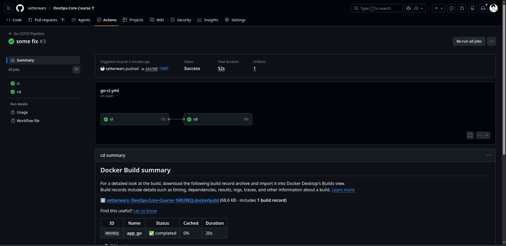

# Lab 3 — Go App CI (Bonus)

## Workflow Summary
- Location: [.github/workflows/go-ci.yml](../../.github/workflows/go-ci.yml)
- Stages:
	- Setup Go 1.22
	- Lint with golangci-lint 
	- go test ./... -v.
	- Build & push Docker image using BUILDX
	- latest and CalVer tags

## Path Filters (Selective CI)
- Path filter created Now then edit files in `app_python` triggered `python-ci.yml` then in `app_go` triggered `go-ci.yml`

## Versioning Strategy
- Strategy: CalVer (monthly), tags like 2026.02 + latest.
- Rationale: services deploy continuously; date-based tags communicate freshness and cadence.

## Evidence (Replace with your links)
- Successful workflow run:https://github.com/setterwars/DevOps-Core-Course/actions/runs/21711862898
- Docker Hub image/tags: https://hub.docker.com/repository/docker/zsalavat/devops-info-service-go/general

## Best Practices Applied
- Path filters to scope runs per app.
- Dependency caching for faster builds.
- Job dependency: CD waits for CI to pass.
- Conditional push: only on master/lab3 branches.
- Buildx for reproducible multi-arch-friendly builds.

## IMPORTANT NOTE

Cant use synk in this part API TOKEN only in Enterprice Subscribtion