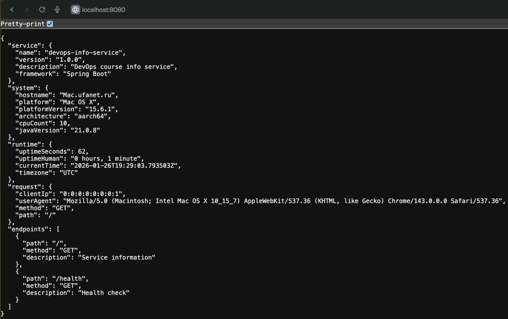
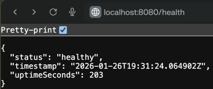
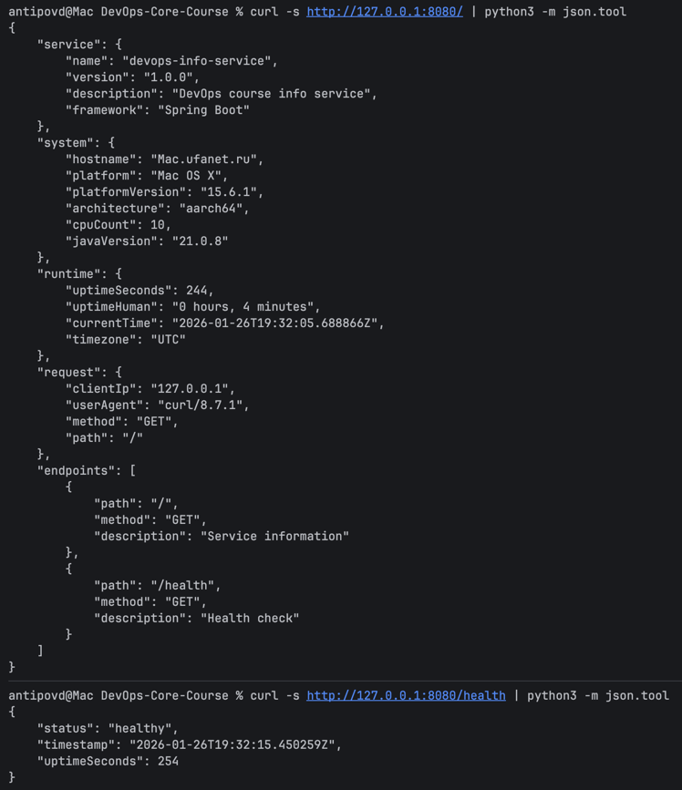
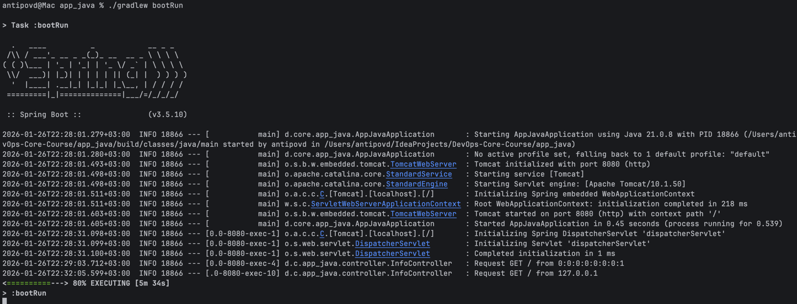

# Java Web Application (Spring Boot)

## 1) Framework Selection

### Chosen framework: Spring Boot (Spring Web)
I chose Spring Boot with Spring Web because it provides a clean and conventional way to build REST APIs in Java with clear separation of concerns: controller layer for HTTP, service layer for business logic, and configuration via application settings.

### Comparison table
| Framework | Pros | Cons | Fit for this lab |
|---|---|---|---|
| Spring Boot (chosen) | Standard approach for REST services, clean structure | More code than minimal frameworks | Best for Java version |
| Jakarta EE (plain) | Standard APIs | More manual wiring/config | Too much setup |
| Micronaut / Quarkus | Fast, modern | Extra learning curve for this course | Not selected |

---

## 2) Best Practices Applied (with code examples)

### 2.1 Clean code organization (Controller + Service + DTO)
HTTP handlers are minimal and delegate logic to a service class.

```java
@RestController
public class InfoController {
    private final InfoService infoService;

    public InfoController(InfoService infoService) {
        this.infoService = infoService;
    }

    @GetMapping("/")
    public InfoResponse index(HttpServletRequest request) {
        return infoService.buildInfoResponse(request);
    }

    @GetMapping("/health")
    public HealthResponse health() {
        return infoService.buildHealthResponse();
    }
}
```
Core logic (system info, uptime, request info) is isolated in the service:
```java
@Service
public class InfoService {
    public InfoResponse buildInfoResponse(HttpServletRequest request) {
        // uptime + system info + request info + endpoints
    }
}
```
### 2.2 External configuration (env-driven)
The app is configurable via environment variables using application.yml placeholders:
```text
server:
    address: ${HOST:0.0.0.0}
    port: ${PORT:8080}

app:
    service:
        name: ${SERVICE_NAME:devops-info-service}
        version: ${SERVICE_VERSION:1.0.0}
        description: ${SERVICE_DESCRIPTION:DevOps course info service}
```
The service metadata is injected using a typed configuration record:
```java
@ConfigurationProperties(prefix = "app.service")
public record ServiceInfoProperties(String name, String version, String description) {}
```

### 2.3 Logging
Requests are logged in the controller to improve observability:

```java
log.info("Request {} {} from {}", request.getMethod(), request.getRequestURI(), request.getRemoteAddr());
```
### 2.4 Error handling (consistent JSON errors)
A global exception handler returns a predictable JSON error payload:

```java
@RestControllerAdvice
public class GlobalExceptionHandler {
    @ExceptionHandler(Exception.class)
    public ResponseEntity<ApiError> handleAny(Exception ex) {
        ApiError body = new ApiError("Internal Server Error", "An unexpected error occurred", Instant.now().toString());
        return ResponseEntity.status(HttpStatus.INTERNAL_SERVER_ERROR).body(body);
    }
}
```
### 2.5 Proxy-aware client IP (best-effort)
If the app is behind a reverse proxy, the client IP may be provided via X-Forwarded-For:

```java
String xff = Optional.ofNullable(request.getHeader("X-Forwarded-For"))
    .map(h -> h.split(",").trim())
    .orElse("");
String clientIp = !xff.isBlank() ? xff : request.getRemoteAddr();
```
## 3) API Documentation
### 3.1 Endpoints
- GET `/` — service + system + runtime + request information
    ```json
    {
      "service": {
        "name": "devops-info-service",
        "version": "1.0.0",
        "description": "DevOps course info service",
        "framework": "Spring Boot"
      },
      "system": {
        "hostname": "Mac.ufanet.ru",
        "platform": "Mac OS X",
        "platformVersion": "15.6.1",
        "architecture": "aarch64",
        "cpuCount": 10,
        "javaVersion": "21.0.8"
      },
      "runtime": {
        "uptimeSeconds": 62,
        "uptimeHuman": "0 hours, 1 minute",
        "currentTime": "2026-01-26T19:29:03.793503Z",
        "timezone": "UTC"
      },
      "request": {
        "clientIp": "0:0:0:0:0:0:0:1",
        "userAgent": "Mozilla/5.0 (Macintosh; Intel Mac OS X 10_15_7) AppleWebKit/537.36 (KHTML, like Gecko) Chrome/143.0.0.0 Safari/537.36",
        "method": "GET",
        "path": "/"
      },
      "endpoints": [
        {
          "path": "/",
          "method": "GET",
          "description": "Service information"
        },
        {
          "path": "/health",
          "method": "GET",
          "description": "Health check"
        }
      ]
    }
    ```
- GET `/health` — health check, timestamp, uptime
    ```json
    {
      "status": "healthy",
      "timestamp": "2026-01-26T19:28:31.110960Z",
      "uptimeSeconds": 30
    }
    ```

### 3.2 Example requests
Run:
```bash
./gradlew bootRun
```
Custom configuration:
```bash
HOST=127.0.0.1 PORT=3000 ./gradlew bootRun
SERVICE_NAME=devops-info-service SERVICE_VERSION=1.0.0 SERVICE_DESCRIPTION="DevOps course info service" ./gradlew bootRun
```
Test:
```bash
curl -i http://127.0.0.1:8080/
curl -i http://127.0.0.1:8080/health
curl -s http://127.0.0.1:8080/ | python -m json.tool
```

# 4) Testing Evidence (Screenshots)
Screenshots are stored in docs/screenshots/:
- 01-main-endpoint.png — GET `/` full JSON response.
  
- 02-health-check.png — GET `/health` response.
  
- 03-formatted-output.png — pretty-printed JSON output (python -m json.tool).
  
- 04-app-run.png — compilation and execution.
  

## 5) Challenges & Solutions
- Uptime formatting: implemented using JVM uptime (RuntimeMXBean.getUptime()) converted to seconds and a human-readable string.
- Hostname retrieval: handled potential lookup issues by using a fallback value if hostname resolution fails.
- Client IP behind proxy: used X-Forwarded-For as a best-effort source with fallback to getRemoteAddr().