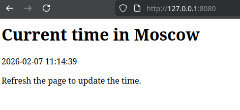

# Moscow Time App

## Overview

This is a simple Python web application built with Flask.  
It displays the current time in Moscow and updates it every time the page is refreshed.

## Requirements

- Python 3.11+
- Flask 3.1.3+
- gunicorn 25.3.0+

## Installation

1. Create a virtual environment:

    ```bash
    python3 -m venv venv
    source venv/bin/activate
    ```

2. Install dependencies:

    ```bash
    pip install -r requirements.txt
    ```

3. Launch application via gunicron:

    ```bash
    gunicorn -b {IP}:{PORT} app:app
    ```

## Usage

```bash
gunicorn -b 127.0.0.1:8080 app:app
```


