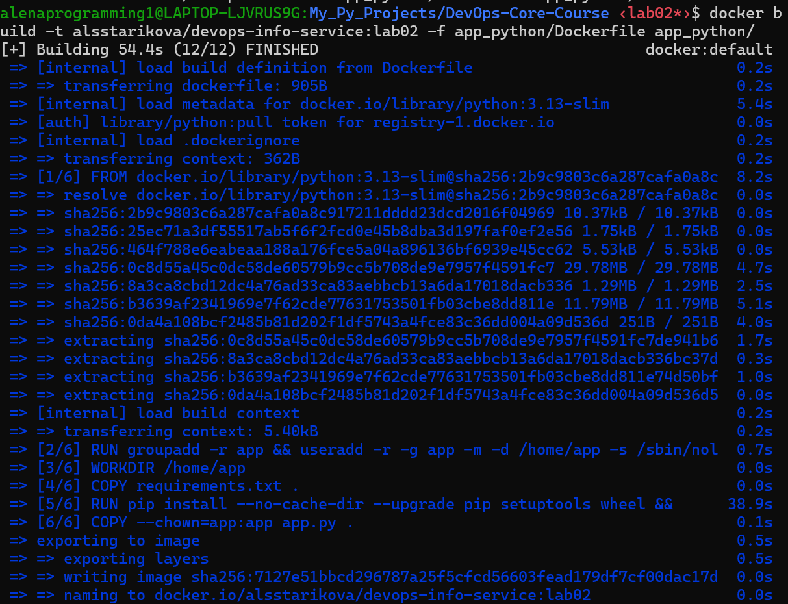
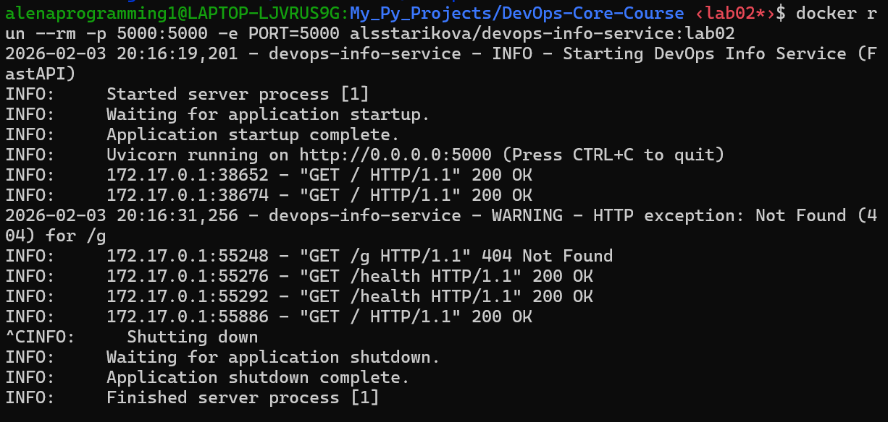
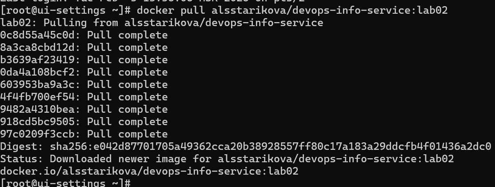

# DevOps Info Service - Python

[](https://github.com/alsstarikova/DevOps-Core-Course/actions/workflows/python-ci.yml)
[](https://codecov.io/gh/alsstarikova/DevOps-Core-Course)
[](https://github.com/alsstarikova/DevOps-Core-Course/actions/workflows/ansible-deploy.yml)


A production-ready web service providing comprehensive system information and health checks. Built with FastAPI for high performance and automatic API documentation.

## Overview

- **Service Information**: Application metadata and framework details
- **System Introspection**: Real-time OS, CPU, and Python version information
- **Runtime Monitoring**: Uptime tracking and timestamped responses
- **Health Checks**: Kubernetes-compatible liveness/readiness probe endpoint
- **Request Tracking**: Client IP, user agent, and request path logging
- **Visit Persistence**: File-based counter stored on a mounted volume
- **Environment Configuration**: PORT and HOST customization via env vars

## Prerequisites

- **Python 3.11+**
- **pip** package manager
- Virtual environment (recommended)

## Installation

1. Clone the repository and navigate to the project:
```bash
cd app_python
```

2. Create and activate a virtual environment:
```bash
python -m venv venv
source venv/bin/activate  # On Windows: venv\Scripts\activate
```

3. Install dependencies:
```bash
pip install -r requirements.txt
```

## Running the Application

### Default Configuration (0.0.0.0:5000)
```bash
python app.py
```

### Custom Port
```bash
PORT=8080 python app.py
```

### Custom Host and Port
```bash
HOST=127.0.0.1 PORT=3000 python app.py
```

### Debug Mode
```bash
DEBUG=true python app.py
```

The application will output:
```
INFO:devops-info-service: Starting DevOps Info Service (FastAPI)
INFO:uvicorn.server:Uvicorn running on http://0.0.0.0:5000
```

---

### Docker (containerized usage)

- Building the image locally:

```bash
# From repository root
docker build -t <your-dockerhub-username>/devops-info-service:<tag> -f app_python/Dockerfile app_python/
```


- Running a container:

```bash
# Map container port 5000 to host
docker run --rm -p 5000:5000 -e PORT=5000 <your-dockerhub-username>/devops-info-service:<tag>
```


- Pulling from Docker Hub:

```bash
docker pull <your-dockerhub-username>/devops-info-service:<tag>
```



## API Endpoints

### GET /

Returns comprehensive service and system information.

**Response (200 OK):**
```json
{
  "service": {
    "name": "devops-info-service",
    "version": "1.0.0",
    "description": "DevOps course info service",
    "framework": "FastAPI"
  },
  "system": {
    "hostname": "LAPTOP-LJVRUS9G",
    "platform": "Linux",
    "platform_version": "#1 SMP Fri Mar 29 23:14:13 UTC 2024",
    "architecture": "x86_64",
    "cpu_count": 20,
    "python_version": "3.10.12"
  },
  "runtime": {
    "uptime_seconds": 6,
    "uptime_human": "0 hours, 0 minutes",
    "current_time": "2026-01-24T17:07:43.217902Z",
    "timezone": "UTC"
  },
  "request": {
    "client_ip": "127.0.0.1",
    "user_agent": "curl/7.81.0",
    "method": "GET",
    "path": "/"
  },
  "visits": {
    "count": 1
  },
  "endpoints": [
    {
      "path": "/",
      "method": "GET",
      "description": "Service information"
    },
    {
      "path": "/health",
      "method": "GET",
      "description": "Health check"
    },
    {
      "path": "/visits",
      "method": "GET",
      "description": "Visits counter"
    }
  ]
}
```

### GET /health

Simple health check endpoint.

**Response (200 OK):**
```json
{
  "status": "healthy",
  "timestamp": "2026-01-24T17:07:54.041701Z",
  "uptime_seconds": 17
}
```

### GET /visits

Returns the persisted visits counter and storage file location.

**Response (200 OK):**
```json
{
  "visits": 3,
  "file_path": "/data/visits",
  "timestamp": "2026-04-14T15:28:00.000000Z"
}
```

## Configuration

| Variable | Default | Description |
|----------|---------|-------------|
| HOST | 0.0.0.0 | Server bind address |
| PORT | 5000 | Server port |
| DEBUG | false | Enable debug mode and verbose logging |
| VISITS_FILE | /data/visits | Path to persisted visits counter file |

## Docker Compose Persistence Test

From `app_python/`:

```bash
docker compose up --build -d
curl http://localhost:5000/
curl http://localhost:5000/
curl http://localhost:5000/visits
cat ./data/visits
docker compose restart devops-info-service
curl http://localhost:5000/visits
docker compose down
```

Expected behavior:
- `/` increments the counter.
- `./data/visits` stores the current number.
- After container restart, `/visits` returns the previous value (persistence works).


## Testing

Run unit tests locally:  
```bash
cd app_python
pip install -r requirements.txt
pytest -v
```

To see coverage report:  
```bash
cd app_python
pip install -r requirements.txt
pytest tests/ -v --cov=. --cov-report=term-missing --cov-fail-under=70
```

Expected output:  
```bash
DevOps-Core-Course/app_python ‹lab12*›$ pytest -v
================================ test session starts =================================
platform linux -- Python 3.10.12, pytest-8.3.3, pluggy-1.6.0 -- /usr/bin/python3
cachedir: .pytest_cache
rootdir: /mnt/c/Users/1alen/Desktop/My_Py_Projects/DevOps-Core-Course/app_python
plugins: cov-5.0.0, anyio-4.9.0
collected 23 items

tests/test_app.py::TestRootEndpoint::test_success_response_code PASSED         [  4%]
tests/test_app.py::TestRootEndpoint::test_response_content_type PASSED         [  8%]
tests/test_app.py::TestRootEndpoint::test_response_structure_validation PASSED [ 13%]
tests/test_app.py::TestRootEndpoint::test_service_section_validation PASSED    [ 17%]
tests/test_app.py::TestRootEndpoint::test_system_section_validation PASSED     [ 21%]
tests/test_app.py::TestRootEndpoint::test_runtime_section_validation PASSED    [ 26%]
tests/test_app.py::TestRootEndpoint::test_request_section_validation PASSED    [ 30%]
tests/test_app.py::TestRootEndpoint::test_endpoints_section_validation PASSED  [ 34%]
tests/test_app.py::TestRootEndpoint::test_visits_section_validation PASSED     [ 39%]
tests/test_app.py::TestRootEndpoint::test_x_forwarded_for_header_handling PASSED [ 43%]
tests/test_app.py::TestRootEndpoint::test_uptime_increases_over_time PASSED    [ 47%]
tests/test_app.py::TestHealthEndpoint::test_success_response_code PASSED       [ 52%]
tests/test_app.py::TestHealthEndpoint::test_response_structure PASSED          [ 56%]
tests/test_app.py::TestHealthEndpoint::test_status_field PASSED                [ 60%]
tests/test_app.py::TestHealthEndpoint::test_uptime_field PASSED                [ 65%]
tests/test_app.py::TestHealthEndpoint::test_timestamp_field PASSED             [ 69%]
tests/test_app.py::TestHealthEndpoint::test_uptime_consistency_with_root PASSED [ 73%]
tests/test_app.py::TestVisitsEndpoint::test_visits_endpoint_success PASSED     [ 78%]
tests/test_app.py::TestVisitsEndpoint::test_visits_increases_after_root_request PASSED [ 82%]
tests/test_app.py::TestVisitsEndpoint::test_visits_persisted_to_file PASSED    [ 86%]
tests/test_app.py::TestErrorHandling::test_404_not_found PASSED                [ 91%]
tests/test_app.py::TestErrorHandling::test_method_not_allowed PASSED           [ 95%]
tests/test_app.py::TestErrorHandling::test_method_not_allowed_health PASSED    [100%]

=========================== 23 passed, 1 warning in 0.89s ============================
DevOps-Core-Course/app_python ‹lab12*›$
```
