# LAB01 — DevOps Info Service (Python)

This document describes the **Python/Flask** implementation of **DevOps Info Service** for Lab 01.  
The service is a small HTTP JSON API that exposes system/runtime/request metadata and a health check endpoint.

---

## Framework Selection

### Choice: Flask

This implementation uses **Flask** as a lightweight WSGI web framework to build a small JSON API with minimal overhead.

**Rationale**
- **Small scope fit:** Flask is well-suited for 2–3 endpoints without extra abstractions.
- **Simple request/response model:** easy access to request metadata (`request.method`, `request.path`, headers).
- **Built-in routing + hooks:** `@app.get`, `@app.before_request`, `@app.after_request`, and error handlers reduce boilerplate.
- **Container-friendly logging:** logs can be emitted to stdout and captured by Docker/Kubernetes.

### Comparison table with alternatives

| Option | Pros | Cons | Decision |
|---|---|---|---|
| **Flask** | Minimal API, easy routing, simple hooks | Not async-first | **Selected** (best fit for small lab service) |
| FastAPI | Automatic OpenAPI, type hints, async support | More dependencies, more setup | Not needed for Lab 01 |
| Django | Full-featured framework | Heavy for a tiny JSON service | Overkill |

---

## Best Practices Applied

Below is a list of practices applied in the implementation, with short code excerpts and why each matters.

### 1) Configuration via environment variables
**Example**
```python
HOST = os.getenv("HOST", "0.0.0.0")
PORT = int(os.getenv("PORT", "5000"))
DEBUG = os.getenv("DEBUG", "False").lower() == "true"
```

**Why it matters**
- Matches Docker/Kubernetes configuration conventions.
- The same code runs in different environments without changes.

### 2) Consistent JSON error responses (404 / 500)
**Examples**
```python
@app.errorhandler(404)
def not_found(error):
    return jsonify({"error": "Not Found", "message": "Endpoint does not exist"}), 404
```

```python
@app.errorhandler(500)
def internal_error(error):
    return jsonify({"error": "Internal Server Error", "message": "An unexpected error occurred"}), 500
```

**Why it matters**
- Clients always receive machine-readable responses.
- Prevents HTML error pages, which are inconvenient for API consumers.

### 3) Request/response logging to stdout
**Examples**
```python
@app.before_request
def log_requests():
    app.logger.info("Request %s %s ...", request.method, request.path)
```

```python
@app.after_request
def log_response(response):
    app.logger.info("Response %s %s -> %s", request.method, request.path, response.status_code)
    return response
```

**Why it matters**
- Stdout logging is the standard for containers.
- Helps verify probes and debug behavior without extra tooling.

### 4) Proxy-aware client IP extraction
**Example**
```python
xff = request.headers.get("X-Forwarded-For", "")
client_ip = xff.split(",")[0].strip() if xff else request.remote_addr
```

**Why it matters**
- Preserves the real client IP when the service runs behind an ingress/reverse proxy.

---

## API Documentation

### `GET /`
Returns service metadata, system/runtime details, request metadata, and a list of available endpoints.

**Request**
```bash
curl -s http://127.0.0.1:5000/
```

**Response (schema)**
```json
{
  "service": {
    "description": "DevOps course info service",
    "framework": "Flask",
    "name": "devops-info-service",
    "version": "1.0.0"
  },
  "system": {
    "architecture": "x86_64",
    "cpu_count": 24,
    "hostname": "SerggAidd",
    "platform": "Linux",
    "platform_version": "6.18.5-arch1-1",
    "python_version": "3.14.2"
  },
  "runtime": {
    "current_time": "2026-01-23T18:16:16Z",
    "timezone": "UTC",
    "uptime_human": "0 hour, 0 minutes",
    "uptime_seconds": 4
  },
  "request": {
    "client_ip": "127.0.0.1",
    "method": "GET",
    "path": "/",
    "user_agent": "curl/8.18.0"
  },
  "endpoints": [
    {
      "description": "Root endpoint: returns service metadata and diagnostic information.",
      "method": "GET",
      "path": "/"
    },
    {
      "description": "Health check endpoint for monitoring and Kubernetes probes.",
      "method": "GET",
      "path": "/health"
    }
  ]
}
```

### `GET /health`
Health endpoint for monitoring / Kubernetes probes. Returns HTTP **200** when the service is running.

**Request**
```bash
curl -s http://127.0.0.1:5000/health
```

**Response (example)**
```json
{
  "status": "healthy",
  "timestamp": "2026-01-23T19:08:22Z",
  "uptime_seconds": 8
}
```

---

### Error handling

**404 Not Found** (unknown routes)
```bash
curl -s http://127.0.0.1:5000/does-not-exist
```

**Response**
```json
{"error":"Not Found","message":"Endpoint does not exist"}
```

**500 Internal Server Error** (unhandled exceptions)
- A test endpoint can be temporarily enabled by uncommenting the `/crash` handler in the code.

```bash
curl -s http://127.0.0.1:5000/crash
```

**Response**
```json
{"error":"Internal Server Error","message":"An unexpected error occurred"}
```

> Note: JSON object key ordering is not guaranteed. Use `python -m json.tool` or `jq` only for pretty-printing.

---

## Testing Commands

### Setup and run

Create venv and install dependencies:
```bash
python -m venv venv
source venv/bin/activate
pip install -r requirements.txt
```

Run the service:
```bash
HOST=0.0.0.0 PORT=5000 DEBUG=false python app.py
```

### Endpoint checks

```bash
curl -s http://127.0.0.1:5000/
curl -s http://127.0.0.1:5000/health
curl -s http://127.0.0.1:5000/does-not-exist
# Optional (if /crash is enabled):
# curl -s http://127.0.0.1:5000/crash
```

Pretty-print JSON:
```bash
curl -s http://127.0.0.1:5000/ | python -m json.tool
```

---

## Testing Evidence

### Screenshots showing endpoints work

Required screenshots should be stored in `docs/screenshots/`:

1) **Main endpoint showing complete JSON**
- `docs/screenshots/01_root_complete_json.png`
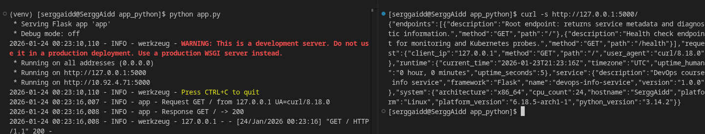

2) **Health check response**
- `docs/screenshots/02_health_check.png`
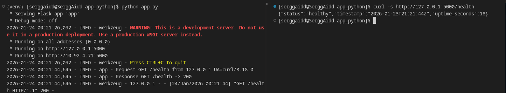

3) **Formatted/pretty-printed output**
- `docs/screenshots/03_pretty_print_command.png`
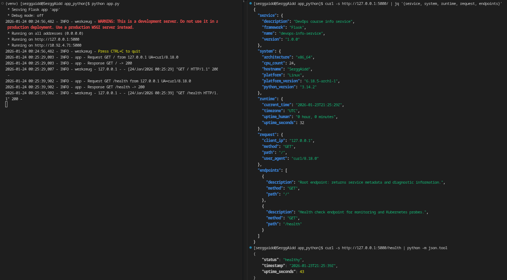


### Terminal output

Include terminal output demonstrating:
```text
curl -s http://127.0.0.1:5000/ | jq '{service, system, runtime, request, endpoints}'
{
  "service": {
    "description": "DevOps course info service",
    "framework": "Flask",
    "name": "devops-info-service",
    "version": "1.0.0"
  },
  "system": {
    "architecture": "x86_64",
    "cpu_count": 24,
    "hostname": "SerggAidd",
    "platform": "Linux",
    "platform_version": "6.18.5-arch1-1",
    "python_version": "3.14.2"
  },
  "runtime": {
    "current_time": "2026-01-23T21:25:29Z",
    "timezone": "UTC",
    "uptime_human": "0 hour, 0 minutes",
    "uptime_seconds": 32
  },
  "request": {
    "client_ip": "127.0.0.1",
    "method": "GET",
    "path": "/",
    "user_agent": "curl/8.18.0"
  },
  "endpoints": [
    {
      "description": "Root endpoint: returns service metadata and diagnostic information.",
      "method": "GET",
      "path": "/"
    },
    {
      "description": "Health check endpoint for monitoring and Kubernetes probes.",
      "method": "GET",
      "path": "/health"
    }
  ]
}
```

```text
curl -s http://127.0.0.1:5000/health | python -m json.tool
{
    "status": "healthy",
    "timestamp": "2026-01-23T21:25:39Z",
    "uptime_seconds": 43
}
```

```text
curl -s http://127.0.0.1:5000/does-not-exist | python -m json.tool
{
    "error": "Not Found",
    "message": "Endpoint does not exist"
}
```

```text
curl -s http://127.0.0.1:5000/crash | python -m json.tool
{
    "error": "Internal Server Error",
    "message": "An unexpected error occurred"
}
```

---

## Challenges & Solutions

### 1) Deterministic endpoint list ordering
**Problem:** Flask’s URL map iteration order is not guaranteed to match a desired display order.  
**Solution:** Collected endpoint entries and sorted by `(path, method)` before returning.

### 2) Correct client IP behind reverse proxies
**Problem:** `request.remote_addr` may show only the proxy address.  
**Solution:** Prefer the first value from `X-Forwarded-For` and fall back to `remote_addr`.

### 3) Consistent 500 responses for exceptions
**Problem:** Unhandled exceptions can result in default HTML error pages.  
**Solution:** Added a `500` error handler returning a JSON payload. A test-only `/crash` endpoint can be enabled to demonstrate this behavior during validation.

---
## GitHub Community Engagement
Starring repositories is a lightweight way to bookmark useful projects and also signals community interest, which improves discovery and encourages maintainers. Following developers and classmates helps track relevant updates, learn from real code activity, and makes collaboration easier by keeping your team’s work visible in one place.

### My Stars:
- Star the course repository
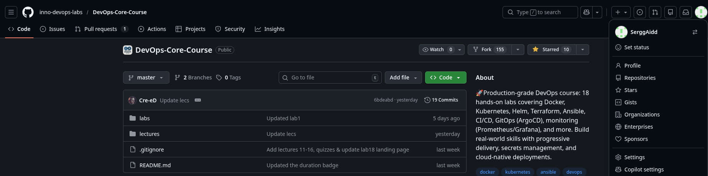
- Star simple-container-com/api
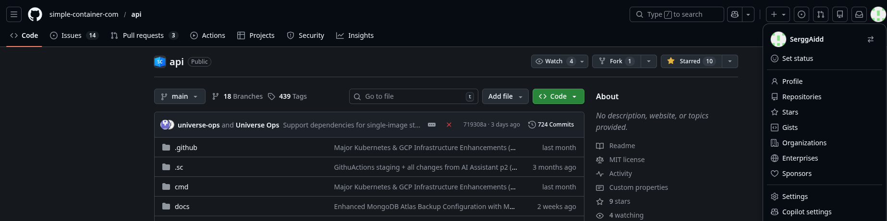

### My Follows:
- Following to Dmitriy Creed (Professor)
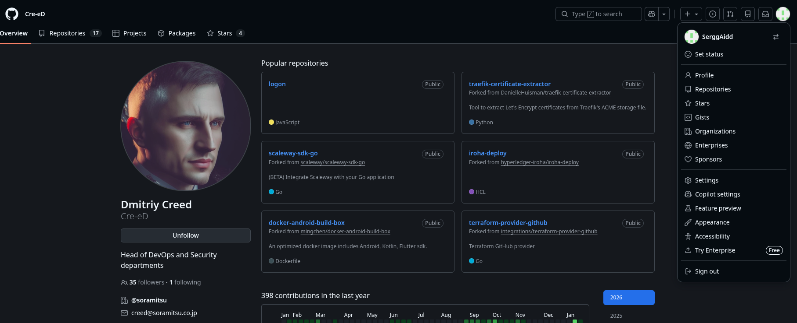
- Following to Du Tham Lieu (TA)
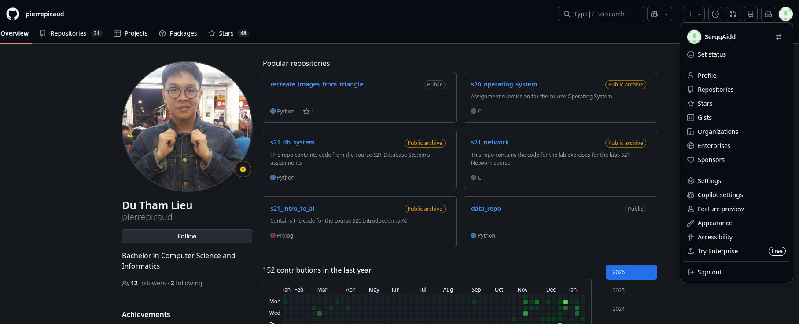
- Following to Marat Biriushev (TA)
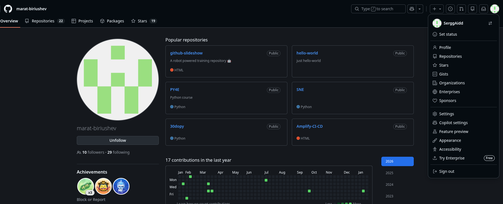
- Following to Alexander Rozanov (classmate)
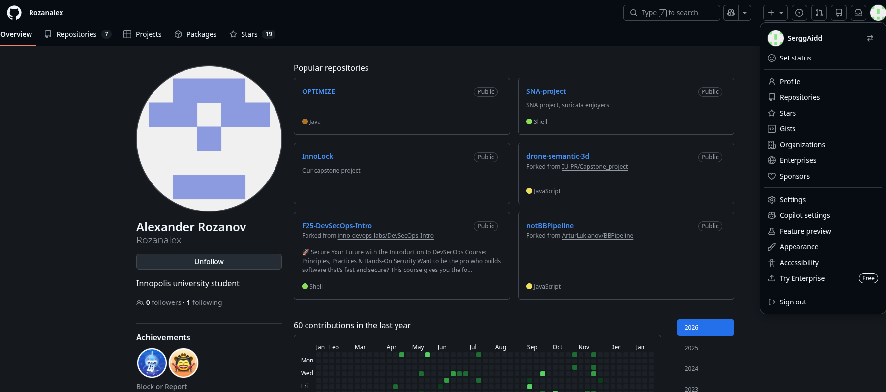
- Following to Ilvina Akhmetzyanova (classmate)
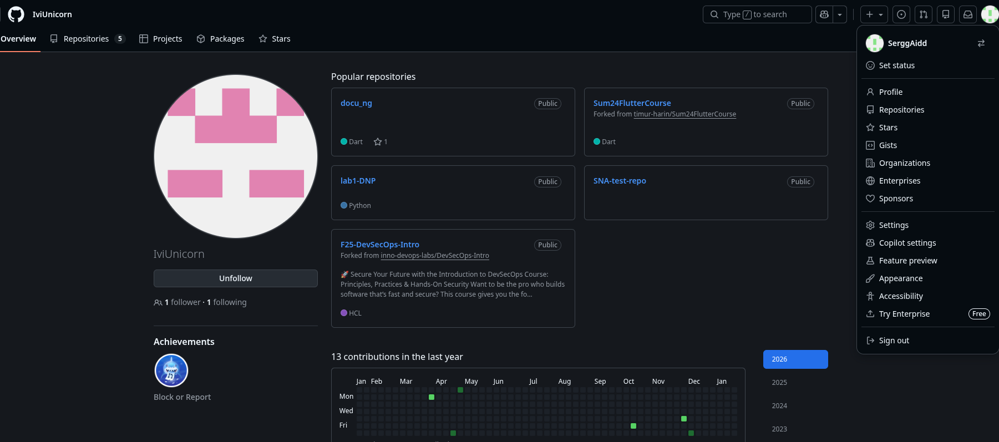
- Following to Klimentii Chistyakov (classmate)
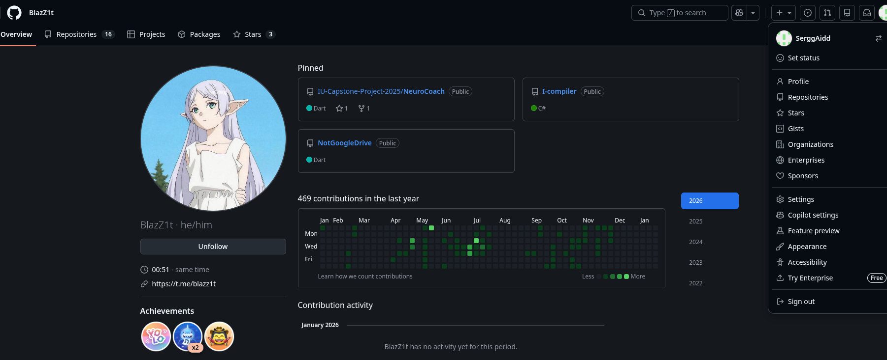