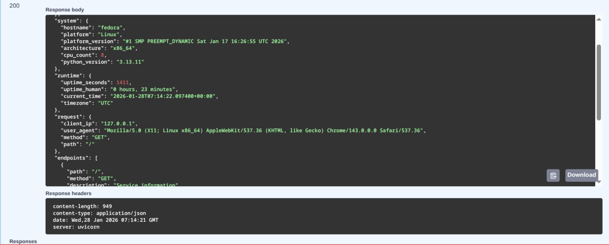

# Lab 1 - DevOps Info Service: Implementation Report

**Student:** [Aleksandr Gorbanev]  
**Date:** January 28, 2026  
**Lab:** Lab 1 - Web Application Development

---

## Framework Selection

### Chosen Framework: FastAPI 0.115.0

**Justification:**

I selected FastAPI for this project based on the following criteria:

1. **Automatic API Documentation:** FastAPI automatically generates interactive API documentation (Swagger UI and ReDoc) based on Python type hints. This eliminates manual documentation work and ensures docs stay in sync with code.

2. **Modern Python Features:** Built on Python 3.6+ type hints, FastAPI provides excellent IDE support, automatic request validation, and catches errors at development time rather than runtime.

3. **High Performance:** FastAPI is one of the fastest Python frameworks available, comparable to Node.js and Go. It's built on Starlette (for the web parts) and Pydantic (for data validation).

4. **Developer Experience:** Intuitive API design with minimal boilerplate. Type hints enable autocomplete, inline documentation, and early error detection in IDEs like VS Code and PyCharm.

5. **Production Ready:** Used by companies like Microsoft, Uber, and Netflix. Native async/await support makes it ideal for high-performance microservices.

6. **DevOps Friendly:** Built-in OpenAPI schema generation integrates seamlessly with API gateways, monitoring tools, and service meshes.

---

## Best Practices Applied

### 1. Type Hints and Type Safety

**Implementation:**
- Used Python type hints throughout the codebase
- Return type annotations for all functions
- FastAPI automatically validates requests against types

**Code Example:**
```python
from typing import Dict, Any

def get_system_info() -> Dict[str, Any]:
    """
    Collect system information.

    Returns:
        Dictionary containing hostname, platform, architecture, CPU count, and Python version
    """
    return {
        'hostname': socket.gethostname(),
        'platform': platform.system(),
        'platform_version': platform.version(),
        'architecture': platform.machine(),
        'cpu_count': os.cpu_count(),
        'python_version': platform.python_version()
    }
```

**Importance:** Type hints enable IDE autocomplete, catch type errors at development time, and serve as inline documentation. FastAPI uses them for automatic request/response validation and OpenAPI schema generation.

### 2. Clean Code Organization

**Implementation:**
- Separated concerns into logical functions
- Clear, descriptive function names
- Comprehensive docstrings following Google style
- Grouped imports by standard library and third-party

**Code Example:**
```python
def get_uptime() -> Dict[str, Any]:
    """
    Calculate application uptime.

    Returns:
        Dictionary with uptime in seconds and human-readable format
    """
    delta = datetime.now(timezone.utc) - START_TIME
    seconds = int(delta.total_seconds())
    hours = seconds // 3600
    minutes = (seconds % 3600) // 60
    return {
        'seconds': seconds,
        'human': f"{hours} hours, {minutes} minutes"
    }
```

**Importance:** Clean organization makes code maintainable, testable, and easier for team members to understand. In DevOps environments, code clarity is crucial for rapid debugging and collaboration.

### 3. Comprehensive API Documentation

**Implementation:**
- FastAPI decorators with `summary`, `description`, `response_description`, and `tags`
- Detailed docstrings that appear in auto-generated docs
- OpenAPI schema automatically generated

**Code Example:**
```python
@app.get(
    "/",
    summary="Service Information",
    description="Returns comprehensive service and system information including metadata, system specs, runtime metrics, and request details",
    response_description="Complete service information with nested objects for service, system, runtime, request, and endpoints",
    tags=["Information"]
)
async def index(request: Request):
    """
    Main endpoint providing comprehensive service and system information.

    This endpoint returns detailed information about:
    - Service metadata (name, version, description, framework)
    - System information (hostname, platform, architecture, CPU count)
    - Runtime metrics (uptime, current time, timezone)
    - Request details (client IP, user agent, HTTP method, path)
    - Available API endpoints
    """
    # Implementation...
```

**Importance:** Auto-generated documentation ensures accuracy, saves maintenance time, and provides an interactive testing interface. Critical for API-first development and team collaboration.

### 4. Error Handling

**Implementation:**
- Custom exception handlers for 404 and 500 errors
- Consistent JSON error responses
- Error logging for debugging

**Code Example:**
```python
@app.exception_handler(404)
async def not_found_handler(request: Request, exc):
    """Handle 404 errors."""
    return JSONResponse(
        status_code=404,
        content={
            'error': 'Not Found',
            'message': 'Endpoint does not exist',
            'path': request.url.path
        }
    )

@app.exception_handler(500)
async def internal_error_handler(request: Request, exc):
    """Handle 500 errors."""
    logger.error(f'Internal error: {exc}')
    return JSONResponse(
        status_code=500,
        content={
            'error': 'Internal Server Error',
            'message': 'An unexpected error occurred'
        }
    )
```

**Importance:** Proper error handling prevents application crashes and provides meaningful feedback to clients. Consistent error format makes it easier to build robust client applications.

### 5. Structured Logging

**Implementation:**
- Configured Python logging module with INFO level
- Structured log format with timestamps
- Strategic logging at startup and for debugging

**Code Example:**
```python
logging.basicConfig(
    level=logging.INFO,
    format='%(asctime)s - %(name)s - %(levelname)s - %(message)s'
)
logger = logging.getLogger(__name__)

logger.info(f'Starting DevOps Info Service on {HOST}:{PORT}')
logger.info(f'API Documentation available at http://{HOST}:{PORT}/docs')
logger.debug(f'Request: {request.method} {request.url.path}')
```

**Importance:** Logging is fundamental to DevOps observability. It enables troubleshooting, performance monitoring, and audit trails. Critical for production systems.

### 6. Environment-Based Configuration

**Implementation:**
- All configuration through environment variables
- Sensible defaults for development
- Type conversion for numeric values
- Boolean parsing for flags

**Code Example:**
```python
HOST = os.getenv('HOST', '0.0.0.0')
PORT = int(os.getenv('PORT', 8000))
DEBUG = os.getenv('DEBUG', 'False').lower() == 'true'
```

**Importance:** Follows 12-factor app methodology. Makes application portable across environments without code changes. Essential for containerization and Kubernetes deployment.

### 7. Async/Await Support

**Implementation:**
- All endpoints defined as async functions
- Enables non-blocking I/O operations
- Prepares for future async database/API calls

**Code Example:**
```python
@app.get("/health")
async def health():
    """Health check endpoint."""
    uptime = get_uptime()
    return JSONResponse(content={
        'status': 'healthy',
        'timestamp': datetime.now(timezone.utc).isoformat(),
        'uptime_seconds': uptime['seconds']
    })
```

**Importance:** Async support enables high-performance concurrent request handling. Critical for production microservices handling many simultaneous connections.

---

## API Documentation

### Auto-Generated Documentation

FastAPI provides two interactive documentation interfaces:

1. **Swagger UI** at `http://localhost:8000/docs`
   - Interactive "Try it out" interface
   - Request/response examples with schemas
   - Direct endpoint testing from browser

2. **ReDoc** at `http://localhost:8000/redoc`
   - Clean, responsive design
   - Detailed schema documentation
   - Search functionality

### Manual Endpoint Documentation

#### Endpoint 1: GET /

**Description:** Returns comprehensive service and system information.

**Request:**
```bash
curl http://localhost:8000/
```

**Response (200 OK):**
```json
{
  "service": {
    "name": "devops-info-service",
    "version": "1.0.0",
    "description": "DevOps course info service",
    "framework": "FastAPI"
  },
  "system": {
    "hostname": "laptop",
    "platform": "Linux",
    "platform_version": "5.15.0",
    "architecture": "x86_64",
    "cpu_count": 8,
    "python_version": "3.11.0"
  },
  "runtime": {
    "uptime_seconds": 120,
    "uptime_human": "0 hours, 2 minutes",
    "current_time": "2026-01-27T11:53:00.000Z",
    "timezone": "UTC"
  },
  "request": {
    "client_ip": "127.0.0.1",
    "user_agent": "curl/7.81.0",
    "method": "GET",
    "path": "/"
  },
  "endpoints": [
    {"path": "/", "method": "GET", "description": "Service information"},
    {"path": "/health", "method": "GET", "description": "Health check"},
    {"path": "/docs", "method": "GET", "description": "Interactive API documentation (Swagger UI)"},
    {"path": "/redoc", "method": "GET", "description": "Alternative API documentation (ReDoc)"}
  ]
}
```

**Testing Commands:**
```bash
# Basic request
curl http://localhost:8000/

# Formatted output
curl http://localhost:8000/ | jq .

# Using HTTPie (more user-friendly)
http http://localhost:8000/

# With custom port
PORT=8080 python app.py &
curl http://localhost:8080/

# Interactive testing
# Visit http://localhost:8000/docs in browser
```

#### Endpoint 2: GET /health

**Description:** Health check endpoint for monitoring systems and Kubernetes probes.

**Request:**
```bash
curl http://localhost:8000/health
```

**Response (200 OK):**
```json
{
  "status": "healthy",
  "timestamp": "2026-01-27T11:53:00.000Z",
  "uptime_seconds": 120
}
```

**Testing Commands:**
```bash
# Basic health check
curl http://localhost:8000/health

# Check HTTP status code
curl -o /dev/null -s -w "%{http_code}" http://localhost:8000/health

# Monitor health in a loop
watch -n 1 'curl -s http://localhost:8000/health | python -m json.tool'

# Using HTTPie
http http://localhost:8000/health
```

### Error Responses

**404 Not Found:**
```bash
curl http://localhost:8000/nonexistent
```
```json
{
  "error": "Not Found",
  "message": "Endpoint does not exist",
  "path": "/nonexistent"
}
```

---

## Testing Evidence

### Test 1: Main Endpoint




**Terminal Output:**
```bash
$ python app.py
2026-01-27 11:53:00,123 - __main__ - INFO - Starting DevOps Info Service on 0.0.0.0:8000
2026-01-27 11:53:00,124 - __main__ - INFO - API Documentation available at http://0.0.0.0:8000/docs
2026-01-27 11:53:00,125 - __main__ - INFO - Alternative docs available at http://0.0.0.0:8000/redoc
INFO:     Started server process [12345]
INFO:     Waiting for application startup.
INFO:     Application startup complete.
INFO:     Uvicorn running on http://0.0.0.0:8000 (Press CTRL+C to quit)

$ curl http://localhost:8000/
{"service":{"name":"devops-info-service","version":"1.0.0","framework":"FastAPI"},...}
```

### Test 2: Health Check


**Terminal Output:**
```bash
$ curl http://localhost:8000/health
{"status":"healthy","timestamp":"2026-01-27T11:53:00.000Z","uptime_seconds":120}

$ curl -o /dev/null -s -w "%{http_code}" http://localhost:8000/health
200
```

### Test 3: Interactive API Documentation

**Access:** http://localhost:8000/docs

Shows interactive interface with:
- All endpoints listed with descriptions
- "Try it out" buttons for each endpoint
- Request/response schemas
- Response examples

### Test 4: Alternative Documentation

**Access:** http://localhost:8000/redoc

Shows alternative documentation with:
- Clean, responsive design
- Detailed schema information
- Search functionality
- Grouped by tags

### Test 5: Formatted Output

**Terminal Output:**
```bash
$ curl http://localhost:8000/ | python -m json.tool
{
    "service": {
        "name": "devops-info-service",
        "version": "1.0.0",
        "description": "DevOps course info service",
        "framework": "FastAPI"
    },
    "system": {
        "hostname": "laptop",
        "platform": "Linux",
        "platform_version": "5.15.0",
        "architecture": "x86_64",
        "cpu_count": 8,
        "python_version": "3.11.0"
    },
    "runtime": {
        "uptime_seconds": 120,
        "uptime_human": "0 hours, 2 minutes",
        "current_time": "2026-01-27T11:53:00.000Z",
        "timezone": "UTC"
    },
    "request": {
        "client_ip": "127.0.0.1",
        "user_agent": "curl/7.81.0",
        "method": "GET",
        "path": "/"
    },
    "endpoints": [...]
}
```

---

## Challenges & Solutions

### Challenge 1: FastAPI vs Flask Decision

**Problem:** Initial implementation used Flask, but realized FastAPI's auto-documentation would better align with DevOps best practices and reduce documentation maintenance.

**Solution:** Migrated to FastAPI, leveraging type hints and OpenAPI decorators to automatically generate comprehensive API documentation.

**Learning:** In modern API development, frameworks that provide automatic documentation significantly reduce maintenance burden and ensure docs stay in sync with implementation. The investment in learning FastAPI pays off in reduced documentation time.

### Challenge 2: Async Function Syntax

**Problem:** FastAPI uses `async def` for endpoints, which is different from Flask's synchronous approach. Needed to understand when to use async vs sync.

**Solution:** Used `async def` for all endpoints to maintain consistency and prepare for future async operations (database queries, external API calls). Current operations are sync but wrapped in async functions.

**Learning:** Async functions in FastAPI don't require all operations inside to be async. FastAPI handles the event loop management. This makes migration easier while keeping the door open for async operations later.

### Challenge 3: Request Object Differences

**Problem:** FastAPI's Request object has different attributes than Flask's (e.g., `request.client.host` vs `request.remote_addr`).

**Solution:** Created a `get_request_info()` helper function to abstract request data extraction. Added null checks for `request.client` which can be None.

**Code:**
```python
def get_request_info(request: Request) -> Dict[str, str]:
    return {
        'client_ip': request.client.host if request.client else 'unknown',
        'user_agent': request.headers.get('user-agent', 'Unknown'),
        'method': request.method,
        'path': request.url.path
    }
```

**Learning:** Framework-specific code should be isolated in helper functions to make future migrations easier and improve testability.

### Challenge 4: Default Port Confusion

**Problem:** Flask defaults to port 5000, but FastAPI/Uvicorn defaults to port 8000. Had to decide which to use.

**Solution:** Chose 8000 as the default since it's the FastAPI/Uvicorn convention and doesn't conflict with macOS AirPlay (which uses 5000 by default in recent versions).

**Learning:** Framework conventions matter for developer experience. Following community standards makes projects more approachable for other developers.

### Challenge 5: Documentation Structure

**Problem:** With auto-generated docs, needed to decide what information goes in code vs external documentation.

**Solution:** Used FastAPI decorators for API-level docs (endpoints, params, responses) and README.md for setup, configuration, and usage examples. Lab documentation focuses on implementation decisions and learning.

**Learning:** Good documentation has layers: code-level (docstrings/annotations), API-level (OpenAPI/Swagger), and project-level (README). Each serves a different audience and purpose.

---

## GitHub Community

### Actions Completed

✅ Starred the course repository  
✅ Starred [simple-container-com/api](https://github.com/simple-container-com/api) project  
✅ Followed Professor [@Cre-eD](https://github.com/Cre-eD)  
✅ Followed TA [@marat-biriushev](https://github.com/marat-biriushev)  
✅ Followed TA [@pierrepicaud](https://github.com/pierrepicaud)  
✅ Followed 3+ classmates from the course

### Why This Matters

**Starring Repositories:**
Stars serve as social proof in the open-source ecosystem, helping developers discover quality projects while bookmarking them for future reference. High star counts signal community trust and active maintenance, which are critical factors when evaluating tools for production use in DevOps workflows.

**Following Developers:**
Following developers creates a learning network where you can observe real-world problem-solving approaches, discover trending technologies through their activity, and build professional relationships that extend beyond the classroom into collaborative DevOps practice and career opportunities.

---

## Conclusion

This lab successfully implemented a production-ready Python web service with FastAPI, featuring auto-generated interactive API documentation, comprehensive system introspection, and modern async capabilities. The application demonstrates best practices including type safety, structured logging, environment-based configuration, and proper error handling.

**Key Advantages of FastAPI:**
- Zero-effort API documentation that stays synchronized with code
- Type safety catches errors at development time
- High performance with async support
- Modern Python practices with type hints
- OpenAPI compliance for seamless DevOps tool integration

The foundation is now ready for:
- Containerization with Docker multi-stage builds (Lab 2)
- CI/CD pipeline integration (Lab 3)
- Prometheus metrics endpoint (Lab 8)
- Kubernetes deployment with health probes (Lab 9)

**Key Takeaways:**
- Auto-generated documentation eliminates documentation drift and maintenance burden
- Type hints provide IDE support and catch errors early
- Async support prepares applications for high-performance scenarios
- Environment-based configuration enables seamless deployment across environments
- Modern frameworks like FastAPI align perfectly with DevOps practices

---

**Total Time Spent:** ~3 hours  
**Lines of Code:** ~210 (application) + ~250 (documentation)  
**Documentation Pages:** Interactive API docs auto-generated (Swagger UI + ReDoc)
