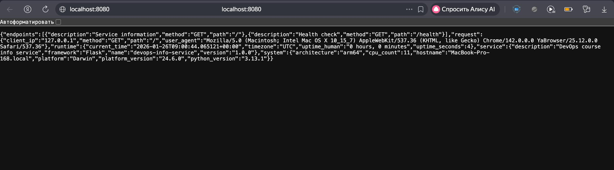
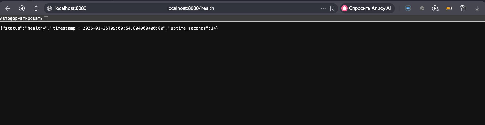
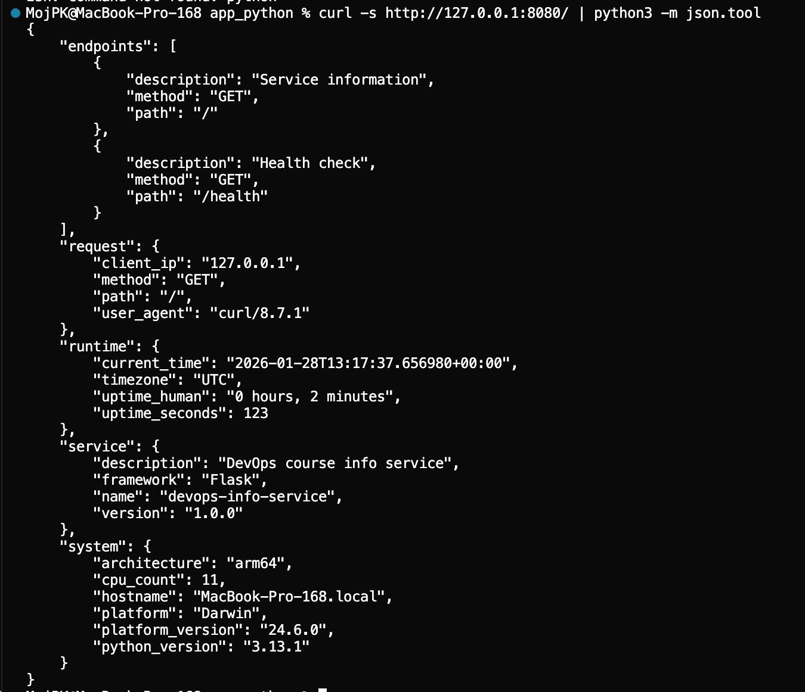

# LAB01 — DevOps Info Service (Python)

## Framework Selection

### Choice
This lab uses **Flask** as the web framework.

### Why Flask
- **Minimal and transparent**: great for a small lab service with 2 endpoints and JSON responses.
- **Fast to implement**: routing, JSON helpers, and error handlers are simple and require little boilerplate.
- **Good fit for DevOps labs**: easy to containerize, easy to configure via environment variables, predictable runtime behavior.

### Comparison with Alternatives

| Framework | Pros | Cons | Fit for this lab |
|---|---|---|---|
| **Flask** | Minimal, simple routing, easy JSON responses, quick setup | Less built-in validation compared to FastAPI | **Excellent** |
| **FastAPI** | Async-ready, automatic OpenAPI docs, strong typing/validation | Slightly more setup, different server (uvicorn) | Good (but more than needed here) |
| **Django** | Batteries included (ORM, admin, auth) | Heavy for a 2-endpoint info service | Overkill |

## Best Practices Applied

### Clean code organization (PEP 8 + structure)
- **Module docstring and clear sections**: improves readability and onboarding.

```1:41:DevOps-Core-Course/app_python/app.py
"""
DevOps Info Service
Main application module

Provides system, runtime, and request information,
as well as a health check endpoint.
"""

import os
import socket
import platform
import logging
from datetime import datetime, timezone

from flask import Flask, jsonify, request
```

- **Small, focused helper functions**: isolates responsibilities and keeps endpoints clean.

```47:75:DevOps-Core-Course/app_python/app.py
def get_uptime():
    """
    Calculate application uptime.

    Returns:
        tuple: uptime in seconds (int), human-readable uptime (str)
    """
    delta = datetime.now(timezone.utc) - START_TIME
    seconds = int(delta.total_seconds())
    hours = seconds // 3600
    minutes = (seconds % 3600) // 60
    return seconds, f"{hours} hours, {minutes} minutes"


def get_system_info():
    """
    Collect system information.

    Returns:
        dict: system information
    """
    return {
        "hostname": socket.gethostname(),
        "platform": platform.system(),
        "platform_version": platform.release(),
        "architecture": platform.machine(),
        "cpu_count": os.cpu_count(),
        "python_version": platform.python_version(),
    }
```

**Why it matters**: clean structure makes the service easier to test, extend, and debug (a key DevOps skill).

### Configuration via environment variables
- **HOST/PORT/DEBUG** are read from environment variables, so the app is portable across local, CI, containers, and Kubernetes.

```23:30:DevOps-Core-Course/app_python/app.py
# Configuration via environment variables
HOST = os.getenv("HOST", "0.0.0.0")
PORT = int(os.getenv("PORT", 5000))
DEBUG = os.getenv("DEBUG", "false").lower() == "true"

# Application start time (used for uptime calculation)
START_TIME = datetime.now(timezone.utc)
```

**Why it matters**: 12-factor style configuration avoids hardcoding and supports different environments safely.

### Structured logging
- Standard logging format with timestamps and log levels.
- Logging is used for service startup, requests, and errors.

```35:41:DevOps-Core-Course/app_python/app.py
logging.basicConfig(
    level=logging.INFO,
    format="%(asctime)s - %(name)s - %(levelname)s - %(message)s"
)
logger = logging.getLogger(__name__)

logger.info("DevOps Info Service starting...")
```

**Why it matters**: logs are the primary observability tool in production and in Kubernetes.

### Error handling (JSON responses)
- Custom JSON handlers for 404 and 500 keep responses consistent and machine-readable.

```136:157:DevOps-Core-Course/app_python/app.py
@app.errorhandler(404)
def not_found(error):
    """
    Handle 404 errors.
    """
    logger.warning("404 Not Found: %s", request.path)
    return jsonify({
        "error": "Not Found",
        "message": "Endpoint does not exist",
    }), 404


@app.errorhandler(500)
def internal_error(error):
    """
    Handle 500 errors.
    """
    logger.error("500 Internal Server Error: %s", error)
    return jsonify({
        "error": "Internal Server Error",
        "message": "An unexpected error occurred",
    }), 500
```

**Why it matters**: predictable error payloads simplify monitoring, alerting, and client behavior.

## API Documentation

### Base URL
- Local: `http://127.0.0.1:5000`
- Container/Kubernetes: depends on Service/Ingress, but endpoints are the same.

### GET /
Returns service metadata, system info, runtime info, request info, and a list of available endpoints.

**Request:**

```bash
curl -s http://127.0.0.1:5000/
```

**Pretty-printed output (recommended for screenshots):**

```bash
curl -s http://127.0.0.1:5000/ | python -m json.tool
```

**Response (example fields):**
- `service`: name/version/framework
- `system`: hostname/platform/architecture/cpu_count/python_version
- `runtime`: uptime + current time in UTC
- `request`: client_ip/user_agent/method/path

### GET /health
Returns health status and uptime (useful for monitoring and Kubernetes probes).

**Request:**

```bash
curl -s http://127.0.0.1:5000/health
```

**Pretty-printed output:**

```bash
curl -s http://127.0.0.1:5000/health | python -m json.tool
```

### Testing commands

**Run the service:**

```bash
python app.py
```

**Run with custom config:**

```bash
HOST=127.0.0.1 PORT=8080 DEBUG=True python app.py
```

**Quick smoke tests:**

```bash
curl -i http://127.0.0.1:5000/
curl -i http://127.0.0.1:5000/health
curl -i http://127.0.0.1:5000/does-not-exist
```

## Testing Evidence

### Required Screenshots
Screenshots are stored in `app_python/docs/screenshots/` and embedded below:

- **Main endpoint showing complete JSON**  
  

- **Health check response**  
  

- **Formatted/pretty-printed output**  
  

### Terminal output (example to capture)
Capture terminal logs while making requests, e.g.:

```text
YYYY-MM-DD HH:MM:SS,mmm - __main__ - INFO - DevOps Info Service starting...
YYYY-MM-DD HH:MM:SS,mmm - __main__ - INFO - Handling request: GET /
YYYY-MM-DD HH:MM:SS,mmm - __main__ - INFO - Handling request: GET /health
```

## Challenges & Solutions

### 1) Port 5000 already in use on macOS
- **Problem**: macOS may occupy port 5000 (for example, AirPlay Receiver or other services).
- **Solution**: run the app on a different port using environment variables:

```bash
PORT=8080 python app.py
```

### 2) Need readable JSON for screenshots and debugging
- **Problem**: raw JSON is harder to visually verify in screenshots.
- **Solution**: use Python’s built-in formatter:

```bash
curl -s http://127.0.0.1:8080/ | python3 -m json.tool
```

## GitHub Community

Starring repositories on GitHub helps you bookmark useful tools (like this course repo and `simple-container-com/api`), signals to maintainers that their work is valuable, and increases the visibility of good open-source projects for the wider community.  
Following your professor, TAs, and classmates lets you discover new projects through their activity, stay aware of what your team is working on, and gradually build a professional network and learning feed that supports future collaborations and career growth.

