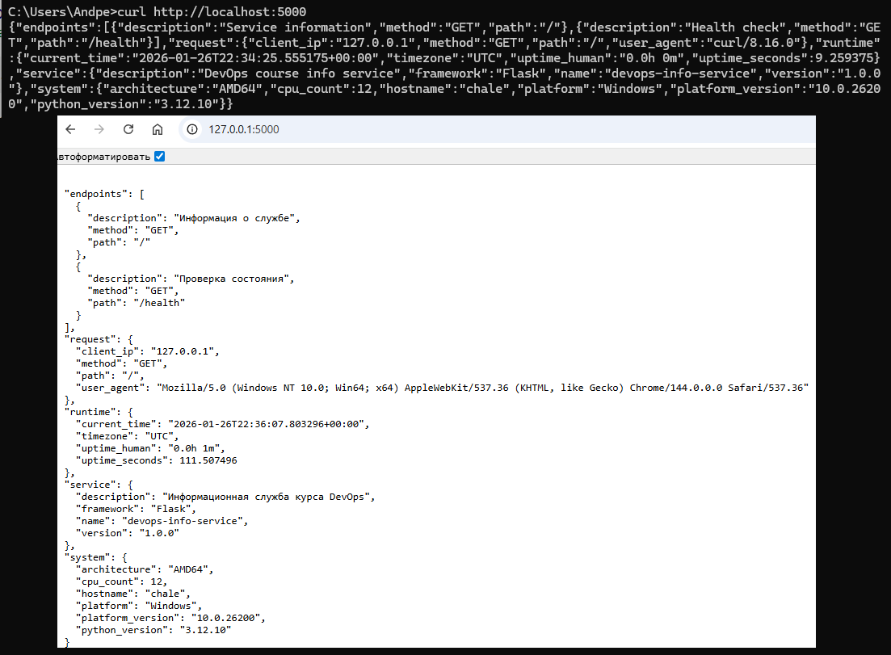
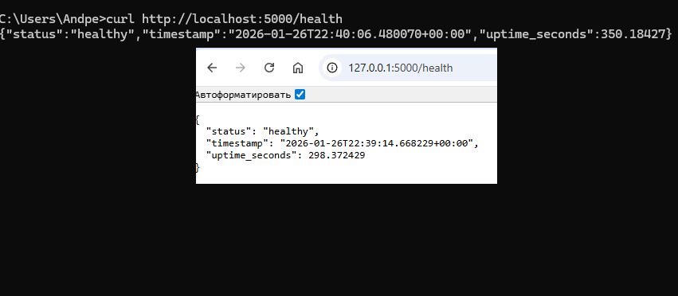
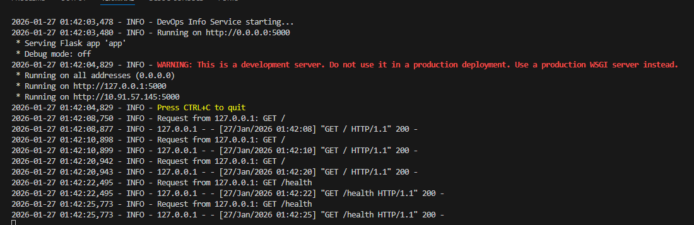

# LAB 01 — DevOps Info Service (Flask Implementation)

## 1. Framework Selection

**Chice:** Flask  
**Reason:**  
- Lightweight and minimal setup  
- Easy to learn and extend  
- Sufficient for small RESTful APIs  

| Framework | Pros | Cons |
|------------|------|------|
| **Flask** | Simple, small footprint | Manual setup for async and docs |
| **FastAPI** | Async, OpenAPI built-in | Slightly more complex |
| **Django** | Full-featured ORM and admin | Overkill for small service |

---

## 2. Best Practices Applied

- **PEP8 compliance:** 
    - Clear function and variable names, consistent code structure (imports -> configuration -> initialization -> routes -> error handlers -> entry point).
    - This structure improves readability and maintainability.
    ```py
    import os
    ...
    from flask import Flask, jsonify, request

    HOST = os.getenv('HOST', '0.0.0.0')
    PORT = int(os.getenv('PORT', 5000))
    DEBUG = os.getenv('DEBUG', 'False').lower() == 'true'

    app = Flask(__name__)
    START_TIME = datetime.now(timezone.utc)

    logging.basicConfig(
        ...
    )
    logger = logging.getLogger(__name__)
    logger.info("DevOps Info Service starting...")

    @app.route("/")
    def index():
        ...
    
    @app.route("/health")
    def health():
        ...

    @app.errorhandler(404)
    def not_found(error):
        ...
    
    @app.errorhandler(500)
    def internal_error(error):
        ...
    
    if __name__ == "__main__":
        logger.info(f"Running on http://{HOST}:{PORT}")
        app.run(host=HOST, port=PORT, debug=DEBUG)
    ```

- **Logging:** 
    - Logging allows tracking of application lifecycle, requests, and potential issues during runtime.
    ```py
        logger.info(f"Request from {request.remote_addr}: {request.method} {request.path}")
    ```

- **Error handling:** 
    - Custom error handlers ensure that users receive clear and meaningful responses when something goes wrong.
    ```py
        @app.errorhandler(500)
        def internal_error(error):
            return jsonify({"error": "Internal Server Error", "message": "Unexpected error"}), 500
    ```

- **Environment variables:** 
    - Configuration is managed externally, allowing deployment to multiple environments without modifying source code.
    ```py
        HOST = os.getenv('HOST', '0.0.0.0')
        PORT = int(os.getenv('PORT', 5000))
        DEBUG = os.getenv('DEBUG', 'False').lower() == 'true'
    ``` 

- **Pinned dependencies:** 
    - Dependencies are version-pinned for reproducibility and stability across environments.
    ```
        Flask==3.1.2
    ```

## 3. API Documentation

### `GET /`
**Description:** Returns service, system, runtime, and request details.
**Example:**
```bash
    curl http://127.0.0.1:5000/
```

### `GET /health`
**Description:** Returns health status and uptime.
**Example:**
```bash
    curl http://127.0.0.1:5000/health
```

---

## 4. Testing Evidence

All screenshots located in [docs/screenshots/](screenshots/):

#### Index page:


#### Health page:


#### Console logs:

---

## 5. Challenges & Solutions

| Challenge | Solution |
|------------|-----------|
| Handling errors gracefully | Added `@app.errorhandler()` decorators |
| Consistent JSON responses | Used base func from Flask (`jsonify()`) for serialization |
| time.timetz returns null if time = datetime.now() | Set UTC as timezone for time |

---


## GitHub Community

**Why Stars Matter:**  
Starring repositories helps developers to show appreciation, bookmark useful projects and improve project visibility in the community.

**Why Following Matters:**  
Following other developers builds a professional network that helps to discover new tools and encourages collaboration.

Followed:
- [@Cre-eD](https://github.com/Cre-eD)
- [@marat-biriushev](https://github.com/marat-biriushev)
- [@pierrepicaud](https://github.com/pierrepicaud)
- [@gleb-pp](https://github.com/gleb-pp)
- [@error10556](https://github.com/Error10556)
- [@Ravwvil](https://github.com/Ravwvil)
