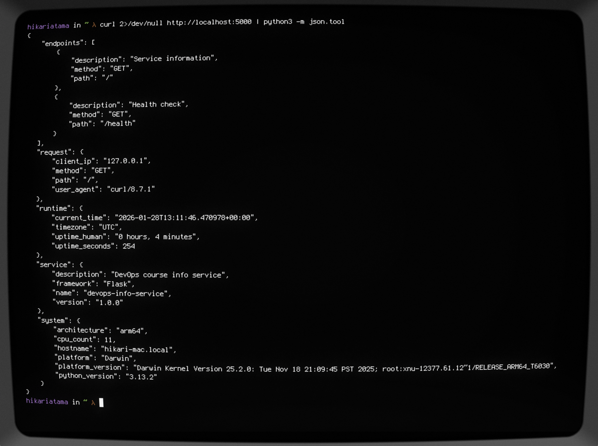
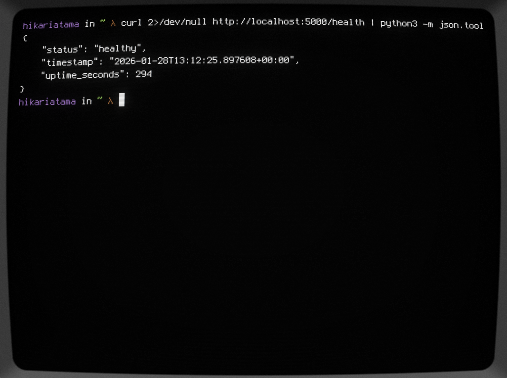
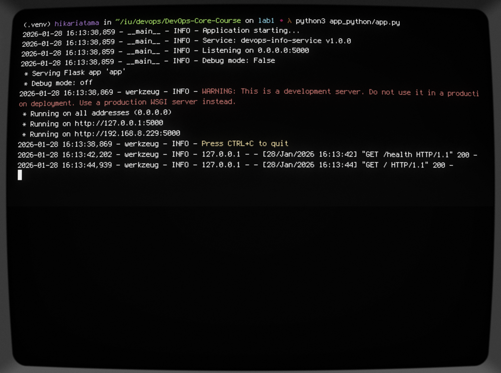

# Lab 1 - DevOps Info Service: Python Implementation

## Framework Selection

I chose Flask for this project. It's simple, lightweight, and perfect for a JSON API service.

### Why Flask?

- **Easy to learn**: Straightforward API without too much magic
- **Lightweight**: No unnecessary features, just what we need
- **Flexible**: Can structure the project however I want
- **Well documented**: Been around since 2010, tons of resources

### Alternatives Considered

**FastAPI**: Great performance and auto-documentation, but the async patterns and type hints felt like overkill for this simple service.

**Django**: Too heavy. We don't need an ORM, admin panel, or authentication for this.

Flask hits the sweet spot between simplicity and functionality.

## Best Practices Applied

### 1. Environment-Based Configuration

```python
HOST = os.getenv('HOST', '0.0.0.0')
PORT = int(os.getenv('PORT', 5000))
DEBUG = os.getenv('DEBUG', 'False').lower() == 'true'
```

This lets me run the same code in different environments without changing anything. It's also more secure since sensitive config stays out of the codebase.

### 2. Clean Code Organization

Functions are grouped logically and named clearly. No need to read implementation details to understand what `get_system_info()` does.

### 3. Structured Logging

```python
logging.basicConfig(
    level=logging.INFO,
    format='%(asctime)s - %(name)s - %(levelname)s - %(message)s'
)
```

Timestamps and log levels make debugging much easier, especially when things break in production.

### 4. Error Handling

Custom error handlers return consistent JSON responses with proper HTTP status codes instead of ugly HTML error pages.

### 5. Pinned Dependencies

```txt
Flask==3.1.0
Werkzeug==3.1.3
```

Exact versions ensure the app works the same way everywhere. No surprises from unexpected updates.

## API Documentation

### GET /

Returns everything about the service, system, runtime, and request.

```bash
curl http://localhost:5000/ | python -m json.tool
```

### GET /health

Simple health check that returns status and uptime.

```bash
curl http://localhost:5000/health
```

## Testing Evidence

Tested on macOS with Python 3.13.2. Both endpoints work correctly:

1. Main endpoint returns all required fields
2. Health check responds quickly with proper status
3. JSON is properly formatted
4. Error handling works (tested with invalid endpoints)
5. Environment variables configure the service correctly





## Challenges and Solutions

### Challenge 1: Platform Version String

The `platform.version()` output on macOS is super long with kernel details. I left it as-is since complete system info is valuable for debugging, even if it's verbose.

### Challenge 2: Uptime Calculation

Initially considered multiple time sources but settled on using `datetime.now(timezone.utc)` consistently throughout. This avoids timezone bugs.

### Challenge 3: CPU Count Edge Case

`os.cpu_count()` can return `None` on some systems. In production code, I'd add `os.cpu_count() or 0` as a fallback, but for this lab it's fine.

### Challenge 4: Production Deployment

Flask's dev server isn't production-ready, so I added gunicorn to requirements.txt and documented how to use it in the README.

## GitHub Community

### Why Starring Matters

Starring repositories is like bookmarking but public. It helps me find projects later, shows maintainers their work is appreciated, and signals to others which projects are worth checking out. The star count is often the first thing people look at when evaluating a project.

### Why Following Matters

Following classmates lets me see what they're working on and makes collaboration easier. Following TAs and the professor keeps me updated on course materials. Following experienced developers helps me discover new tools and learn from their work. It's basically building a professional network on GitHub.

## Conclusion

The Flask implementation is straightforward and gets the job done. It follows Python best practices, handles errors properly, and is ready to evolve in future labs. The environment-based configuration and structured logging will be especially useful when we containerize this in Lab 2.
