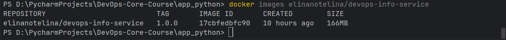
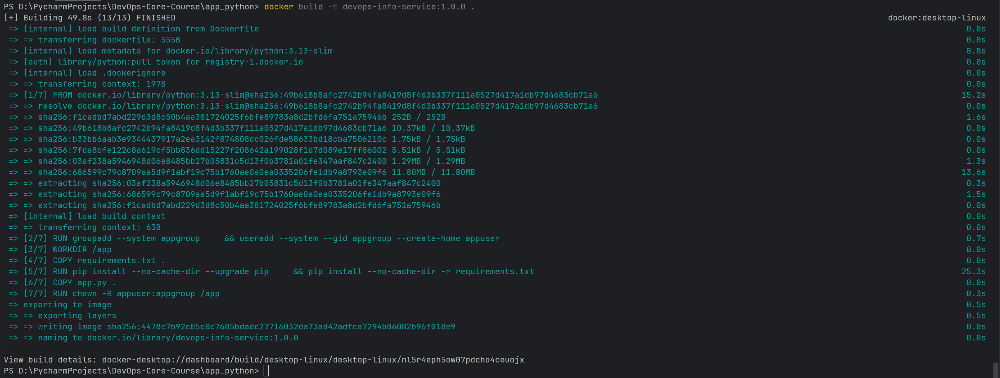
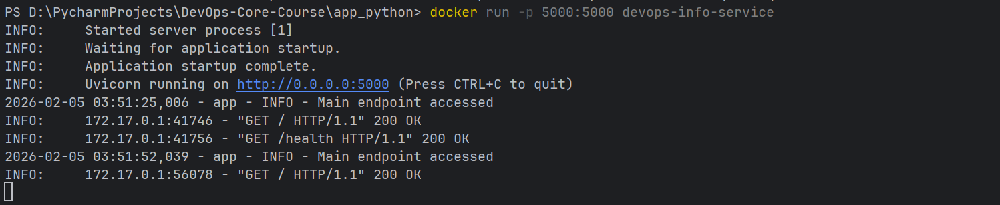
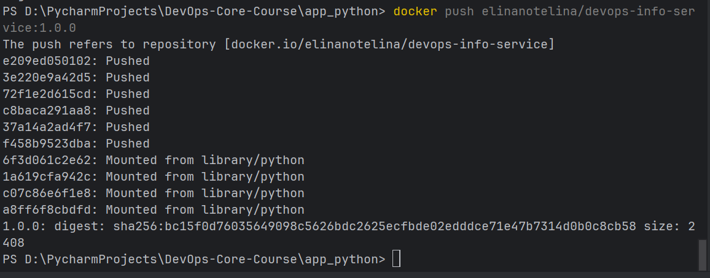
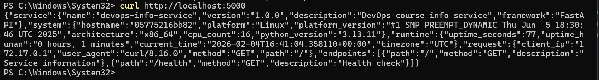
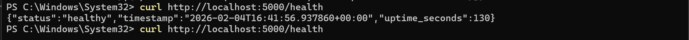
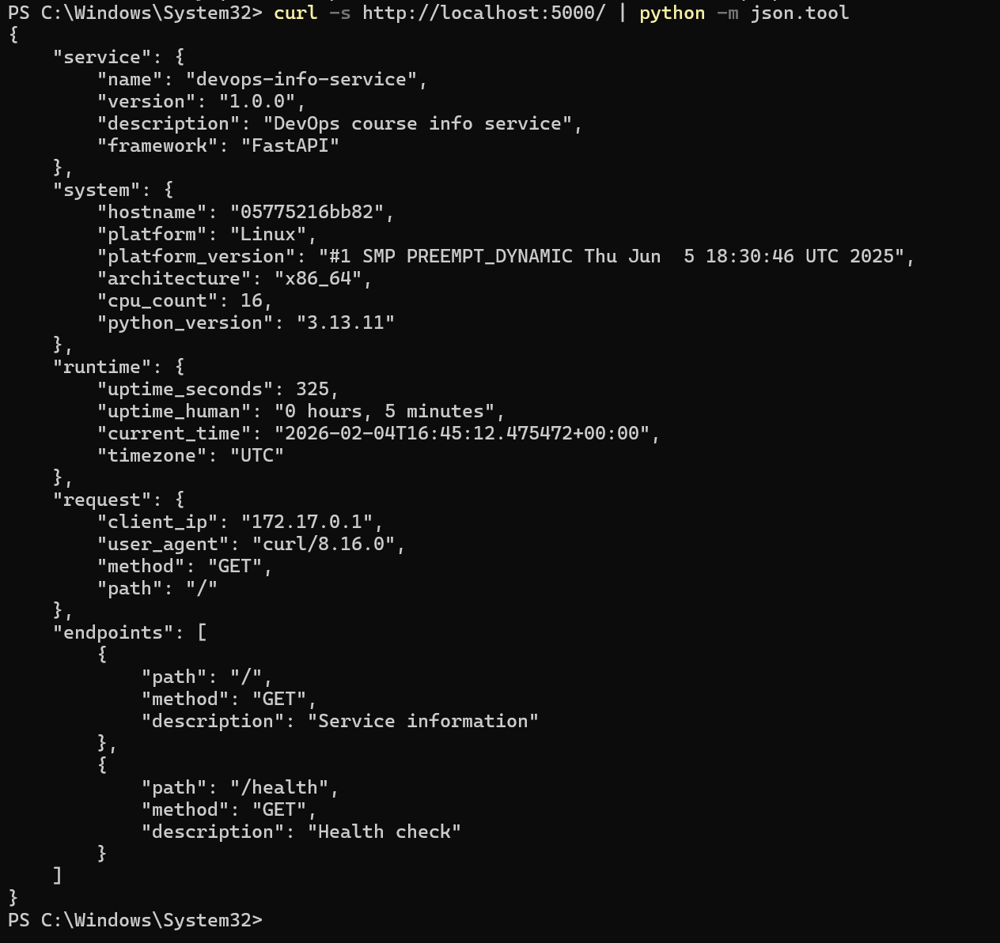

# Lab 02 — Docker Containerization

## Docker Best Practices Applied

### 1. Non-Root User

**Implementation:**

```bash
RUN groupadd --system appgroup \
    && useradd --system --gid appgroup --create-home appuser
RUN chown -R appuser:appgroup /app
USER appuser
```
A dedicated system group and system user are created during the image build process. The `--system` flag ensures that both the user and group receive system-level IDs (GID/UID < 1000) and that the application does not run as root. The user is explicitly assigned to the created group using `--gid`, and a home directory is created with `--create-home`. File ownership for the application directory is adjusted accordingly to grant the required permissions. Finally, the container is configured to run under this non-root user (`appuser`), following the principle of least privilege and Docker security best practices.

**Why It Matters:**  
Running the container as root is a security risk. Using a non-root user (`appuser`) prevents privilege escalation and limits potential damage if the container is compromised.

---

### 2. Specific Base Image Version

**Implementation:**

`FROM python:3.13-slim`

**Why It Matters:** 

Using an explicitly defined base image version ensures predictable and repeatable builds over time. It eliminates uncertainty caused by implicit updates and guarantees that the same environment is recreated on every build. A fixed version also improves security practices by making vulnerability analysis consistent and traceable, as the exact runtime components are known. Additionally, locking the base image version reduces the risk of unexpected failures introduced by upstream changes

**Why the choice of the slim version matters:** 

Compared to the full image, it contains significantly fewer preinstalled packages, which reduces the potential attack surface and limits exposure to unused components. The smaller image size also results in faster image transfers and quicker container startup times.

---

### 3. Layer Caching and pip Сache Optimization

**Implementation:**

```bash
COPY requirements.txt .
RUN pip install --no-cache-dir --upgrade pip \
    && pip install --no-cache-dir -r requirements.txt
COPY app.py .
```

**Why It Matters:**  

Docker reuses previously built layers when their inputs do not change. Since application dependencies are updated far less frequently than the source code, copying requirements.txt and installing dependencies before adding the application files allows the dependency installation layer to be cached. As a result, changes to the application code do not trigger a full reinstallation of dependencies, significantly reducing build time.

At the same time, the `--no-cache-dir` option prevents `pip` from storing downloaded packages inside the image. In containerized environments, such caches provide no practical benefit because images are immutable and rebuilt from scratch when dependencies change. Disabling the pip cache reduces the final image size, eliminates unnecessary files.

---

### 4. Minimal File Copying

**Implementation:**

`COPY requirements.txt . COPY app.py .`

**Why It Matters:**  
Only essential files are included, keeping the image small and reducing attack surface. Tests, docs, or virtual environments are excluded.

---

### 5. .dockerignore File

**Implementation:**

```bash
__pycache__/
*.pyc
*.pyo
*.pyd

venv/
.venv/
env/
ENV/

*.log
pytest_cache/

.git/
.gitignore
.gitattributes

README.md
docs/

tests/
```

**Why It Matters:**  

Using a `.dockerignore` file reduces the Docker build context to only the files required at runtime, which speeds up image builds, prevents accidental inclusion of large directories (such as local virtual environments), and lowers the risk of exposing sensitive data. In this project, excluding non-production files significantly decreased the build context size and resulted in a cleaner, more efficient container image.

---

## Image Information & Decisions

## Image Information & Decisions

**Base Image:** The application image is built on top of `python:3.13-slim`.

**Justification:**  
The fixed version ensures consistent builds across different environments and avoids unexpected changes from upstream updates. The `slim` variant provides the Python runtime and essential system libraries while excluding unnecessary packages, which reduces the image size and minimizes the potential attack surface.

**Alternatives Considered:**  
- `python:3.13` – full image includes extra build tools and libraries (~1GB), not needed for this application.  
- `python:3.13-alpine` – smaller, but uses musl instead of glibc, which can cause compatibility issues with some Python packages.

- **Final Image Size:** ~166MB (after dependency installation and code copy).  
  This includes:
  - Base python:3.13-slim: ~78MB
  - Dependencies (from requirements.txt): ~48MB
  - Application code: <1MB
  - Other system libraries and metadata: remainder


 

### Layer Structure

1. **Base image**  
    `FROM python:3.13-slim` – minimal Python 3.13 image containing only the base OS and Python runtime.
    
2. **Environment variables**  – configures Python behavior and application environment variables.
    ```bash
    ENV PYTHONDONTWRITEBYTECODE=1 \
    PYTHONUNBUFFERED=1 \
    HOST=0.0.0.0 \
    PORT=5000
   ```

    
3. **User creation** – creates a system group and user to run the container without root privileges.
    ```bash
    RUN groupadd --system appgroup \
    && useradd --system --gid appgroup --create-home appuser
   ```

    
4. **Working directory setup**  
    `WORKDIR /app` – sets the working directory for subsequent commands and the application.
    
5. **Requirements copy**  
    `COPY requirements.txt .` – copies the dependency manifest into the container.
    
6. **Dependency installation**  – installs Python libraries.
    ```bash
        RUN pip install --no-cache-dir --upgrade pip && pip install --no-cache-dir -r requirements.txt
    ```
7. **Application code copy**  
    `COPY app.py .` – adds the application source code into the container.
    
8. **Permission changes**  
    `RUN chown -R appuser:appgroup /app` – adjusts file ownership for the application directory.
    
9. **User switch**  
    `USER appuser` – switches to the non-root user.
    
10. **Expose port**  
    `EXPOSE 5000` – declares the port for external access.
    
11. **CMD definition**  
    `CMD ["uvicorn", "app:app", "--host", "0.0.0.0", "--port", "5000"]` – default command to start the application when the container runs.

**Optimization:**  
Installing dependencies before copying the application code allows Docker to reuse the cached layer when only code changes, reducing rebuild time.

---

## Build & Run Process

### Build Locally

```bash
cd app_python 
docker build -t devops-info-service .
```

**Sample Output:**
 

### Run Locally

```bash
docker run -p 5000:5000 devops-info-service
```

 

**Check Endpoints:**
```bash
curl http://localhost:5000
curl http://localhost:5000/health
```


---

### Docker Hub

**Push to Hub:**
```bash
docker tag devops-info-service:1.0.0 elinanotelina/devops-info-service:1.0.0 
docker login 
docker push elinanotelina/devops-info-service:1.0.0
```
 

**Repository URL:**  
https://hub.docker.com/r/elinanotelina/devops-info-service

**Tagging Strategy:**

- `username/repository:version` → `elinanotelina/devops-info-service:1.0.0`
    
- Clear semantic versioning ensures reproducibility and differentiates between local builds and published versions.
    

**Pulling & Testing Endpoints:**
```bash
docker pull elinanotelina/devops-info-service:1.0.0 
docker run -p 5000:5000 elinanotelina/devops-info-service:1.0.0 
curl http://localhost:5000/
curl http://localhost:5000/health
curl -s http://localhost:5000/ | python -m json.tool
```

 

 

 

---
## Technical Analysis

- **Why Dockerfile Works:**  
The Dockerfile leverages layer caching to speed up rebuilds, installs dependencies before copying application code, and runs the container as a non-root user (`appuser`) for security. The `.dockerignore` file reduces build context and prevents unnecessary or sensitive files from being included in the image.

- **Layer Order Importance (What would happen if you changed the layer order?):**  
Dependencies are installed before copying `app.py`. If the application code were copied first, the pip install layer would be rebuilt on every code change, significantly increasing build time. The current order ensures efficient use of Docker’s cache.

- **Security Considerations:**  
The container runs under a dedicated non-root user (`appuser`) created with system UID/GID, reducing risk of privilege escalation. Using the `python:3.13-slim` base image minimizes unnecessary packages, lowering the attack surface. Only essential files (`requirements.txt` and `app.py`) are included in the image.

- **.dockerignore Benefits:**  
Excludes virtual environments, test directories, docs, and Git metadata, resulting in smaller build context, faster builds, and avoiding accidental inclusion of sensitive or large files.

---

## Challenges & Solutions

1. **Hostname Behavior:**  
Inside the container, `socket.gethostname()` returns the container ID instead of the host machine name. This is expected in containerized environments.

2. **Removing Images:**  
Docker prevents deletion of images currently used by running containers. Containers must be stopped or removed first before removing associated images.

3. **Layer Ordering:**  
Initially, copying application code before dependencies caused unnecessary rebuilds of the pip install layer. Adjusting the order to copy `requirements.txt` first allowed caching of installed dependencies.

**Lessons Learned:**  
Practical understanding of Docker layer caching, non-root execution, production-ready Python image practices, managing build context with `.dockerignore`, and Docker Hub workflow including pushing and pulling images.
