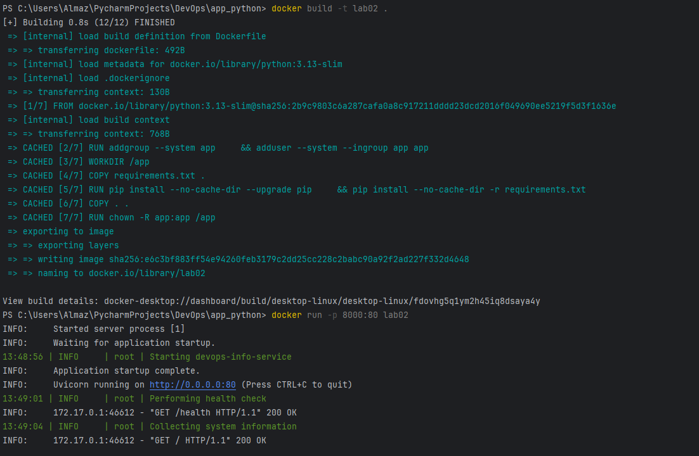
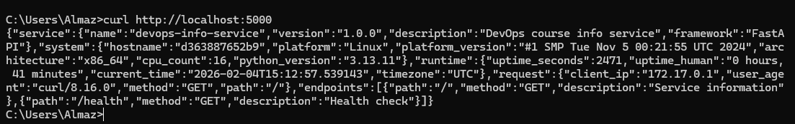
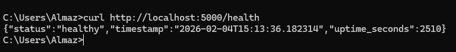

## Docker best practices

- Use a minimal base image (`python:3.13-slim`)
- Set working directory to `/app`
- Caching dependencies by copying only `requirements.txt` first
- Install dependencies in a single layer
- Using .dockerignore to exclude unnecessary files
- Expose only necessary port
- Create a non-root user to run the application
- Use `CMD` to specify the default command
- Using PYTHONDONTWRITEBYTECODE and PYTHONUNBUFFERED for better performance and logging
This layer sets the base image
```bash
FROM python:3.13-slim
````
This layer creates user and group
```bash
RUN addgroup --system app \
    && adduser --system --ingroup app app
```
This layer exposes port with environment variable
```bash
EXPOSE $APP_PORT
```

## Decisions 
- Base image `python:3.13-slim` is chosen for its small size and because python 3.13 is the latest stable version.
- Final size of the image is 143MB which is decent for a python application.
- Layer structure explanation:
  - Base image layer to get Python environment
  - Environment variables layer to setup variables
  - User creation layer to enhance security
  - Working directory layer to set context
  - Copy requirements layer for caching
  - Dependency installation layer for installing packages
  - Application code layer to copy the app code
  - Change to non-root user layer to run not as root
  - Expose port layer to make the app accessible
  - Command execution layer to run the app
- Optimizations used:
  - Caching dependencies by copying only `requirements.txt` first
  - PYTHONDONTWRITEBYTECODE environment used to prevent .pyc files
  - Caching dependencies in a separate layer to speed up builds 
## Build & Run Process



https://hub.docker.com/repository/docker/andiazdi/lab02
## Technical Analysis
### Why does your Dockerfile work the way it does?
The Dockerfile is works correctly because I used Docker best practices and optimized the layers
### What would happen if you changed the layer order?
It will affect caching, for example if I copy the entire application code before installing dependencies and update somehow code, all dependencies will be reinstalled.
Also, it could break the build
### What security considerations did you implement?
- Created a non-root user to run the application to limit permissions.
- Used a minimal base image to reduce the attack surface.
- Excluded unnecessary files using .dockerignore to hide sensitive data.
### How does .dockerignore improve your build?
It excludes unnecessary files and directories from the build context, reducing the size of the build context and speeding up the build process.
## Challenges & Solutions
I had problems with writing command to run program and using environment variables
I handle them by reading the output of the container
I learned how to correctly write Dockerfiles and how to optimize the container.