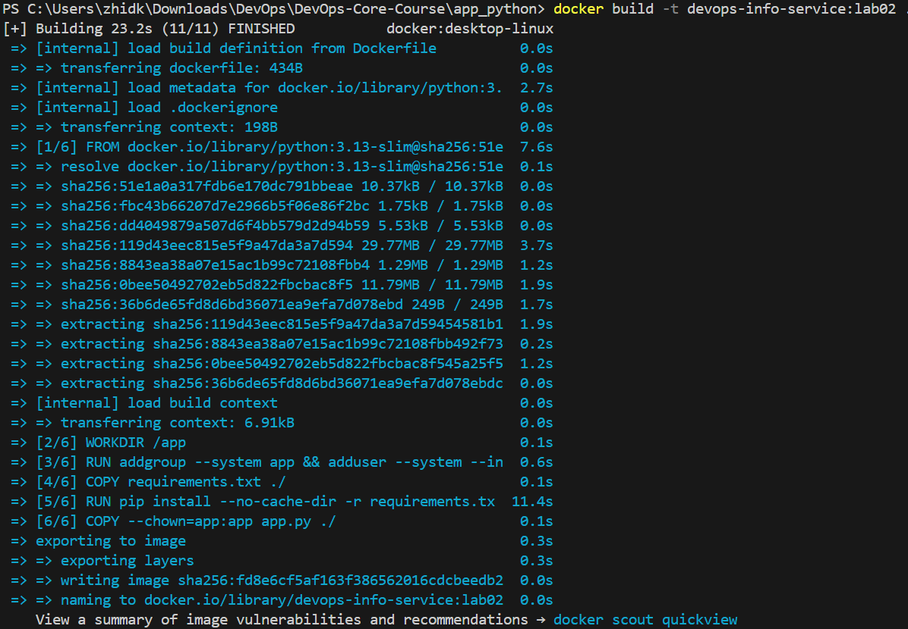
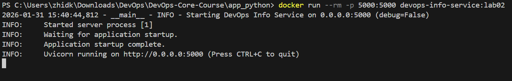
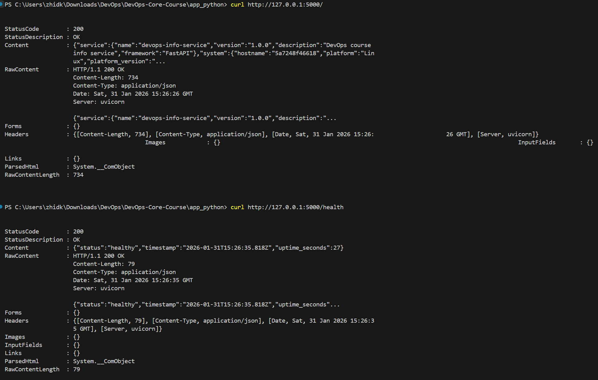
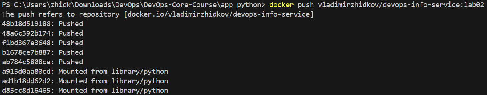

# LAB02 - Docker Containerization (Python)

## 1. Docker Best Practices Applied

1) Pinned base image (`python:3.13-slim`)
   - Why: predictable runtime and smaller footprint than full images.

2) Non-root user
   - Why: reduces container privilege and attack surface.

3) Layer caching for dependencies
   - `requirements.txt` is copied and installed before application code.
   - Why: dependency layers are reused when only code changes.

4) Minimal copy + .dockerignore
   - Only `requirements.txt` and `app.py` are copied.
   - `.dockerignore` excludes tests, docs, VCS, and virtualenvs.
   - Why: smaller build context, faster builds, smaller images.

5) Lean pip install
   - `--no-cache-dir` and `PIP_DISABLE_PIP_VERSION_CHECK=1`.
   - Why: avoids cache bloat and reduces noise.

### Dockerfile snippets

```dockerfile
FROM python:3.13-slim
```

Pinned slim image for smaller runtime.

```dockerfile
COPY requirements.txt ./
RUN pip install --no-cache-dir -r requirements.txt
```

Dependency install layer before code for caching.

```dockerfile
RUN addgroup --system app && adduser --system --ingroup app --home /home/app app
COPY --chown=app:app app.py ./
USER app
```

Creates and switches to a non-root user, ensuring app files are owned correctly.

## 2. Image Information & Decisions

- Base image: `python:3.13-slim`
  - Chosen for a balance of size and compatibility with Python wheels.
- Final image size: 156MB
  - Run `docker images` after build and record the size here.
- Layer structure (top to bottom):
  1. Base Python runtime
  2. Environment variables
  3. OS user creation
  4. Dependency install
  5. Application code copy
  6. Runtime user + CMD
- Optimization choices:
  - Minimal base image.
  - Single app file copied (no tests/docs).
  - Pip cache disabled.

## 3. Build & Run Process

### Build

```bash
docker build -t devops-info-service:lab02 .
```



### Run

```bash
docker run --rm -p 5000:5000 devops-info-service:lab02
```



### Test endpoints

```bash
curl http://127.0.0.1:5000/
curl http://127.0.0.1:5000/health
```

### Docker Hub

- Repository URL: https://hub.docker.com/r/vladimirzhidkov/devops-info-service
- Tagging strategy: `vladimirzhidkov/devops-info-service:lab02` (tag matches lab number).

```bash
docker push vladimirzhidkov/devops-info-service:lab02
```



## 4. Technical Analysis

1) Why the Dockerfile works:
   - Uses a compatible Python runtime and installs the exact dependencies.
   - Runs the same `app.py` entrypoint used locally.

2) Layer order impact:
   - If you copy the app before installing dependencies, any code change
     invalidates the cache and forces reinstalling packages, slowing builds.

3) Security considerations:
   - Non-root user prevents accidental privilege escalation.
   - Slim base image lowers attack surface.
   - No extra build tools installed in runtime image.

4) .dockerignore impact:
   - Reduces context size and speeds up Docker build.
   - Prevents accidental inclusion of dev files.

## 5. Challenges & Solutions

- No significant issues encountered.
- Verified build, run, and endpoint checks; Docker Hub push succeeded.
