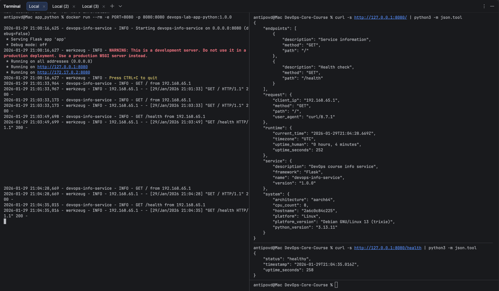

# LAB02 — Docker (devops-info-service)

## 1) Docker Best Practices Applied
### 1. Non-root user
**What I did:** created a dedicated user and switched to it using `USER`.  
**Why it matters:** if the service can run without privileges, switching away from root reduces the impact of a container breakout or a compromised process.
```dockerfile
RUN groupadd -g 10001 app && useradd -u 10001 -g 10001 -s /usr/sbin/nologin app
USER app
```

### 2. Layer caching / correct layer order
**What I did:** copied requirements.txt first, installed dependencies, and only after that copied application code.
**Why it matters:** Docker builds images layer-by-layer; when a layer changes, all following layers rebuild, so keeping “rarely changing” steps (deps) earlier speeds up rebuilds.
```dockerfile
COPY requirements.txt /app/requirements.txt
RUN pip install --no-cache-dir -r /app/requirements.txt
COPY app.py /app/app.py
```
### 3. .dockerignore usage
**What I did:** excluded dev artifacts (e.g., __pycache__, venv, .git, docs, tests) from build context.
**Why it matters:** .dockerignore removes matching files from the build context before it is sent to the builder, which improves build speed and reduces unnecessary context size.
```text
__pycache__/
*.py[cod]
venv/
.venv/
.git/
docs/
tests/
```
### 4. Pinned base image version
**What I did:** used a specific Python base image tag (example: python:3.13-slim).
**Why it matters:** Docker notes that image tags can be mutable; pinning reduces unexpected changes between builds and improves reproducibility.

## 2) Image Information & Decisions
Base image selection
- Chosen base image: python:3.13-slim
- Justification: 3.13-slim gives me a fixed major/minor Python line (3.13) while using the -slim variant, which is described as containing only the minimal Debian packages needed to run Python (i.e., smaller than the default python tag).

Final image size
- Image size: 46.16 MB
- Assessment: This is acceptable for a small info-service because it is based on a slim runtime image and includes only the Python runtime plus my dependencies.

Layer structure explanation
- My Dockerfile is structured so that the “dependency layer” is built before the “application layer”: first `COPY requirements.txt` + `RUN pip install` ..., and only then `COPY app.py`.
- This matters because Docker builds images layer-by-layer, and once a layer changes, all layers after it must be rebuilt; by isolating dependencies in earlier layers, changing `app.py` typically invalidates only the later “application” layers, making rebuilds faster.

Optimization choices made
- I used `pip install --no-cache-dir` so pip does not store its download cache inside the image layers, keeping the final image smaller.
- I copied only the runtime files (`requirements.txt` and `app.py`) instead of `COPY . .`, which reduces the build context and also avoids unnecessary cache invalidations when unrelated files (docs/tests) change; 
Docker also recommends excluding irrelevant files using .dockerignore.

## 3) Build & Run Process
Build output:
```terminaloutput
antipovd@Mac app_python % docker build -t devops-lab-app-python:1.0.0 .                         
[+] Building 1.4s (12/12) FINISHED                                                                                                                                                       docker:desktop-linux
 => [internal] load build definition from Dockerfile                                                                                                                                                     0.0s
 => => transferring dockerfile: 400B                                                                                                                                                                     0.0s 
 => [internal] load metadata for docker.io/library/python:3.13-slim                                                                                                                                      1.3s 
 => [auth] library/python:pull token for registry-1.docker.io                                                                                                                                            0.0s
 => [internal] load .dockerignore                                                                                                                                                                        0.0s
 => => transferring context: 225B                                                                                                                                                                        0.0s 
 => [1/6] FROM docker.io/library/python:3.13-slim@sha256:51e1a0a317fdb6e170dc791bbeae63fac5272c82f43958ef74a34e170c6f8b18                                                                                0.0s 
 => => resolve docker.io/library/python:3.13-slim@sha256:51e1a0a317fdb6e170dc791bbeae63fac5272c82f43958ef74a34e170c6f8b18                                                                                0.0s 
 => [internal] load build context                                                                                                                                                                        0.0s 
 => => transferring context: 63B                                                                                                                                                                         0.0s 
 => CACHED [2/6] WORKDIR /app                                                                                                                                                                            0.0s 
 => CACHED [3/6] COPY requirements.txt /app/requirements.txt                                                                                                                                             0.0s 
 => CACHED [4/6] RUN pip install --no-cache-dir -r /app/requirements.txt                                                                                                                                 0.0s 
 => CACHED [5/6] RUN groupadd -g 10001 app &&     useradd --no-log-init -m -u 10001 -g 10001 -s /usr/sbin/nologin app &&     chown -R app:app /app                                                       0.0s 
 => CACHED [6/6] COPY --chown=app:app app.py /app/app.py                                                                                                                                                 0.0s 
 => exporting to image                                                                                                                                                                                   0.0s 
 => => exporting layers                                                                                                                                                                                  0.0s 
 => => exporting manifest sha256:35eed0b6ce59e46fcd10b30b638a9a0f7addfd08e01a02218952fb498885e5d9                                                                                                        0.0s 
 => => exporting config sha256:0767cc16251909efabf6784b39b25df7818ef387629032407e0262e8db85ca01                                                                                                          0.0s 
 => => exporting attestation manifest sha256:899fc7441ba8f375bc3d556a6ef8b1152d24e27ad5daf684565cf96badfec0a2                                                                                            0.0s 
 => => exporting manifest list sha256:a2eddd4433b981230dbe29e106c0b6f0b61b1172cc2bbb28a96035dc41b2bcb0                                                                                                   0.0s 
 => => naming to docker.io/library/devops-lab-app-python:1.0.0                                                                                                                                           0.0s 
 => => unpacking to docker.io/library/devops-lab-app-python:1.0.0                                                                                                                                        0.0s                                             
```
Container run output:
```terminaloutput
antipovd@Mac app_python % docker run --rm -e PORT=8080 -p 8080:8080 devops-lab-app-python:1.0.0

2026-01-29 21:00:16,625 - devops-info-service - INFO - Starting devops-info-service on 0.0.0.0:8080 (debug=False)
 * Serving Flask app 'app'
 * Debug mode: off
2026-01-29 21:00:16,627 - werkzeug - INFO - WARNING: This is a development server. Do not use it in a production deployment. Use a production WSGI server instead.
 * Running on all addresses (0.0.0.0)
 * Running on http://127.0.0.1:8080
 * Running on http://172.17.0.2:8080
2026-01-29 21:00:16,627 - werkzeug - INFO
2026-01-29 21:01:33,964 - devops-info-service - INFO - GET / from 192.168.65.1
2026-01-29 21:01:33,967 - werkzeug - INFO - 192.168.65.1 - - [29/Jan/2026 21:01:33] "GET / HTTP/1.1" 200 -
```
Tests output:

Docker Hub repository URL: https://hub.docker.com/r/gghost1/devops-lab-app-python

## 4) Technical Analysis

- My Dockerfile works because `docker build` uses a **build context**, and instructions like `COPY` can only reference files that exist inside that context (e.g., `requirements.txt` and `app.py`).
- If I changed the layer order (for example, copying the whole project before installing dependencies), I would invalidate the cache more often: Docker builds images as layers, and once a layer changes, all following layers must be rebuilt.
- The main security considerations I implemented were using a minimal, trusted base image and switching to a non-root user with `USER`, which Docker recommends when the service does not require privileges.
- `.dockerignore` improves my build because the Docker build client looks for `.dockerignore` in the root of the context and removes matching files from the context before sending it to the builder, which improves build speed (especially with a remote builder).

## 5) Challenges & Solutions

- One issue I ran into was making sure the app still starts correctly after switching to a non-root user; I solved it by ensuring the application directory ownership/permissions were set before `USER app`.
- Another issue was understanding why builds sometimes felt “slow” even for small code changes; I verified caching behavior by keeping dependencies in earlier layers and using Docker’s guidance that cache invalidation forces downstream layers to rebuild.
- For debugging, I used practical checks like rebuilding with `--no-cache` when I wanted a clean rebuild and `--pull` when I wanted to ensure the latest base image was used, which matches Docker’s best-practice guidance for rebuild behavior.
- What I learned is that build performance depends heavily on build context size and layer ordering, and that `.dockerignore` plus correct caching strategy makes rebuilds predictable and faster.