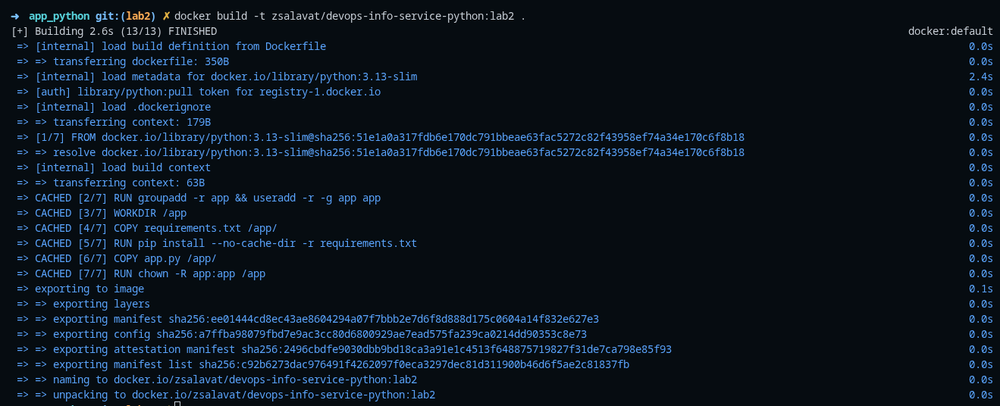
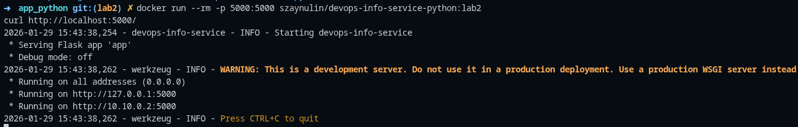

## 1. Docker Best Practices Applied
- **Non-root user**: `USER app`
- **Layer caching with proper order**
- **Minimal copy**
- **`.dockerignore`**
- **Logging and bytecode settings**
- **Expose runtime port**

## 2. Image Information & Decisions

- **Base image chosen**: `python:3.13-slim` small footprint with Debian base; better compatibility with many Python wheels compared to `alpine` (musl). Pins major/minor for reproducibility.
- **Final image size**: 182mb
- **Layer structure (conceptual)**:
  - Base: Python runtime
  - Env + user setup
  - `requirements.txt` copied, `pip install` layer
  - `app.py` copied
  - Ownership change and `USER app`
  - `EXPOSE` and `CMD`

---

## 3. Build & Run Process

### Build

### Run (pattern)

### Test endpoints

### Docker Hub repository URL
- URL: https://hub.docker.com/r/zsalavat/devops-info-service-python
---

## 4. Technical Analysis

### Why this Dockerfile works
It work because we create well typed Dockerfile, and after running it system using name spaces isolated place for running required app

### What changes in layer order would do
- if we change requirements installing and code running with places every time then we change code we will triger pip install.
- Skipping `chown` the app user might not read/execute files
- Copying the full repo later can take more time
### Security choices
- Run as a non-root user to limit damage if something goes wrong.
- Use the slim base image to reduce the number of packages
- Keep the command simple

### How `.dockerignore` helps
- Faster builds by sending a smaller context to the Docker daemon.
- More stable caching because irrelevant files don’t change the context checksum.
- Prevents accidental inclusion of dev artifacts, virtualenvs, `.git`, and docs.
- Avoids copying sensitive files into images by mistake.

## 5. Challenges & Solutions
No challenge in lab doing proccess.