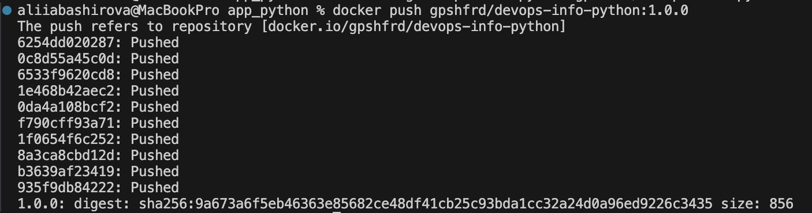
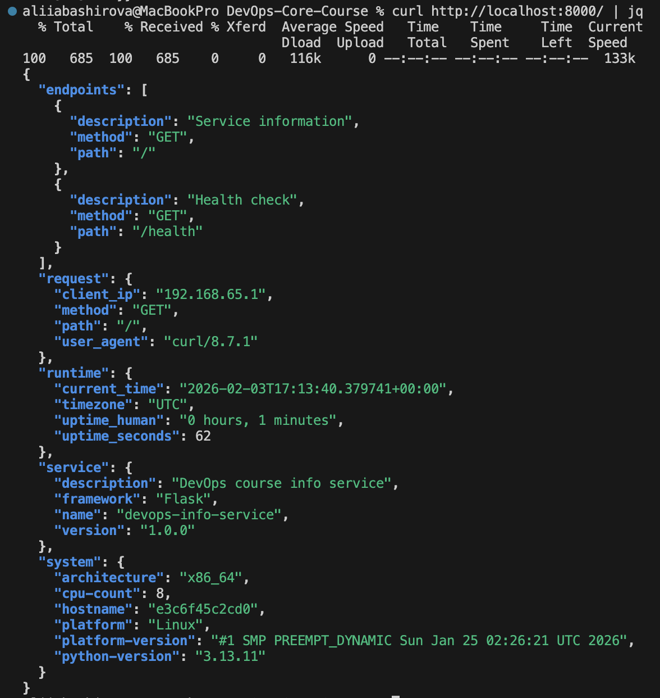
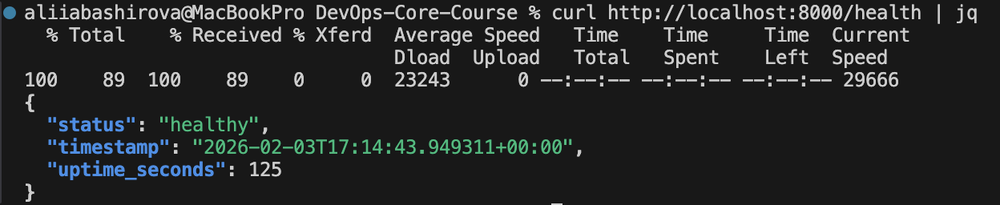

# Lab 2 - DevOps Info Service: Docker Containerization

## Docker Best Practices Applied
**Non-root user**
The container runs under a non-root user created inside the image, which reduces security risks by limiting container privileges in case of compromise.

**Layer caching**
`requirements.txt` is copied before application code to leverage Docker layer caching, which significantly speeds up rebuilds when application code changes, but dependencies do not.

## Image information and Decisions
Base image: python:3.13-slim
Reason: smaller image size comparing with full python image while keeping glibc compatibility.

Final image size: 182.36MB
Acceptable for a python service with external dependencies.

## Build and Run Processes
### Docker build

### Docker run

### Docker push

### Check

### Docker Hub URL
https://hub.docker.com/r/gpshfrd/devops-info-python

## Technical Analysis
### Why does your Dockerfile work the way it does?
The Dockerfile is written step by step so Docker can build the image correctly and efficiently.
A base image is chosen first, then the working directory is set. Dependencies are installed before copying the application code so Docker can reuse cached layers.
The application is started with a clear command, so the container always runs the same way.

### What would happen if you changed the layer order?
Docker uses caching.
If the source code is copied before installing dependencies, Docker will reinstall dependencies every time the code changes. This makes builds slower. Correct layer order helps Docker reuse layers and build images faster.

### What security considerations did you implement?
- The application runs as a non-root user
- A minimal base image is used
- Only necessary files are copied into the container

### How does .dockerignore improve your build?
`.dockerignore` prevents unnecessary files from being included in the Docker build, which makes the build faster, reduces image size, and avoids copying files that are not needed for running the app.

## Challenges and Solutions
Initially, I tried to launch the container using the wrong name of the local image. I was also a little confused with the port mapping, so curl returned connection errors.

When starting the container, I rechecked the name of the image with the tag (docker run -p 8000:5000 username/image:tag).
Also I checked port mapping between container and host to make sure endpoints were reachable.