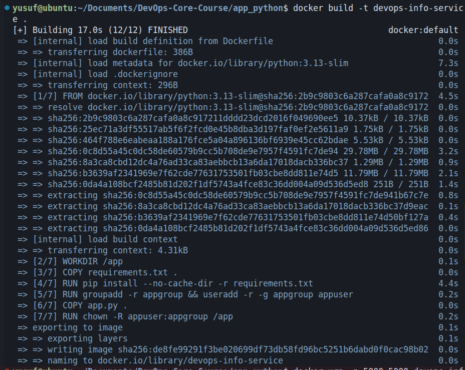
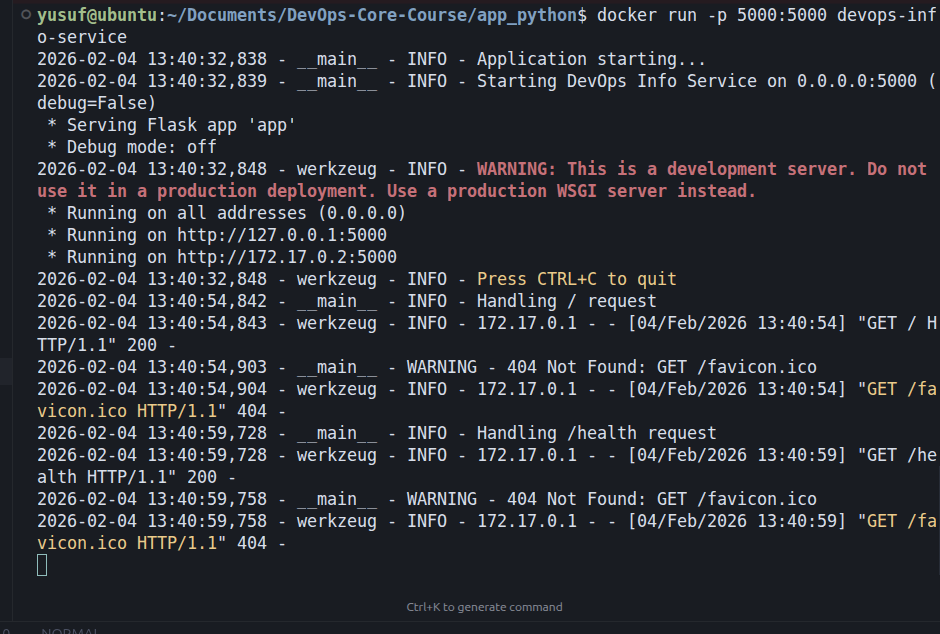
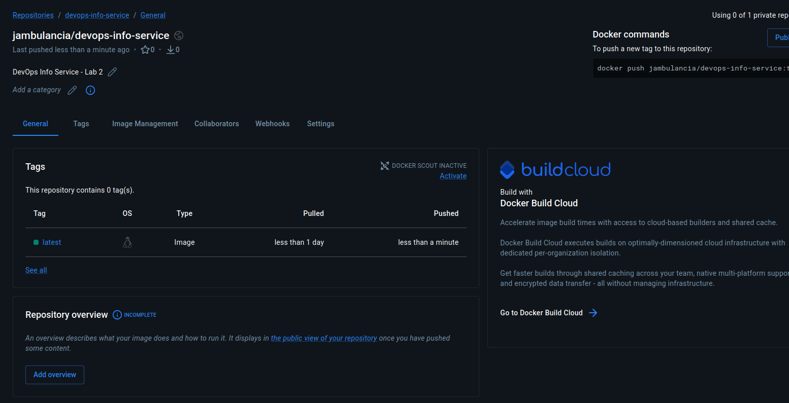
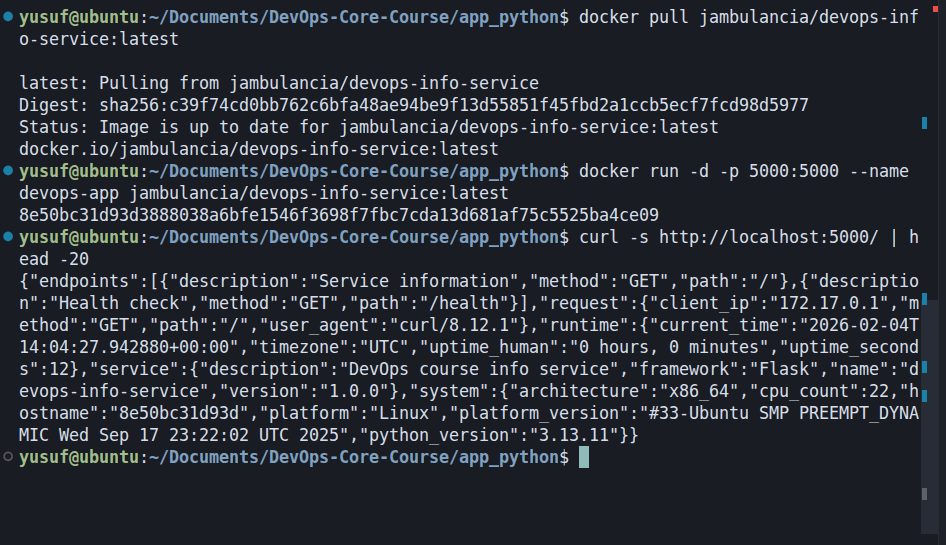

## LAB02 — Docker Containerization (Python)

### 1. Docker Best Practices Applied

#### Non-root user
- **What:** Created a dedicated `appuser` in `appgroup` and switched to it with `USER appuser`.
- **Why:** Running as root inside a container is a security risk. If the app is compromised, an attacker would have root access. Non-root users limit the blast radius and follow the principle of least privilege.

```dockerfile
RUN groupadd -r appgroup && useradd -r -g appgroup appuser
# ... copy files, chown ...
USER appuser
```

#### Specific base image version
- **What:** Use `python:3.13-slim` instead of `python:3` or `python:latest`.
- **Why:** Pinned versions ensure reproducible builds and avoid surprises when base images change. `slim` is smaller than the full image (no build tools, fewer packages) while still being easy to work with.

#### Layer ordering for caching
- **What:** Copy `requirements.txt` first, run `pip install`, then copy `app.py`.
- **Why:** Dependencies change less often than application code. Docker caches each layer; if only `app.py` changes, the `pip install` layer is reused, making rebuilds faster.

```dockerfile
COPY requirements.txt .
RUN pip install --no-cache-dir -r requirements.txt
COPY app.py .
```

#### Only copy necessary files
- **What:** Copy only `requirements.txt` and `app.py`; use `.dockerignore` to exclude the rest.
- **Why:** Smaller build context speeds up uploads to the Docker daemon. Fewer files in the image reduce attack surface and image size.

#### .dockerignore
- **What:** Exclude `__pycache__`, `venv`, `.git`, `docs`, `tests`, IDE configs, etc.
- **Why:** These files are not needed at runtime and would bloat the build context and potentially the image. Excluding them speeds up builds and keeps images lean.

#### PYTHONDONTWRITEBYTECODE and PYTHONUNBUFFERED
- **What:** Set `ENV PYTHONDONTWRITEBYTECODE=1 PYTHONUNBUFFERED=1`.
- **Why:** Avoid writing `.pyc` files and buffer stdout/stderr so logs appear immediately in `docker logs`.

---

### 2. Image Information & Decisions

| Decision | Choice | Justification |
|----------|--------|---------------|
| Base image | `python:3.13-slim` | Latest stable Python, slim variant for smaller size without sacrificing compatibility |
| Final image size | ~150–180 MB | Typical for python:3.13-slim + Flask; acceptable for a dev/lab service |
| Layer structure | Base → deps → user → app → USER | Dependencies first for cache, user setup before app copy, USER last |

**Optimization choices:**
- `--no-cache-dir` with pip to avoid keeping package cache in the image
- Minimal COPYs (only `requirements.txt` and `app.py`)
- No build tools or unnecessary packages

---

### 3. Build & Run Process

**Build:**

```bash
cd app_python
docker build -t devops-info-service .
```



**Run container:**

```bash
docker run -d -p 5000:5000 --name devops-app devops-info-service
```



**Test endpoints:**

```bash
curl http://localhost:5000/
curl http://localhost:5000/health
```

**Docker Hub:**



**Pull and run from Docker Hub** (verifies image is publicly accessible):

```bash
docker pull jambulancia/devops-info-service:latest
docker run -d -p 5000:5000 --name devops-app jambulancia/devops-info-service:latest
curl http://localhost:5000/health
```



**Repository URL:** https://hub.docker.com/r/jambulancia/devops-info-service

**Tagging strategy:** Image tagged as `jambulancia/devops-info-service:latest` — `latest` for the current stable build; version tags (e.g. `1.0.0`) can be added later for releases.

---

### 4. Technical Analysis

**Why does the Dockerfile work this way?**
- The app binds to `0.0.0.0` (all interfaces) by default, so it is reachable from outside the container.
- Port 5000 is exposed; `-p 5000:5000` maps host 5000 to container 5000.
- The `USER` directive ensures the process runs as `appuser`, not root.

**What if layer order changed?**
- If we copied `app.py` before `pip install`, any code change would invalidate the cache for `pip install`, forcing a full reinstall on every build.
- Putting `USER` before `COPY` would cause permission errors unless we copy as root and then chown (which we do).

**Security considerations:**
- Non-root user reduces impact of container escape or app compromise.
- Minimal base image and fewer files shrink the attack surface.
- No secrets or credentials in the image.

**How does .dockerignore improve the build?**
- Reduces the amount of data sent to the Docker daemon during `docker build`.
- Avoids including `.git`, `venv`, or other large/unnecessary directories.
- Faster builds and cleaner images.

---

### 5. Challenges & Solutions

**Challenge:** Ensuring the app listens on `0.0.0.0` inside the container.
- **Solution:** The app already uses `HOST = os.getenv("HOST", "0.0.0.0")`, so it binds to all interfaces by default. No change needed.

**Challenge:** Non-root user and file ownership.
- **Solution:** Create the user, copy files as root, run `chown -R appuser:appgroup /app`, then `USER appuser` so the app can read its files.

**Challenge:** Keeping the image small.
- **Solution:** Use `python:3.13-slim`, `--no-cache-dir` for pip, and `.dockerignore` to exclude dev artifacts.
