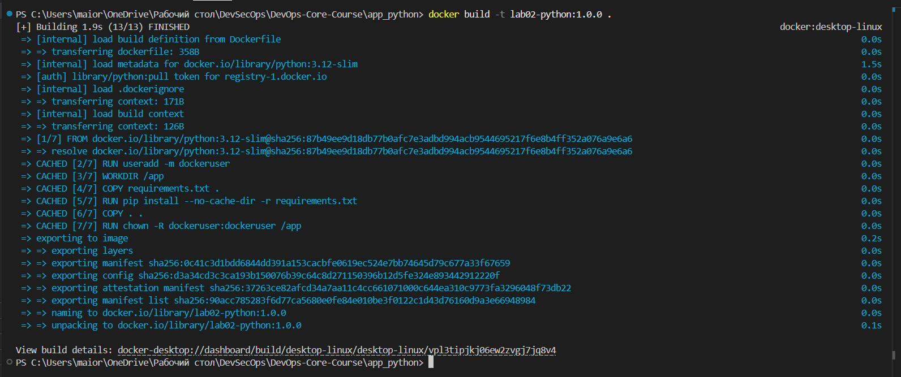
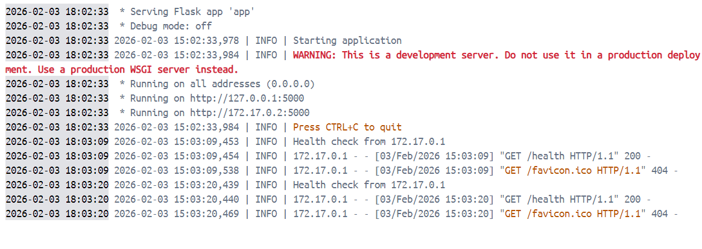
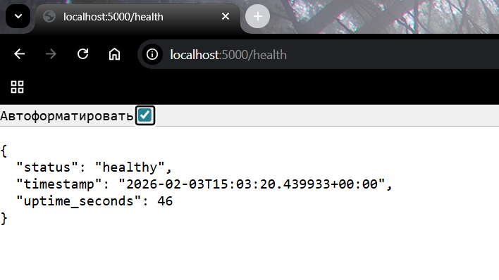

# LAB02 — Docker Containerization

## 1. Docker Best Practices Applied

### Non-root user

The container runs under a non-root user instead of the default root user. This significantly improves security because even if an attacker gains access to the container, they will not have full administrative privileges.

In the Dockerfile, a dedicated user is created and activated using the `USER` directive. This follows Docker security best practices and reduces the potential impact of vulnerabilities.

### Specific base image version

The image is based on `python:3.12-slim`. Using a specific version instead of `latest` ensures build reproducibility and prevents unexpected breaking changes when the base image is updated.

The `slim` variant was chosen because it provides a good balance between minimal size and compatibility with Python dependencies.

### Layer caching optimization  

Dependencies are installed before copying the application source code. This allows Docker to reuse cached layers when only the application code changes, which significantly speeds up rebuilds during development.

### .dockerignore usage 

A `.dockerignore` file is used to exclude unnecessary files such as virtual environments, Git metadata, cache files, and IDE configuration. This reduces the build context size, speeds up the build process, and helps keep the final image smaller and cleaner.

---

## 2. Image Information & Decisions

### Base image choice

The base image used is `python:3.12-slim`.

**Justification:**

* Matches the Python version used during local development
* Smaller image size compared to full Python images
* Official image with regular security updates

### Final image size

The final image size is approximately **42.68 MB**, which is acceptable for a Python web application with Flask and demonstrates reasonable optimization.

### Layer structure

The image layers are structured as follows:

1. Base Python image
2. System setup and non-root user creation
3. Dependency installation (`requirements.txt`)
4. Application source code

This structure maximizes cache reuse and minimizes rebuild time.

### Optimization choices

* Used `python:slim` instead of a full image
* Excluded unnecessary files using `.dockerignore`
* Installed only required dependencies

---

## 3. Build & Run Process

### Build process

The image was built locally using Docker. Below is the terminal output from the build process:



### Run process

The container was started with port mapping so the service is accessible from the host:

```bash
$ docker run -p 5000:5000 lab02-python:1.0.0
```


### Endpoint testing

The application endpoints were tested using browser:



### Docker Hub

The image was pushed to Docker Hub and is publicly available:

**Repository URL:**

```
https://hub.docker.com/r/daniil20xx/lab02-python
```

---

## 4. Technical Analysis

### Dockerfile behavior

The Dockerfile works by first preparing a secure and minimal runtime environment, then installing dependencies, and finally copying the application code. This ensures both security and efficiency.

### Layer order importance

If the application code were copied before installing dependencies, any code change would invalidate the cache and force dependency reinstallation, significantly slowing down rebuilds.

### Security considerations

* The container does not run as root
* Uses an official Python base image
* Minimal image size reduces attack surface

### .dockerignore benefits

By excluding unnecessary files from the build context, `.dockerignore` improves build speed, reduces image size, and prevents accidental inclusion of sensitive or irrelevant files.

---

## 5. Challenges & Solutions

### Issue: Port not accessible

Initially, the application was not accessible from the host machine because the container port was not correctly mapped.

**Solution:**
The issue was resolved by explicitly mapping the container port to the host port using the `-p` option in `docker run`.

### Learning outcome

Through this lab, I gained a deeper understanding of Dockerfile structure, image optimization, security best practices, and the full workflow of building, running, and publishing Docker images.
