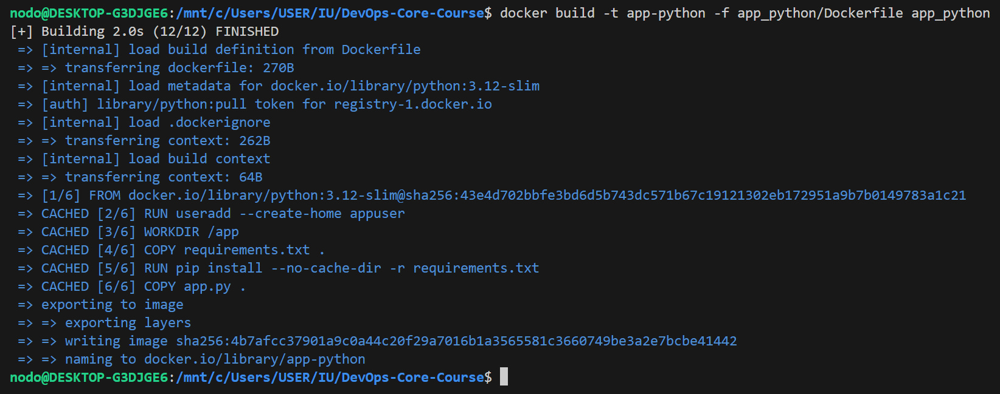
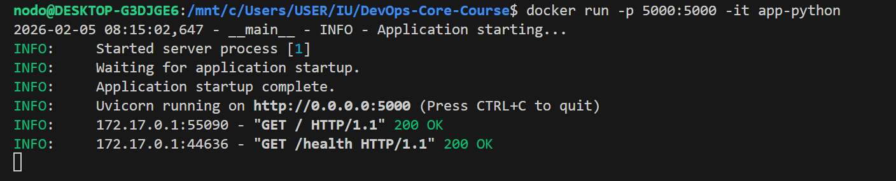

# LAB02 — Docker Containerization

## Docker Best Practices Applied

### Non-root User
The container runs using a non-root user created during the build process.

Why it matters:
Running containers as non-root reduces security risks and limits the impact of a potential container compromise.

Dockerfile snippet:
```dockerfile
RUN useradd --create-home appuser
USER appuser
```

### Layer Caching
Dependency files are copied before application code to leverage Docker layer caching.

Why it matters:
This avoids reinstalling dependencies when only application code changes, resulting in faster rebuilds.

Dockerfile snippet:
```dockerfile
COPY requirements.txt .
RUN pip install --no-cache-dir -r requirements.txt
```

### .dockerignore Usage

A .dockerignore file excludes unnecessary files such as virtual environments, cache files, tests, and documentation.

Why it matters:
Reducuces build context size, speeds up builds, and prevents leaking development artifacts into the image.

## Image Information & Decisions

### Base Image Choice
The image uses python:3.12-slim.

Justification:

* Slim images are smaller and more secure than full images

* Better compatibility than alpine images

* Explicit version ensures reproducible builds

### Image Size

Final image size is approximately 144 MB.

Assessment:
The image size is reasonable for a Python application and avoids unnecessary layers and files.

### Layer Structure

* Base Python image

* User creation

* Dependency installation

* Application code copy

* Runtime execution

This structure optimizes caching and rebuild speed.

## Build & Run Process

Build Output



Run Output


### Docker Hub

Repository URL:

https://hub.docker.com/repository/docker/tailrot/app-python/general

## Technical Analysis
### Why This Dockerfile Works

The Dockerfile installs dependencies before copying application code, runs as a non-root user, and uses a slim base image for efficiency.

### Effect of Changing Layer Order

If application files were copied before installing dependencies, any code change would invalidate the dependency cache and slow down rebuilds.

### Security Considerations

* Non-root user execution

* Minimal base image

* No unnecessary files copied into the container

### Role of .dockerignore

The .dockerignore file reduces build context size and prevents unnecessary files from being included in the image.

## Challenges & Solutions
### Challenges

* Understanding Docker layer caching

* Correctly excluding files using .dockerignore

### Solutions

* Reordered Dockerfile layers to optimize caching

* Iteratively refined .dockerignore based on build context size

### Lessons Learned

This lab demonstrated how Dockerfile structure, security practices, and image optimization significantly affect container performance and safety.