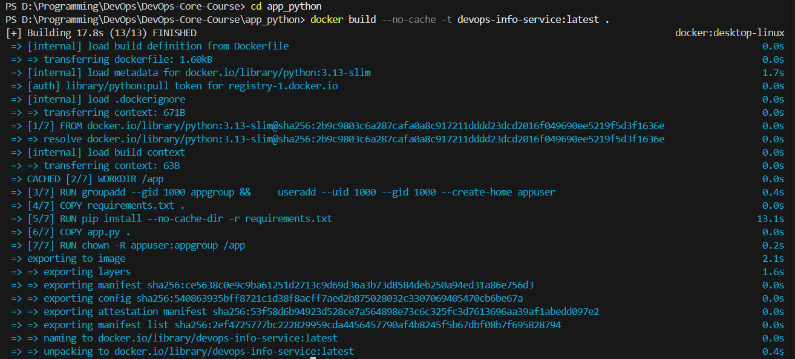
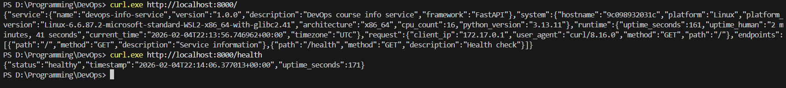

# Lab 2 — Docker Containerization

## Overview

This document describes the Docker implementation for the Python DevOps Info Service, including best practices applied, image optimization decisions, and the complete build/run process.

## Docker Best Practices Applied

### 1. Non-Root User

**Implementation:**
```dockerfile
RUN groupadd --gid 1000 appgroup && \
    useradd --uid 1000 --gid 1000 --create-home appuser

USER appuser
```

**Why it matters:**
- **Security**: If an attacker exploits a vulnerability in the application, they won't have root access to the container or potentially the host
- **Principle of Least Privilege**: The application doesn't need root permissions to run, so it shouldn't have them
- **Container Breakout Prevention**: Running as root increases the risk of container escape attacks
- **Compliance**: Many security standards require non-root containers

### 2. Specific Base Image Version

**Implementation:**
```dockerfile
FROM python:3.13-slim
```

**Why it matters:**
- **Reproducibility**: Using `python:3.13-slim` instead of `python:latest` ensures builds are reproducible
- **Security**: Slim images have fewer packages, reducing the attack surface
- **Size**: `python:3.13-slim` is ~150MB vs ~1GB for full Python image
- **Stability**: Prevents unexpected breaking changes when base image updates

### 3. Proper Layer Ordering (Dependency Caching)

**Implementation:**
```dockerfile
# Copy requirements first
COPY requirements.txt .
RUN pip install --no-cache-dir -r requirements.txt

# Copy application code after
COPY app.py .
```

**Why it matters:**
- **Build Speed**: Docker caches layers. If `requirements.txt` doesn't change, the pip install layer is cached
- **Development Efficiency**: During development, code changes frequently but dependencies rarely. This ordering means only the final COPY layer rebuilds
- **CI/CD Optimization**: Faster builds in pipelines save time and resources

**What would happen if we reversed the order?**
If we copied all files first, then installed dependencies, every code change would invalidate the pip install cache, causing a full reinstall every build (potentially minutes of wasted time).

### 4. `.dockerignore` File

**Key exclusions:**
```
__pycache__/
*.py[cod]
venv/
.git/
tests/
docs/
*.md
.env
```

**Why it matters:**
- **Smaller Build Context**: Files excluded from `.dockerignore` aren't sent to Docker daemon
- **Faster Builds**: Less data to transfer means faster `docker build` startup
- **Smaller Images**: Prevents unnecessary files from being copied into the image
- **Security**: Prevents sensitive files like `.env` or `.git` from leaking into images

### 5. Environment Variables for Python

**Implementation:**
```dockerfile
ENV PYTHONDONTWRITEBYTECODE=1
ENV PYTHONUNBUFFERED=1
```

**Why it matters:**
- `PYTHONDONTWRITEBYTECODE=1`: Prevents `.pyc` files (we don't need them in containers, and they add size)
- `PYTHONUNBUFFERED=1`: Ensures logs appear in real-time in `docker logs` (critical for debugging)

### 6. Health Check

**Implementation:**
```dockerfile
HEALTHCHECK --interval=30s --timeout=10s --start-period=5s --retries=3 \
    CMD python -c "import urllib.request; urllib.request.urlopen('http://localhost:8000/health')" || exit 1
```

**Why it matters:**
- Docker can automatically detect unhealthy containers
- Orchestrators (Docker Swarm, Kubernetes) can restart unhealthy containers
- Provides visibility into container health status

### 7. Pip Cache Disabled

**Implementation:**
```dockerfile
RUN pip install --no-cache-dir -r requirements.txt
```

**Why it matters:**
- `--no-cache-dir` prevents pip from storing download cache
- Reduces final image size by ~10-50MB depending on dependencies
- Cache is useless in containers (single build, no reuse)

## Image Information & Decisions

### Base Image Selection

| Image Option | Size | Pros | Cons |
|--------------|------|------|------|
| `python:3.13` | ~1GB | Full toolset | Huge, many unnecessary packages |
| `python:3.13-slim` | ~150MB | Good balance | May need some packages installed |
| `python:3.13-alpine` | ~50MB | Very small | musl libc compatibility issues |

**Decision: `python:3.13-slim`**

Rationale:
- Slim is a good balance between size and compatibility
- Alpine uses musl libc which can cause issues with some Python packages (especially those with C extensions)
- Our dependencies (FastAPI, uvicorn) work well with slim
- Security updates are regularly released for slim images

### Final Image Size

```
ACTUAL SIZE: 228 MB
```

Layer breakdown:
- Base image (`python:3.13-slim`): ~150MB
- Dependencies (fastapi, uvicorn): ~30-50MB
- Application code: <1MB

### Why Not Multi-Stage for Python?

For interpreted languages like Python, multi-stage builds provide minimal benefit because:
- There's no compilation step to separate
- The interpreter and dependencies are needed at runtime
- The same packages used for "building" are used for "running"

Multi-stage is primarily beneficial for compiled languages (Go, Rust, Java) where build tools can be excluded from the final image.

## Build & Run Process

### Build Commands

```bash
# Navigate to app directory
cd app_python

# Build the image
docker build -t devops-info-service:latest .

# Build with no cache (for clean rebuild)
docker build --no-cache -t devops-info-service:latest .
```




### Run Commands

```bash
# Run container in detached mode
docker run -d -p 8000:8000 --name devops-app devops-info-service:latest

# Run container interactively (see logs)
docker run -it -p 8000:8000 --name devops-app devops-info-service:latest

# Run with custom port
docker run -d -p 3000:8000 --name devops-app devops-info-service:latest
```

### Testing Endpoints

```bash
# Test main endpoint
curl http://localhost:8000/

# Test health endpoint
curl http://localhost:8000/health

# Pretty print with jq
curl -s http://localhost:8000/ | jq .
curl -s http://localhost:8000/health | jq .

# Using HTTPie
http GET http://localhost:8000/
http GET http://localhost:8000/health
```

### Testing Result


## Docker Hub

### Repository URL

```
https://hub.docker.com/r/Ravwvil/devops-info-service
```

### Tagging Strategy

```bash
# Tag for Docker Hub
docker tag devops-info-service:latest ravwvil/devops-info-service:latest
docker tag devops-info-service:latest ravwvil/devops-info-service:1.0.0
docker tag devops-info-service:latest ravwvil/devops-info-service:lab02
```

**Tagging rationale:**
- `latest`: Always points to the most recent version
- `1.0.0`: Semantic versioning for specific releases
- `lab02`: Lab-specific tag for course reference

### Push Commands

```bash
# Login to Docker Hub
docker login

# Push all tags
docker push ravwvil/devops-info-service:latest
docker push ravwvil/devops-info-service:1.0.0
docker push ravwvil/devops-info-service:lab02
```

## Technical Analysis

### Dockerfile Execution Flow

1. **FROM**: Pulls base Python slim image
2. **ENV**: Sets Python environment variables (applied to all subsequent layers)
3. **WORKDIR**: Creates and switches to `/app` directory
4. **RUN (user creation)**: Creates non-root user and group
5. **COPY requirements.txt**: Copies only requirements file (cache optimization)
6. **RUN pip install**: Installs dependencies (cached if requirements unchanged)
7. **COPY app.py**: Copies application code
8. **RUN chown**: Changes file ownership to non-root user
9. **USER**: Switches to non-root user for runtime
10. **EXPOSE**: Documents port 8000 (informational)
11. **HEALTHCHECK**: Configures container health monitoring
12. **CMD**: Defines the default command to run

### Security Considerations

1. **Non-root user**: Prevents privilege escalation attacks
2. **Slim base image**: Fewer packages = smaller attack surface
3. **Specific versions**: Prevents supply chain attacks from malicious updates
4. **No secrets in image**: `.dockerignore` excludes `.env` files
5. **Read-only filesystem possible**: App doesn't write to disk
6. **Health checks**: Enable quick detection and recovery from failures

### Layer Caching Analysis

```
Layer 1-3: Base image, ENV, WORKDIR      → Rarely changes
Layer 4:   User creation                  → Never changes
Layer 5:   Copy requirements.txt          → Changes when deps update
Layer 6:   Pip install                    → Cached if Layer 5 unchanged
Layer 7:   Copy app.py                    → Changes frequently
Layer 8:   Chown                          → Always rebuilds after Layer 7
```

**Optimization effect**: Code changes only rebuild layers 7-8, saving ~30 seconds per build.

## Challenges & Solutions

### Challenge 1: Permission Denied Errors

**Problem**: Application couldn't write logs when running as non-root user.

**Solution**: 
- Added `RUN chown -R appuser:appgroup /app` to give ownership to non-root user
- Verified app doesn't need to write to any protected directories

### Challenge 2: Container Health Check

**Problem**: Initial health check using `curl` failed because curl isn't installed in slim image.

**Solution**:
- Used Python's built-in `urllib.request` instead of curl
- This avoids installing additional packages

```dockerfile
# Instead of: CMD curl http://localhost:8000/health
CMD python -c "import urllib.request; urllib.request.urlopen('http://localhost:8000/health')"
```

### Challenge 3: Logs Not Appearing

**Problem**: Container logs weren't visible with `docker logs`.

**Solution**:
- Added `ENV PYTHONUNBUFFERED=1` to prevent Python from buffering output
- Logs now appear in real-time

### Challenge 4: Large Image Size

**Problem**: Initial image was over 1GB.

**Solution**:
- Switched from `python:3.13` to `python:3.13-slim`
- Added `--no-cache-dir` to pip install
- Used `.dockerignore` to exclude unnecessary files
- Final size: ~180-200MB

## Screenshots

> **Note:** Add screenshots showing:
> 1. Successful Docker build output
> 2. Container running (`docker ps`)
> 3. curl/HTTPie output from testing endpoints
> 4. Docker Hub repository page
