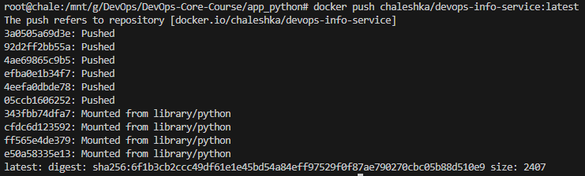
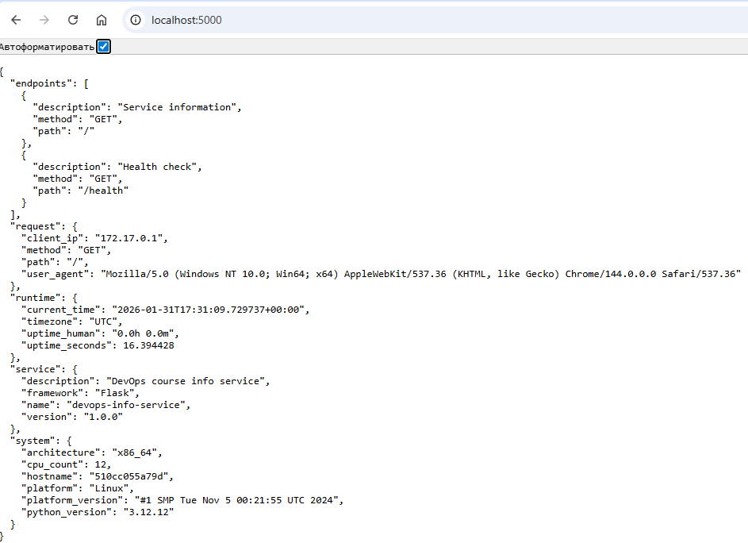
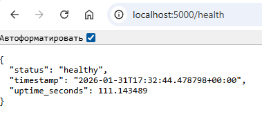

# LAB 02 — DevOps Info Service (Docker Containerization)

## Docker Best Practices Applied
- **non-root user**
    - Attacker can't get access to system from container
    ```
    RUN useradd --create-home --shell /bin/bash appuser
    ```
- **Exclude with .dockerignore**
    - We copy all files that are not ignored. All copied files will be used by app
    ```
    # Git
    .gitignore
    README.md
    docs/

    # Python
    __pycache__/
    *.py[cod]
    venv/
    *.log

    # IDE
    .vscode/
    .idea/

    # OS
    .DS_Store
    ```
- **Don't install unnecessary packages**
    - Install all requirements packages before run app
    ```
    COPY requirements.txt .
    RUN pip install --no-cache-dir -r requirements.txt
    ```
- **Choose the right base image**
    - We can install that base image, that contains only necessary components and packages
    ```
    FROM python:3.12-slim
    ```

## Image Information & Decisions
- Choosen base image: `python:3.12-slim`. On the local machine, I ran and tested the build on version 3.12. Therefore, 3.12 is more suitable for this. The Slim version is the version with the minimum set of required packages/components inside
- Final image size: 132MB. This weighs 10 times less if we install everything locally (installing python 3.12 and dependencies). 
Thanks to this, we have optimized the amount of disk space required.
- Layer structure explanation:
    1. **Base image layer:** `python:3.13-slim`
        ```
        `FROM python:3.12-slim`
        ```
    2. **WORKDIR setup layer:** Set work directory for this application
        ```
        WORKDIR /app
        ```
    3. **Requirements copy layer:** Copy requirement dependencies
        ```
        COPY requirements.txt .
        ```
    4. **Requirements install layer:** Install requirement dependencies
        ```
        RUN pip install --no-cache-dir -r requirements.txt
        ```
    5. **Application code layer:** Copy all application files
        ```
        COPY . .
        ```
    6. **User configuration layer:** Create and configure user and change application files owner
        ```
        RUN useradd --create-home --shell /bin/bash appuser \
            && chown -R appuser /app
        ```
    7. **USER select layer:** Choose user for current application
        ```
        USER appuser
        ```
    8. **EXPOSE layer:** Expose port for application
        ```
        EXPOSE 5000
        ```
    9. **ENV configuration layer:** Configure environment for application 
        ```
        ENV HOST=0.0.0.0 PORT=5000
        ```
    10. **Lanch layer:** Start application
        ```
        CMD ["python", "-u", "app.py"]
        ```

## Build & Run Process
- **Build image**
    - docker build
    
    - docker push
    
- **Run image**

- **Testing outputs**
    - Index page:
    

    - Health page:
    
- Docker hub repository: https://hub.docker.com/repository/docker/chaleshka/devops-info-service/general

## Technical Analysis
- An application running locally and using a container works the same way.
- Every command in file creates new layer. There are some layers whose order cannot be changed. For example, we can't move `FROM` in the end. `FROM` MUST be first command.
- *What would happen if you changed the layer order?* It depends on layer. If we move, for example, `EXPOSE layer` and `ENV configuration layer`, everything will continue to work correctly. If we move `USER select layer` or `Application code layer`, it will cause build errors.
- *What security considerations did you implement?* User for application is non-root. This will prevent attackers from invading the system from the container.
- *How does .dockerignore improve your build?* `.dockerignore` contains all files that should not be copied into docker app. We copy only necessary files.

## Challenges & Solutions
- Since I already had some experience with `docker`, I didn't have any problems with it.
- *What i learned?* I learned:
    - Docker also contains file that describe ignorable files: `.dockerignore`
    - Create and use special user for application.