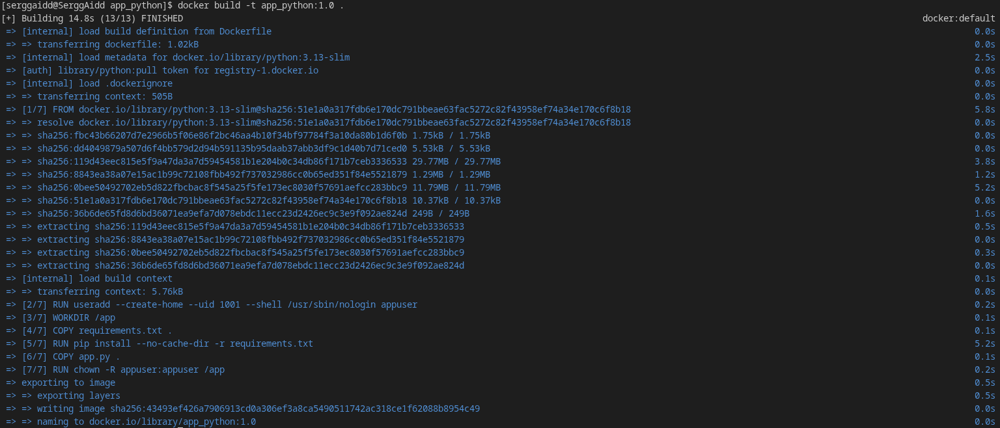
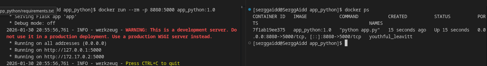
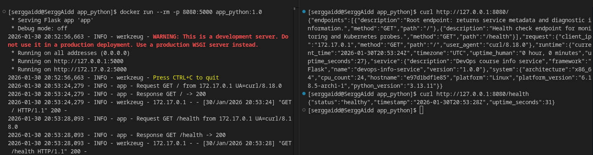

# LAB02 — Docker Containerization (app_python)

This document describes the **Python/Flask** implementation of **DevOps Info Service** for Lab 01.  
The service is a small HTTP JSON API that exposes system/runtime/request metadata and a health check endpoint.

---

## Best Practices Applied
### 1) Base image pin and minimal base
**Example**
```dockerfile
FROM python:3.13-slim
```

**Why it matters**
- "Pinning" the version makes the build reproducible: you'll get the same environment today and in a month.
- `-slim` is significantly smaller than the "full" image, then faster pull/push, smaller attack surface.

### 2) Non-root runtime
**Example**
```dockerfile
RUN useradd --create-home --uid 1001 --shell /usr/sbin/nologin appuser
...
USER appuser
```

**Why it matters**
- If a process in a container is compromised, the attacker will not gain root privileges.
- Important for Kubernetes/PodSecurity (root containers are often prohibited by policy)

### 3) Correct layer order (layer caching)
**Example**
First, `requirements.txt` is copied and dependencies are installed, and only then the code is copied:
```dockerfile
COPY requirements.txt .
RUN pip install --no-cache-dir -r requirements.txt

COPY app.py .
```

**Why it matters**
- Docker caches layers.
- If only `app.py` changes, the build runs faster because the dependency layer is reused.

### 4) Installing dependencies is done with `--no-cache-dir`
**Example**
```dockerfile
RUN pip install --no-cache-dir -r requirements.txt
```

**Why it matters**
- The cache increases the final image size and is not required at runtime.
- Faster delivery due to a smaller file size.
- Smaller attack surface.

### 5) `.dockerignore` file
**Example**

Added `.dockerignore`..

**Why it matters**
- The build context is smaller, meaning faster builds.
- The risk of leaking sensitive files (e.g., .env) is reduced if they are accidentally stored in the directory.

## Image Information & Decisions
### Base image
`python:3.13-slim` was selected:
- Sufficiently "complete" for most Python web apps;
- Significantly smaller than the full `python:3.13`;
- Compatible with most wheel packages and the glibc environment (unlike Alpine/musl, which sometimes have build/dependency compatibility issues).

### Final image size and assessment
**Final image size:** 129 MB.

**Assessment:** For a Python web application based on python:3.13-slim, this is a reasonable size because the image includes not only my code but also the Python interpreter and system libraries. This size ensures fast pull/push and a smaller attack surface compared to a "full" python:3.13 image (around 1 GB).

### Layer structure
1. `FROM python:3.13-slim` — minimal base
2. `ENV ...` — configure Python behavior in the container.
3. `RUN useradd ...` — create an unprivileged user
4. `WORKDIR /app` — working directory.
5. `COPY requirements.txt` — depends on (cached layer)
6. `RUN pip install ...` — install dependencies
7. `COPY app.py .` — copy application code.
8. `RUN chown -R appuser:appuser /app` — directory and file permissions
9. `USER appuser` — run as an unprivileged user.
10. `EXPOSE 5000` — document the port
11. `CMD["python", "app.py"]` — start command

### Optimization Choices:
>This section almost completely replicates the Best Practices guidelines, so key patterns will be described here

- The minimum required for the application to work is used (a slim image is used, only the necessary files are copied, the cache is cleared)
- The correct layer order eliminates unnecessary actions (no reinstallation of dependencies, etc.)


## Build & Run Process

- Complete terminal output from build process: 
- Terminal output showing container running: 
- Terminal output from testing endpoints (curl/httpie): 
- Docker Hub repository URL: https://hub.docker.com/repository/docker/sergey173/app_python


## Technical Analysis
1. **Why does your Dockerfile work the way it does?**

    **Answer:** Because it pins the runtime environment (base image + dependencies), uses efficient layer caching, and runs the app as a non-root user, which makes the container reproducible, faster to rebuild, and safer to run.

2. **What would happen if you changed the layer order?**

    **Answer:** This is a complex question, depending on what you're changing. I'll give a couple of examples.
    - If I copied the application code before installing dependencies, any code change would invalidate the cache and force pip to reinstall dependencies on every build, making rebuilds much slower (bad for CI/CD).
    - If I switched to a non-root user too early, I could run into file permission issues (e.g., the app might not be able to write files under /app if ownership/permissions were not set correctly).
    - If I moved ENV instructions to the very end, the app would still work, but it could reduce caching efficiency depending on what changes, and the Dockerfile would be less structured. ENV variables are meant to define runtime behavior early and clearly.

3. **What security considerations did you implement?**

    **Answer:** 
    - Run as non-root user (USER appuser) to reduce impact if the application is compromised.
    - Use a minimal base image (python:3.13-slim) to reduce attack surface and vulnerability exposure compared to full images.
    - Avoid pip cache in the final image (--no-cache-dir) to keep the image smaller and reduce unnecessary files.
    - Use .dockerignore to avoid accidentally shipping development artifacts or secrets into the build context/image.

4. **How does `.dockerignore` improve your build?**

    **Answer:** This file reduces build context and the risk of using unnecessary files and secrets during the build.
---

## Challenges & Solutions

### 1) BuildKit/buildx on Arch
**Problem:** I encountered a problem where `DOCKER_BUILDKIT=1` didn't work due to a buildx call/break.

**Solution:** Install `docker-buildx` or build using the legacy builder (without `--check`).

### 2) Unexpected requests in logs
**Problem:** When launching a containerized application, regular requests to a non-existent endpoint appeared in the logs.

**Solution:** Using diagnostics (command `sudo lsof -nP -iTCP:8080 -sTCP:ESTABLISHED`) it was revealed that the problem was not in the container, but in the cache of the browser being used.


