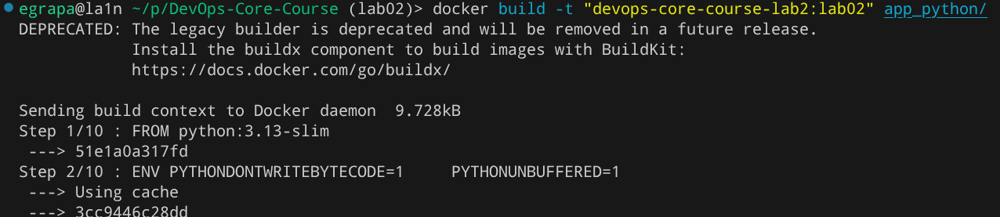
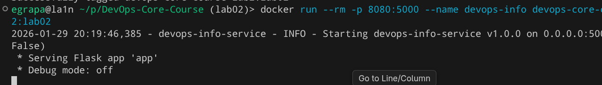
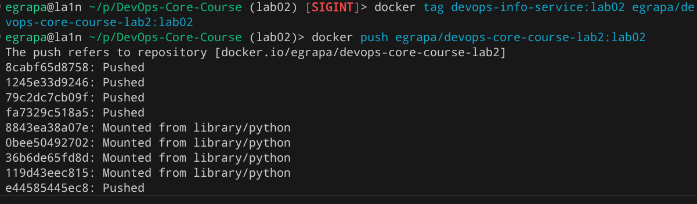

# LAB02 — Docker Containerization (Python)

Repository used for publication (example / chosen for this submission):
- **Docker Hub:** `egrapa/devops-core-course-lab2`
- **Example image tag:** `egrapa/devops-core-course-lab2:lab02`

---

## 1. Docker Best Practices Applied

### 1) Specific base image version
- **What:** `FROM python:3.13-slim`
- **Why:** Pinning a specific version makes builds reproducible and prevents unexpected breakage when upstream images change.
  The `slim` variant is smaller than the full image, reducing download time and attack surface.

**Dockerfile snippet**
```dockerfile
FROM python:3.13-slim
```

### 2) Non-root user (mandatory)
- **What:** Create and run as a dedicated unprivileged user (`appuser`).
- **Why:** Running as root increases the blast radius if the service is compromised. A non-root user is a baseline container security practice.

**Dockerfile snippet**
```dockerfile
RUN groupadd --gid 10001 appuser \
 && useradd --uid 10001 --gid 10001 --create-home --shell /usr/sbin/nologin appuser
USER appuser
```

### 3) Proper layer ordering (dependency caching)
- **What:** Copy `requirements.txt` first, install dependencies, then copy `app.py`.
- **Why:** Docker caches layers. If only app code changes, dependencies remain cached and rebuilds are much faster.

**Dockerfile snippet**
```dockerfile
COPY requirements.txt /app/requirements.txt
RUN pip install --no-cache-dir -r /app/requirements.txt
COPY app.py /app/app.py
```

### 4) Copy only necessary files
- **What:** Only `requirements.txt` and `app.py` are copied.
- **Why:** Smaller images build faster, reduce the chance of leaking secrets, and minimize the attack surface.

### 5) `.dockerignore` to reduce build context
- **What:** Excludes venv, caches, docs, tests, and VCS metadata.
- **Why:** A smaller build context is sent to Docker daemon, improving build speed and preventing accidental inclusion of local artifacts.

---

## 2. Image Information & Decisions

### Base image choice
- **Chosen:** `python:3.13-slim`
- **Justification:** Modern Python runtime, significantly smaller than full images, and commonly used in production container workflows.

### Optimization choices
- `pip install --no-cache-dir` reduces final size by not storing pip cache in the image.
- Copy order supports caching (requirements before code).
- Minimal runtime payload (only what is needed to run).

### Layer structure (high level)
1. Base runtime (Python slim)
2. Non-root user creation (security baseline)
3. Dependency installation (cached if requirements unchanged)
4. Application code copy (frequent changes, fast rebuild)
5. Switch to non-root + `CMD`

### Final image size
Run:
```bash
docker images | grep devops-core-course-lab2
```

Paste your real output here:
```text
<PASTE YOUR OUTPUT HERE>
```

---

## 3. Build & Run Process

### Build
```bash
docker build -t devops-core-course-lab2:lab02 app_python/
```


### Run
```bash
docker run --rm -p 8080:5000 --name devops-info devops-core-course-lab2:lab02
```


### Test endpoints
```bash
curl -s http://127.0.0.1:8080/ | python -m json.tool
curl -s http://127.0.0.1:8080/health | python -m json.tool
```
```sh
egrapa@la1n ~/p/DevOps-Core-Course (lab02)> curl -s http://127.0.0.1:8080/ | python -m json.tool
```
```json
{
    "endpoints": [
        {
            "description": "Service information",
            "method": "GET",
            "path": "/"
        },
        {
            "description": "Health check",
            "method": "GET",
            "path": "/health"
        }
    ],
    "request": {
        "client_ip": "172.17.0.1",
        "method": "GET",
        "path": "/",
        "user_agent": "curl/8.18.0"
    },
    "runtime": {
        "current_time": "2026-01-29T20:20:32.870580+00:00",
        "timezone": "UTC",
        "uptime_human": "0 hours, 0 minutes",
        "uptime_seconds": 46
    },
    "service": {
        "description": "DevOps course info service",
        "framework": "Flask",
        "name": "devops-info-service",
        "version": "1.0.0"
    },
    "system": {
        "architecture": "x86_64",
        "cpu_count": 8,
        "hostname": "966befca105e",
        "platform": "Linux",
        "platform_version": "Linux-6.18.7-arch1-1-x86_64-with-glibc2.41",
        "python_version": "3.13.11"
    }
}
```
```bash
egrapa@la1n ~/p/DevOps-Core-Course (lab02)> curl -s http://127.0.0.1:8080/health | python -m json.tool
```
```json
{
    "status": "healthy",
    "timestamp": "2026-01-29T20:21:33.338637+00:00",
    "uptime_seconds": 106
}
```
### Push to Docker Hub
```bash
docker login
docker push egrapa/devops-core-course-lab2:lab02
```


### Docker Hub repository URL
```text
https://hub.docker.com/r/egrapa/devops-core-course-lab2
```

### Tagging strategy
Tags follow the pattern `egrapa/devops-core-course-lab2:<tag>`.  
For this lab, `lab02` is used to clearly indicate the image corresponds to Lab 2 and to avoid ambiguity of `latest`.

---

## 4. Technical Analysis

### Why this Dockerfile works
- The image contains Python, pinned dependencies, and the application module.
- `CMD ["python","app.py"]` starts the service exactly like local execution.
- `HOST`, `PORT`, and `DEBUG` remain configurable via environment variables at runtime.

### What would happen if layer order changed?
If application code was copied before installing dependencies:
- Any code change would invalidate the cache
- Dependencies would be reinstalled on every build
- Rebuilds would become slower and less efficient

### Security considerations implemented
- Running as non-root reduces privileges in the container.
- Minimal copy reduces the chance of shipping secrets or unnecessary artifacts.

### How `.dockerignore` improves builds
- Reduces build context size → faster builds
- Prevents accidental inclusion of venv/tests/docs into the image
- Helps keep runtime image clean and minimal

---

## 5. Challenges & Solutions

(Write your real notes here.)

- **Challenge:**  
  During the initial Docker push attempt, the image could not be uploaded to Docker Hub because the specified tag did not exist locally.

- **Solution:**  
  The issue was resolved by re-tagging the already built local image using `docker tag` so that the tag matched the Docker Hub repository name. After re-tagging, the image was successfully pushed without rebuilding.

- **What I learned:**  
  I learned how Docker image tagging works and that `docker push` only uploads existing local tags. Re-tagging images is a common and efficient workflow that avoids unnecessary rebuilds and is useful when preparing images for different registries or environments.