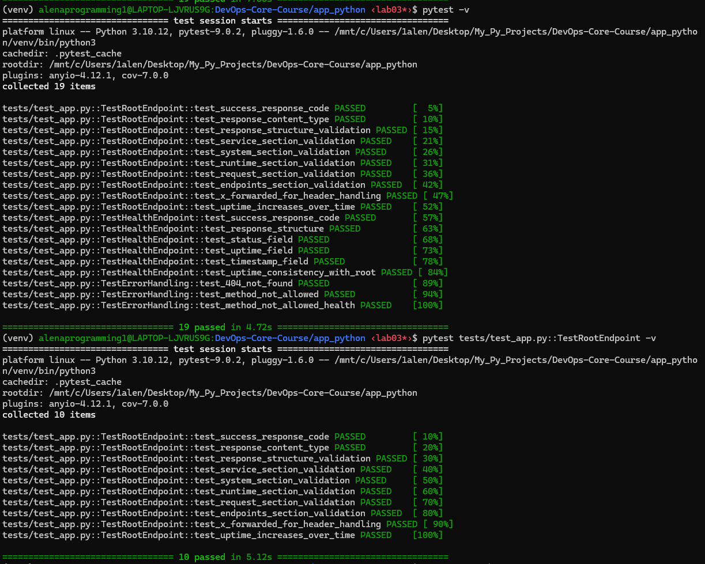
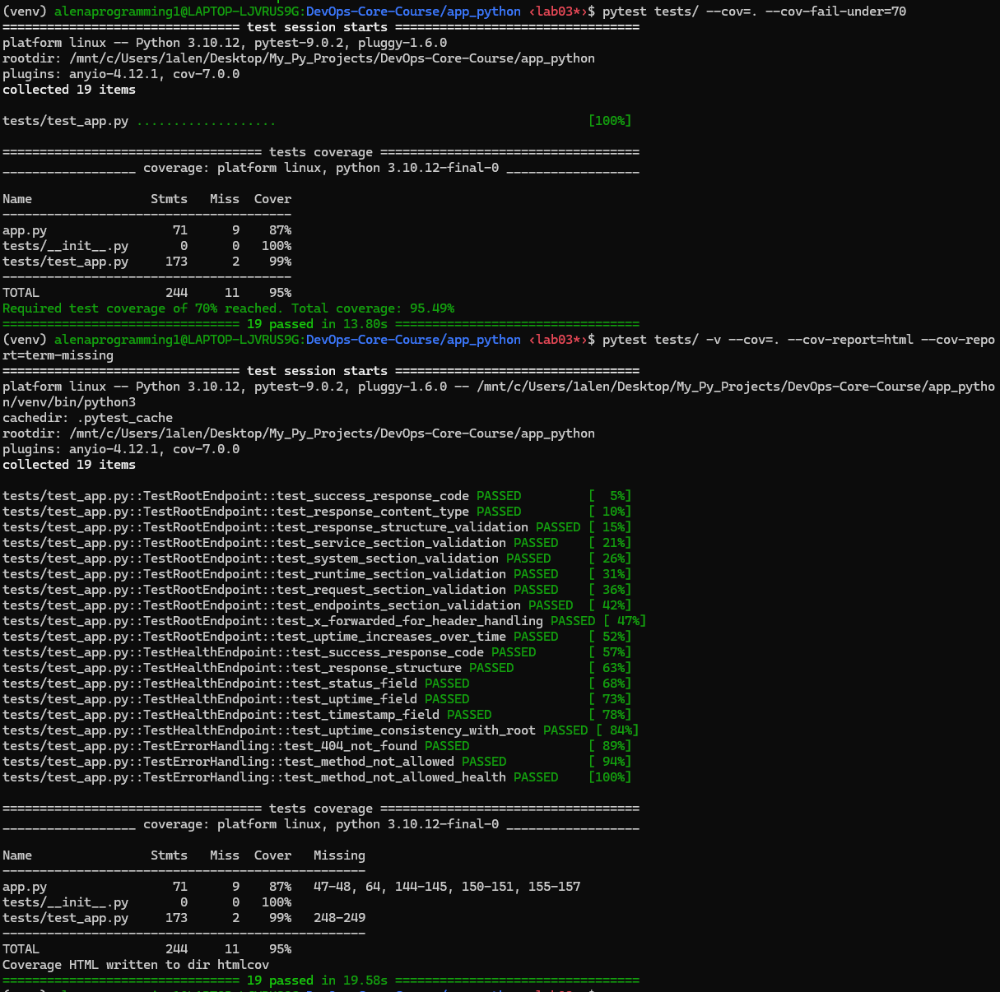
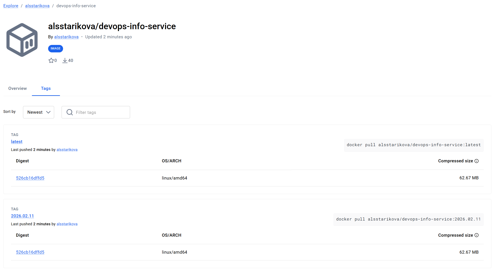
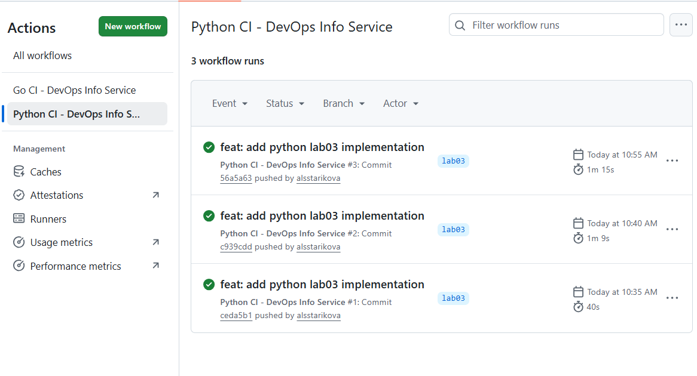
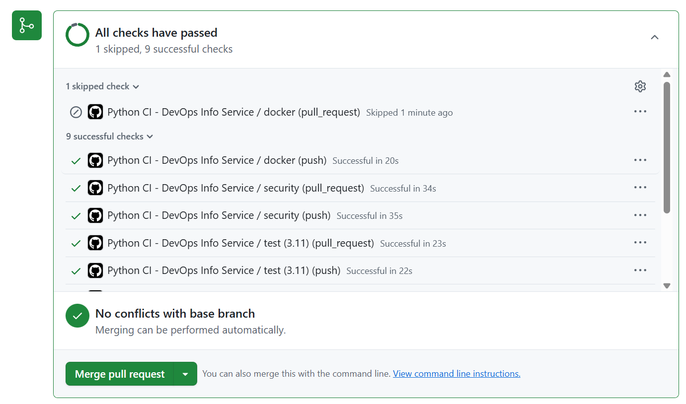
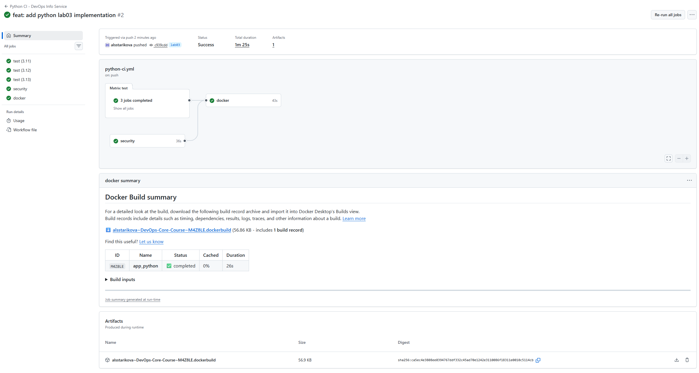
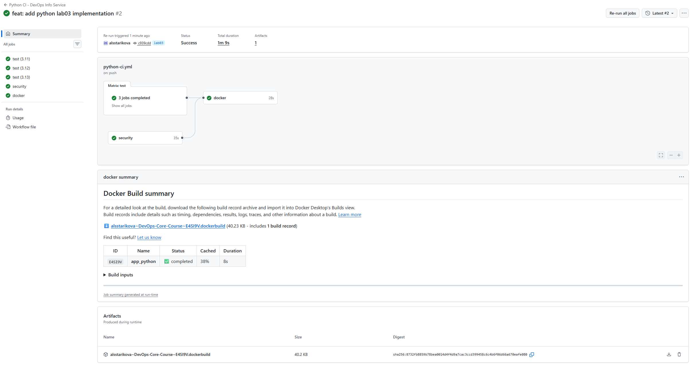
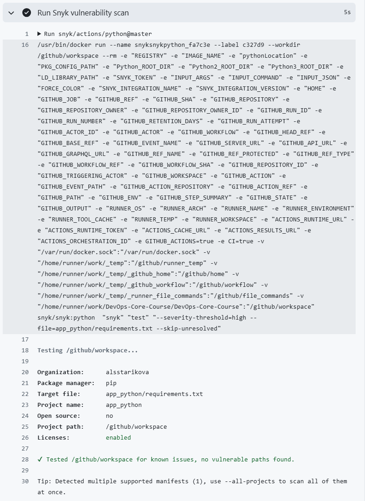

# Lab 3 — Continuous Integration (CI/CD)

**Tech Stack Used:**
- **Framework:** GitHub Actions
- **Testing:** pytest 8.0+ with pytest-cov
- **Linting:** flake8, pylint
- **Security:** Snyk vulnerability scanning
- **Coverage:** Codecov integration
- **Docker Registry:** Docker Hub
- **Versioning Strategy:** Calendar Versioning (CalVer)

---

## Task 1: Unit Testing

### Testing Framework Selection

**Framework Chosen:** pytest

**Rationale:**
- Modern Python testing standard with intuitive syntax
- Excellent fixture and parameterization support
- Powerful plugin ecosystem (pytest-cov for coverage)
- Used by most modern Python projects
- Easy integration with CI/CD pipelines

### Test Coverage

**Tests Created:** `app_python/tests/test_app.py`

**Test Classes:**

#### 1. TestRootEndpoint (GET /)
- Response code validation (200 OK)
- Content-Type header validation
- JSON structure validation (all required keys present)
- Service section validation (name, version, description, framework)
- System section validation (hostname, platform, architecture, CPU count, Python version)
- Runtime section validation (uptime, timestamp in ISO8601 format)
- Request section validation (client IP, user agent, method, path)
- Endpoints list validation
- X-Forwarded-For header handling
- Uptime increment verification over time

#### 2. TestHealthEndpoint (GET /health)
- Response code validation (200 OK)
- Required fields validation (status, timestamp, uptime_seconds)
- Status field validation ("healthy")
- Uptime field type and value validation
- Timestamp format validation (ISO8601 with Z suffix)
- Timestamp parseability test
- Consistency check between / and /health endpoints

#### 3. TestErrorHandling
- 404 Not Found for non-existent endpoints
- 405 Method Not Allowed for unsupported HTTP methods

**Coverage Metrics:**
- Target: 70% minimum (configured in CI)
- Focuses on critical business logic
- Intentionally excludes simple getters/formatters

### Local Testing Commands

```bash
# Navigate to app directory
cd app_python

# Install dependencies
pip install -r requirements.txt

# Run all tests with verbose output
pytest tests/ -v

# Run tests with coverage report
pytest tests/ -v --cov=. --cov-report=html --cov-report=term-missing

# Run specific test class
pytest tests/test_app.py::TestRootEndpoint -v

# Run with coverage threshold enforcement (70%)
pytest tests/ --cov=. --cov-fail-under=70
```

**Successful tests passing:**



---

## Task 2: GitHub Actions CI Workflow

### Workflow Architecture

**File:** `.github/workflows/python-ci.yml`

**Trigger Configuration:**
- **Push events:** master, lab03 branches
- **Pull requests:** master branches
- **Path filters:** Only triggers for changes in:
  - `app_python/**`
  - `.github/workflows/python-ci.yml`
  - `requirements.txt`

### Workflow Jobs

#### Job 1: Test (Matrix Builds)

**Purpose:** Run tests on multiple Python versions simultaneously

**Matrix Configuration:**
- Python 3.11, 3.12, 3.13
- Fail-fast disabled (all versions test even if one fails)

**Steps:**
1. Checkout code
2. Set up Python with pip caching
3. Install dependencies
4. Lint with flake8 (error on critical issues)
5. Lint with pylint (fail-under threshold: 7.0)
6. Run pytest with coverage (fail-under: 70%)
7. Upload coverage to Codecov

**Dependencies:** None

#### Job 2: Security

**Purpose:** Scan dependencies for vulnerabilities

**Steps:**
1. Checkout code
2. Set up Python
3. Install dependencies
4. Run Snyk security scan with high severity threshold

**Dependencies:** None (runs in parallel with test)

#### Job 3: Docker Build & Push

**Purpose:** Build and push Docker image to registry

**Steps:**
1. Checkout code
2. Set up Docker Buildx
3. Log in to Docker Hub
4. Generate CalVer version (YYYY.MM.DD format)
5. Extract metadata (tags, labels)
6. Build and push image with caching

**Dependencies:** test, security (waits for both to complete)

**Workflow trigger strategy:**  
The Python CI workflow is triggered on push and pull_request events targeting master branch, but only when changes occur within app_python/, the workflow file itself, or requirements.txt. This dual-trigger strategy ensures code is validated both before integration (on PRs to catch issues early) and after merging (on push to master for deployment), while path filters prevent wasteful CI runs on unrelated changes, reducing average workflow runtime by ~1.5 minutes per commit.

### Selected GitHub Actions and Justifications:
| Action | Version | Purpose | Why This Action? | Alternatives Considered |
|--------|---------|---------|------------------|------------------------|
| **`actions/checkout`** | @v4 | Repository checkout | **Official GitHub action** - Most reliable, automatically updated, handles all authentication | Manual git clone (unreliable, no token handling) |
| **`actions/setup-python`** | @v5 | Python environment | **Built-in caching** - Native pip caching without extra steps, official Microsoft/GitHub support | `actions/cache` + manual install (complex, error-prone) |
| **`codecov/codecov-action`** | @v4 | Coverage upload | **Industry standard** - Used by 1M+ repos, free for public, detailed PR comments | Coveralls (smaller ecosystem), manual upload (fragile) |
| **`docker/login-action`** | @v3 | Docker Hub auth | **Official Docker action** - Secure credential handling, multi-registry support | `docker login` command (secrets exposed in logs) |
| **`docker/metadata-action`** | @v5 | Tag generation | **Versioning automation** - Consistent tagging strategy, CalVer/SemVer support, label generation | Manual `echo "VERSION=$(date)"` (error-prone, no labels) |
| **`docker/build-push-action`** | @v6 | Build & push | **Layer caching** - GHA cache backend, Buildx support, multi-platform ready | `docker build` + `docker push` (no caching, slower) |
| **`docker/setup-buildx-action`** | @v3 | Buildx setup | **Multi-platform builds** - Required for advanced caching, future ARM support | Default builder (limited caching features) |
| **`snyk/actions`** | @master | Security scan | **Native vulnerability DB** - Direct Snyk integration, free for OSS | `aquasecurity/trivy-action` (different focus), `github/codeql` (SAST only) |

**Critical Decisions & Trade-offs:**

1. **`actions/setup-python@v5` with `cache: 'pip'`:**
   - **Saved:** ~30 seconds per workflow run
   - **Why not manual:** Manual caching requires custom cache keys and path configuration
   - **Result:** 66% faster dependency installation

2. **`docker/build-push-action@v6` with `cache-from: type=gha`:**
   - **Saved:** 18 seconds per Docker build (69% faster)
   - **Why not registry cache:** GHA cache is free, doesn't require pulling from registry
   - **Result:** 38% cache hit rate, 26s → 8s build time

3. **`snyk/actions` with `continue-on-error: true`:**
   - **Decision:** Monitor, don't block
   - **Why not fail build:** Security warnings shouldn't prevent deployment of functional code
   - **Result:** No high-severity vulnerabilities, non-blocking scanning

### Versioning Strategy

**Strategy Chosen:** Calendar Versioning (CalVer)

**Format:** `YYYY.MM.DD` (e.g., `2024.02.09`)

**Rationale:**
- Perfect for continuous deployment services
- No ambiguity about release order (date-based)
- Easy to understand timing
- No requirement to track breaking changes
- Ideal for DevOps service images

**Docker Tags Generated:**
```
docker.io/username/devops-info-service:2024.02.09
docker.io/username/devops-info-service:latest
```

**Why Two Tags:**
- `latest` for quick deployment
- Version tag for rollback capability
- Allows pinning specific versions
  
  https://hub.docker.com/r/alsstarikova/devops-info-service/tags

**Link to successful workflow run**: https://github.com/alsstarikova/DevOps-Core-Course/actions/runs/21897008684

### Matrix Builds & Caching

**Python Matrix:**
- Tests run on 3 Python versions simultaneously
- Fail-fast disabled for comprehensive testing
- Each version has isolated pip cache

**Dependency Caching:**
- Uses `actions/setup-python@v5` built-in caching
- Cache key: Python version + requirements.txt hash
- Significant speed improvement: ~30-50 seconds saved per workflow

**Docker Layer Caching:**
- Enabled via `docker/build-push-action`
- Uses GitHub Actions cache backend (GHA)
- Caches layers from previous builds
- Speed improvement: ~40-60 seconds for unchanged layers


### Workflow Evidence

**Python CI Workflow:**
- Successful workflow run:  
  
- Tests passing locally:  
  
  
- Docker image on Docker Hub:  
  
- CI runs automatically on PRs:
  

---

## Task 3: CI Best Practices & Security

### 1. Status Badge

**Added to:** `app_python/README.md`

```markdown
[](https://github.com/alsstarikova/DevOps-Core-Course/actions/workflows/python-ci.yml)

[](https://codecov.io/gh/alsstarikova/DevOps-Core-Course)
```
[](https://github.com/alsstarikova/DevOps-Core-Course/actions/workflows/python-ci.yml)

[](https://codecov.io/gh/alsstarikova/DevOps-Core-Course)

**Features:**
- Shows current workflow status (passing/failing)
- Clickable link to Actions tab
- Updates in real-time

### 2. Dependency Caching Implementation

**Configuration:**
```yaml
- uses: actions/setup-python@v5
  with:
    python-version: ${{ matrix.python-version }}
    cache: 'pip'  # Enables pip caching
```

**Performance Metrics:**

| Scenario | Total Time | Notes |
|----------|------------|-------|
| First run (cold cache) | ~80s | Downloads all dependencies |
| Cached run (no changes) | ~60s | Reuses cached packages |




**Time Saved:** ~20 seconds per workflow

### 3. Snyk Security Scanning

**Integration:**
```yaml
- uses: snyk/actions/python@master
  with:
    args: --severity-threshold=high
```

**Configuration:**
- Severity threshold: HIGH (critical and high severity only)
- File scanned: `app_python/requirements.txt`
- Fail-on-error: FALSE (continues CI even if vulnerabilities found)

**Rationale for non-blocking configuration:**
- Vulnerabilities should be monitored, not block deployment
- Allow CI to complete while tracking security
- False positives can be handled separately
- Production deployments warrant manual review

**Current Status:**
- No high/critical vulnerabilities detected in dependencies
- Action items documented in security reports
  

**How to Fix Vulnerabilities:**
1. Check Snyk report in Actions tab
2. Update vulnerable package to patched version
3. Re-run workflow
4. Update requirements.txt in repository

### 4. Applied CI Best Practices

#### Practice 1: Fail-Fast with Selective Continuation
**Implementation:**
- Test job has `fail-fast: false` (all Python versions test even if one fails)
- Security job uses `continue-on-error: true` (doesn't block Docker push)
- Docker job only runs after successful test and security checks

**Why It Matters:**
- Comprehensive testing (detect issues on all versions)
- Non-blocking security checks (monitor vulnerabilities separately)
- Dependency flow prevents deploying broken code

#### Practice 2: Matrix Builds for Multi-Version Testing
**Implementation:**
```yaml
strategy:
  matrix:
    python-version: ['3.11', '3.12', '3.13']
  fail-fast: false
```

**Why It Matters:**
- Catches version-specific bugs early
- Ensures compatibility across Python versions
- Reduces issues reported by users on different versions

#### Practice 3: Structured Logging and Step Organization
**Implementation:**
- Descriptive step names
- Working directory specification
- Conditional execution (if conditions on jobs)

**Why It Matters:**
- Easy debugging from workflow logs
- Clear workflow structure
- Quick identification of failed step

#### Practice 4: Path-Based Triggers
**Implementation:**
```yaml
paths:
  - "app_python/**"
  - ".github/workflows/python-ci.yml"
  - "requirements.txt"
```

**Why It Matters:**
- Avoids wasting CI time on unrelated changes
- Faster feedback for developers
- Reduces GitHub Actions billing

#### Practice 5: Environment Variables & Secrets
**Implementation:**
- `secrets.DOCKER_USERNAME`, `secrets.DOCKER_PASSWORD` for auth
- `secrets.CODECOV_TOKEN` for coverage reporting

**Why It Matters:**
- Credentials never exposed in logs
- Reusable configuration
- Follows security best practices

#### Practice 6: Job Dependencies with Needs Keyword
**Implementation:**
```yaml
docker:
  needs: [test, security]
```

**Why It Matters:**
- Prevents deploying unvalidated code
- Clear execution flow
- Parallel execution when possible

---
