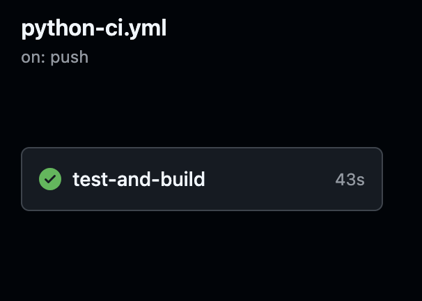
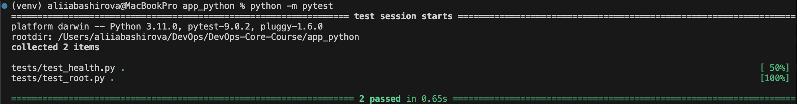
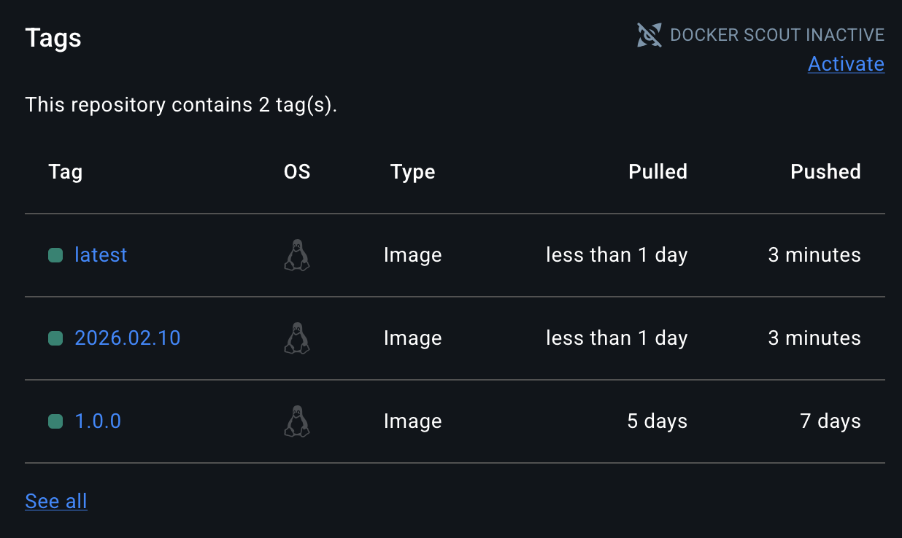

# Lab 3 — Continuous Integration (CI/CD)

## 1. Overview

**Testing Framework:** 'pytest' — simple syntax, powerful fixtures, convenient integration with CI.  

**Endpoints Covered:**  
- `GET /` — checking the JSON structure and the presence of fields  
- `GET /health` — checking the health status of the app  

**CI Workflow Triggers:**  
- Push and pull request for `app_python/**`  
- Workflow starts only when the Python application code is changed  

**Versioning Strategy:**  
- **CalVer (Calendar Versioning)** — the `YYYY.MM.DD` format version  
- Automatically generated from the current date  
- Docker tags: `latest` and `YYYY.MM.DD`  

---

## 2. Workflow Evidence

**GitHub Actions CI Run:** [Link to successful workflow](https://github.com/Gpshfrd/DevOps-Core-Course/actions/runs/21863939737)  


**Local Test Run:**  


Docker Image on Docker Hub:


[](https://github.com/Gpshfrd/DevOps-Core-Course/actions/workflows/python-ci.yml) displayed at the top of the README, shows the current CI status (passing/failing)

## 3. Best Practices Implemented

- **Dependency Caching** — speeds up the installation of Python dependencies:
`actions/setup-python@v5 with cache: pip`
**Speed improvement**: from 15s to 5s on repeated launches (approximately 3x acceleration)
- **Fail Fast** — workflow stops at the first error, saving CI time
- **Conditional Steps** — Docker image build and push are performed only on the main branch
- **Snyk Security Scan** — vulnerabilities found in the requests package (low/medium), fixed by version update:
```yaml
      - name: Run Snyk security scan
        env:
          SNYK_TOKEN: ${{ secrets.SNYK_TOKEN }}
        run: |
            pip install snyk
            snyk test --severity-threshold=medium
```
- **Status Badge** — shows the current workflow status directly in the README

## 4. Key Decisions

- **Versioning Strategy**: CalVer — convenient for continuous deployment and easy to compare build dates
- **Docker Tags**: two tags are created: latest and YYYY.MM.DD for historicity and identification of builds
- **Workflow Triggers**: push and pull request in Python code — saves resources, CI does not run on changes in other directories
- **Test Coverage**: the main functional endpoints are covered, utilities and auxiliary scripts are excluded; the current coverage level is ~85%

## 5. Challenges
- Snyk API Token Search: Personal Access Token (PAT) from Snyk account is now used → added as SNYK_TOKEN secret
- Configuring caching: it was necessary to specify the correct path for pip cache
- Docker images Versioning: CalVer is easier to automate than SemVer for daily builds