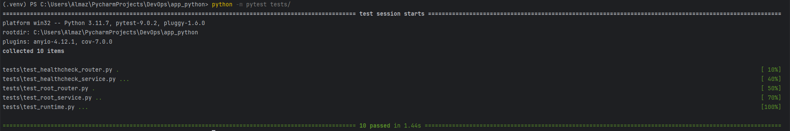
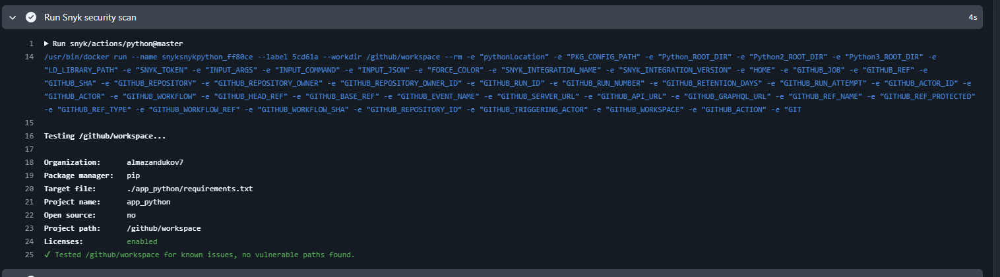
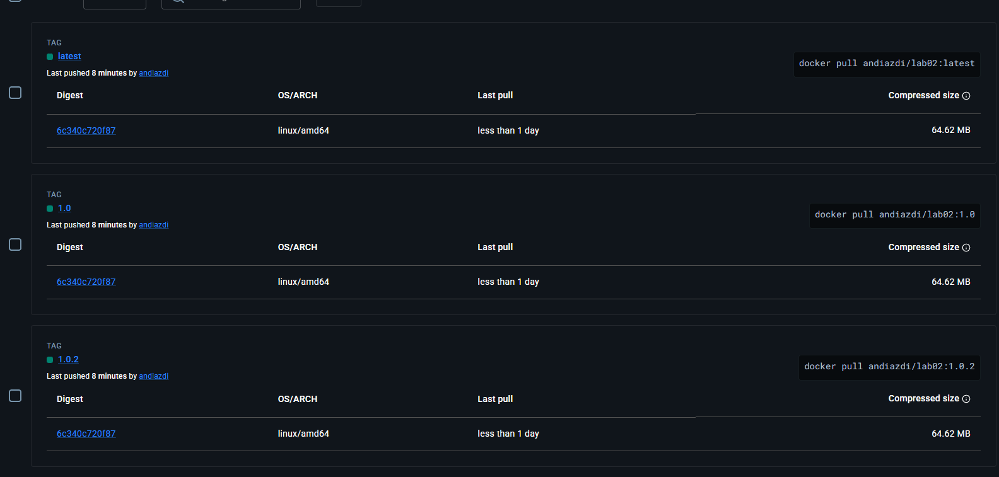
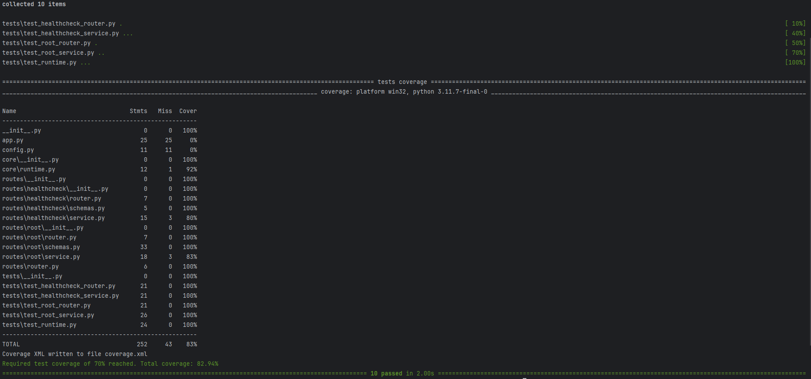

## Testing framework 
I used pytest framework because of it is simple and easy to use. It also has a lot of features that makes testing easier.

## Testing code locally

All tests passed successfully.

## Tests are cover
Tests cover routers, services and runtime modules. Config module is not covered because it is just a simple module that loads environment variables and does not contain any logic that needs to be tested.
Also some services are partially covered because they contain some logic that is not covered by tests.

## Versioning Strategy
I chose to use semantic versioning strategy because my program will have regular updates. It will be easy to manage and understand the changes in the program.

## CI/CD Status Badge
https://github.com/andiazdi/DevOps-Core-Course/actions/workflows/python-ci.yml/badge.svg

## CI/CD Successful Run
https://github.com/andiazdi/DevOps-Core-Course/actions/runs/21919710740

## Sync Security Scan

No vulnerabilities found in the code.

## Docker Hub Image

At every new tag on GitHub, a new image is built and published to Docker Hub with 3 tags - latest, major and minor. For example, for version 1.0.1, the tags will be latest, 1.0 and 1.0.1

## CI Best Practices
1. Caching dependencies to speed up the build process.
2. Splitting the build process into jobs to make it easier to manage and debug.
3. Using `needs` to define dependencies between jobs to ensure that they run in the correct order.
4. Using GitHub secrets to store sensitive information such as API keys and credentials. 
5. For simple pushes, only tests are run; for tags, builds and image publication to Docker Hub are triggered to avoid unnecessary builds and deployments.

## Caching results
After caching takes around 5 seconds to install dependencies while without caching it takes around 10-15 seconds.

## Coverage percentage

The test coverage is 82.94% which means all the code is covered by tests which is higher than the required 70%.
Results are pretty acceptable. Almost all code is covered by tests but config and some services are either not covered or partially covered.