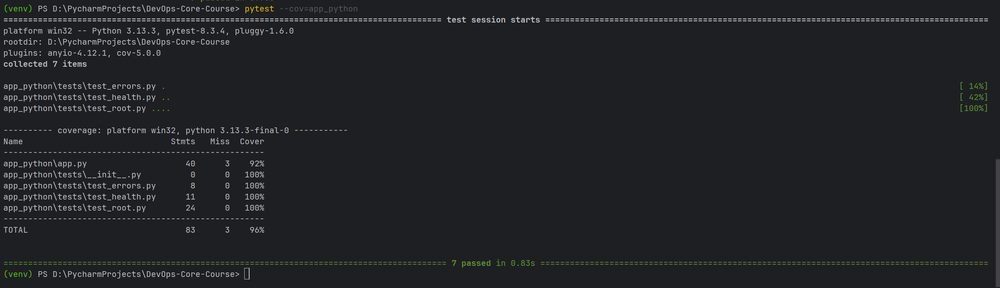
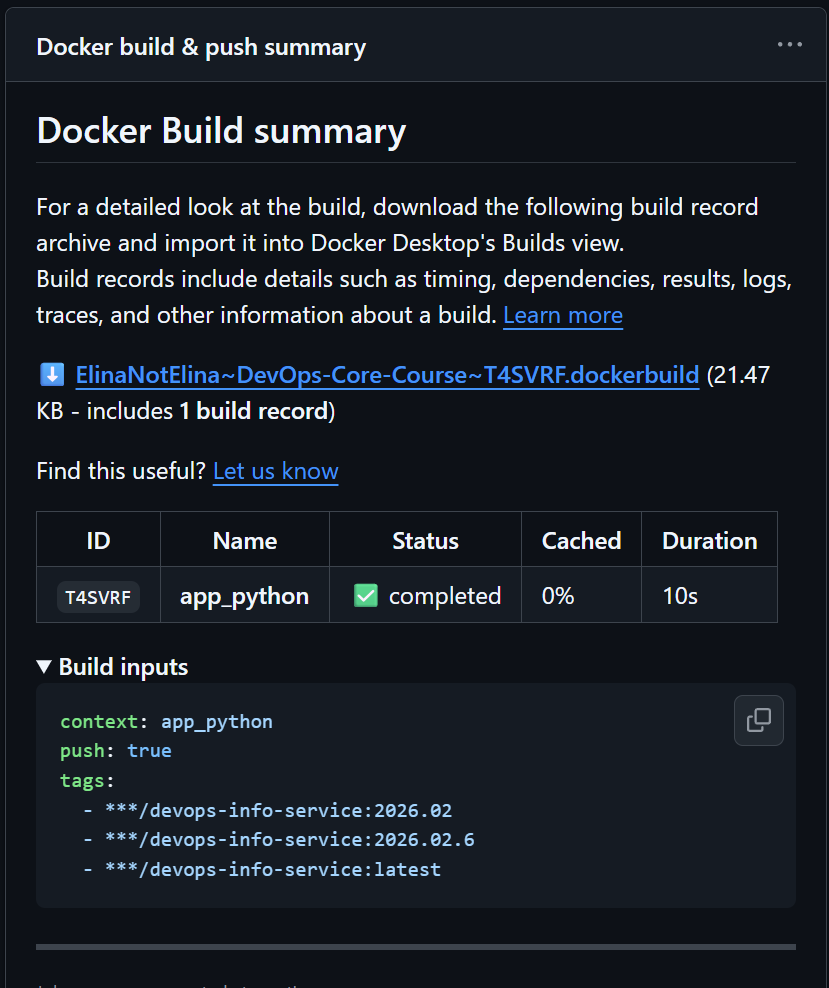

# Lab 03 — Continuous Integration (CI/CD)
## 1. Overview

**Testing framework used:**

- **pytest** — chosen for its concise syntax, fixture support, and easy integration with FastAPI test clients.
    
- **Reason:** Allows precise testing of endpoint responses, JSON structures, and type assertions in a reproducible way.
    

**Endpoints/functionality tested:**

- **`GET /non-existent-endpoint`**
    
    - Checks that unknown endpoints return `404 Not Found`.
        
    - Confirms JSON response includes key `"error"` with value `"Not Found"`.
        
- **`GET /health`**
    
    - Confirms HTTP status `200`.
        
    - Checks that response JSON contains:
        
        - `"status"` field with value `"healthy"`.
            
        - `"uptime_seconds"` field of type `int`.
            
        - `"timestamp"` field exists (type not asserted).
            
- **`GET /` (root endpoint)**
    
    - Confirms HTTP status `200`.
        
    - Checks response JSON includes top-level keys: `"service"`, `"system"`, `"runtime"`, `"request"`, `"endpoints"`.
        
    - **Service metadata checks:**
        
        - `"service.name"` equals `"devops-info-service"`.
            
        - `"service.framework"` equals `"FastAPI"`.
            
        - `"service.version"` is of type `str`.
            
    - **Runtime checks:**
        
        - `"runtime.uptime_seconds"` is `int`.
            
        - `"runtime.uptime_human"` is `str`.
            
        - `"runtime.timezone"` equals `"UTC"`.
            

**CI workflow trigger configuration:**

- Workflow runs on push to `master` and `lab3` branches.
    
- Runs on pull requests targeting `master`.
    
- Path filters (`app_python/**` and `.github/workflows/python-ci.yml`) ensure only Python code or workflow changes trigger the CI.
    

**Versioning strategy:**

- **Calendar Versioning (CalVer)**: `YYYY.MM` + build number and `latest`.
```bash
    type=raw,value={{date 'YYYY.MM'}}
    type=raw,value={{date 'YYYY.MM'}}.${{ github.run_number }}
    type=raw,value=latest
```
- **Reason:** Provides clear mapping to build date, suitable for continuous deployment and frequent builds.

---

## 2. Workflow Evidence
### Structure of Test Files:

```
app_python/               
├── tests/
    ├── __init__.py
    ├── test_errors.py
    ├── test_health.py
    └── test_root.py
```


**test_root.py** - tests for GET / endpoint (6 test cases)

- `test_root_status_code` - verifies endpoint returns 200 status code
    
- `test_root_response_structure` - checks presence of all required sections (service, system, runtime, request, endpoints)
    
- `test_service_metadata` - validates service name, framework, and version format
    
- `test_runtime_fields` - confirms uptime fields (seconds/human) and timezone are correct

    

**test_health.py** - tests for GET /health endpoint (2 test cases)

- `test_health_status_code` - verifies endpoint returns 200 status code
    
- `test_health_response` - validates health status, uptime_seconds type, and timestamp presence
    

**test_errors.py** - tests for error responses (1 test case)

- `test_404_handler` - verifies 404 status code and error message format for non-existent endpoints


---
**Successful workflow run:**

- [GitHub Actions link to latest run](https://github.com/ElinaNotElina/DevOps-Core-Course/actions/runs/21939394576)

**Tests passing locally (venv):**

 

### GitHub Actions Workflow
#### Jobs

- **`test` job**
  - Runs on `ubuntu-latest`.
  - Checks out the repository.
  - Sets up Python `3.13` with pip caching based on `app_python/requirements.txt` and `app_python/requirements-dev.txt`.
  - Installs application and dev dependencies.
  - Runs **Snyk** security scan for Python dependencies (`snyk/actions/python@master`, `--severity-threshold=high`).
  - Runs **Ruff** linter: `ruff check app_python`.
  - Runs **Ruff** formatter check: `ruff format --check app_python`.
  - Runs tests with coverage from `app_python`:  
    `pytest --cov=. --cov-report=xml --cov-fail-under=70`.
  - Uploads `coverage.xml` to **Codecov** using `codecov/codecov-action@v4`.

- **`docker` job (Docker build & push)**
  - Has `needs: test`, so it only runs if the `test` job succeeds.
  - Logs in to Docker Hub using `docker/login-action@v3` and GitHub Secrets (`DOCKERHUB_USERNAME`, `DOCKERHUB_TOKEN`).
  - Uses `docker/metadata-action@v5` to generate **CalVer** tags:
    - `YYYY.MM`
    - `YYYY.MM.<run_number>`
    - `latest`
  - Builds and pushes the image from the `app_python` context using `docker/build-push-action@v6` with those tags for `elinanotelina/devops-info-service`.


**Docker image on Docker Hub**

- Images are published from the `Docker build & push` job in `python-ci.yml` with tags:
  - `elinanotelina/devops-info-service:YYYY.MM`
  - `elinanotelina/devops-info-service:YYYY.MM.<run_number>`
  - `elinanotelina/devops-info-service:latest`

 

**Status badge working in README**

- `app_python/README.md` contains a status badge for the `Python CI` workflow (branch `lab3`):

```markdown

[](https://codecov.io/gh/ElinaNotElina/DevOps-Core-Course)
```

The badge gives an at-a-glance view of the current pipeline status.

---

## 3. Best Practices Implemented

**Practice 1 — Separate jobs with `docker` depending on `test`**

- The workflow has two jobs: `test` and `docker`.  
- The `docker` job has `needs: test`, which means the image will not be built or pushed to Docker Hub if tests or linters fail.  
- **Why it helps:** prevents publishing potentially broken images.

**Practice 2 — Dependency caching for Python**

- The `Set up Python` step uses:

```yaml
with:
  python-version: "3.13"
  cache: pip
  cache-dependency-path: |
    app_python/requirements.txt
    app_python/requirements-dev.txt
```

- **Why it helps:** repeated CI runs are significantly faster because the `pip` cache is reused.  
- **Time impact:** initial runs require a full dependency install; subsequent runs with a cache hit are noticeably shorter, since installation is skipped or reduced to only changed packages.

**Practice 3 — Linting and formatting (Ruff)**

- Two steps are used:
  - `ruff check app_python` — static analysis and linting;
  - `ruff format --check app_python` — formatting check.
- **Why it helps:** enforces a consistent code style and catches issues (unused imports, dead code, etc.) before tests run.

**Caching — before vs after (qualitative)**

- **Without cache:** each run reinstalls dependencies from scratch, which dominates the runtime of the `test` job.  
- **With cache:** when `requirements*.txt` do not change, the install step becomes much faster (or almost instant), and most of the time is spent on tests and linters.

**Snyk — results and policy**

- The `test` job includes:

```yaml
- name: Snyk security scan
  uses: snyk/actions/python@master
  continue-on-error: true
  env:
    SNYK_TOKEN: ${{ secrets.SNYK_TOKEN }}
  with:
    args: --severity-threshold=high
```

- **What this provides:**
  - automated analysis of dependencies for known vulnerabilities;
  - the build does not fail due to medium/low vulnerabilities (or temporary Snyk issues), but the report is available in the logs;
  - when high‑severity issues appear, they are visible in the CI log and can be fixed by updating dependencies.

At the moment, Snyk does not report critical vulnerabilities in the current dependency set.

---

## 4. Key Decisions

**Versioning Strategy — SemVer or CalVer and why**

- The project uses **CalVer** (year.month + run number) because the service is deployed frequently and the main need is to understand *when* an image was built.  
- Internal API compatibility is enforced via tests and contracts rather than strict SemVer version bumps.

**Docker Tags — which tags CI creates**

- For every successful build on `master` or `lab3`, the workflow creates tags:
  - `elinanotelina/devops-info-service:YYYY.MM`
  - `elinanotelina/devops-info-service:YYYY.MM.<run_number>`
  - `elinanotelina/devops-info-service:latest`
- This provides:
  - human‑readable date-based tags;
  - unique tags for each build;
  - a standard `latest` alias for quickly pulling the newest image.

**Workflow Triggers — why these triggers**

- `push` on `master` and `lab3`:
  - `lab3` is the working branch for this lab where full validation is required;
  - `master` is the main branch where only validated changes should land.
- `pull_request` targeting `master`:
  - ensures every attempt to merge into the main branch is validated by CI.
- Path filters on `app_python/**`:
  - speed up CI and save resources in the monorepo — the Python workflow does not run if only other course components change.

**Test Coverage — what is covered and what is not**

- Coverage is calculated via `pytest --cov=. --cov-report=xml --cov-fail-under=70` and uploaded to Codecov.  
- From the current `coverage.xml`:
  - **overall line coverage** is about **96.4%** for the project;
  - the **`app_python` package** has about **92.5%** of lines covered.
- **Well covered:**
  - response generation logic for `/` and `/health`;
  - basic 404 handler;
  - computation of runtime and service fields.
- **Partially or not covered:**
  - less common/error branches (e.g. configuration error paths, future additional endpoints).
- **Threshold:** CI enforces a minimum of `--cov-fail-under=70`, while actual coverage is kept significantly higher (90%+).

---

## 5. Challenges

- **Configuring Snyk and secrets:** required setting up `SNYK_TOKEN` and `CODECOV_TOKEN` as GitHub Secrets and ensuring they are only available to the intended workflow.
