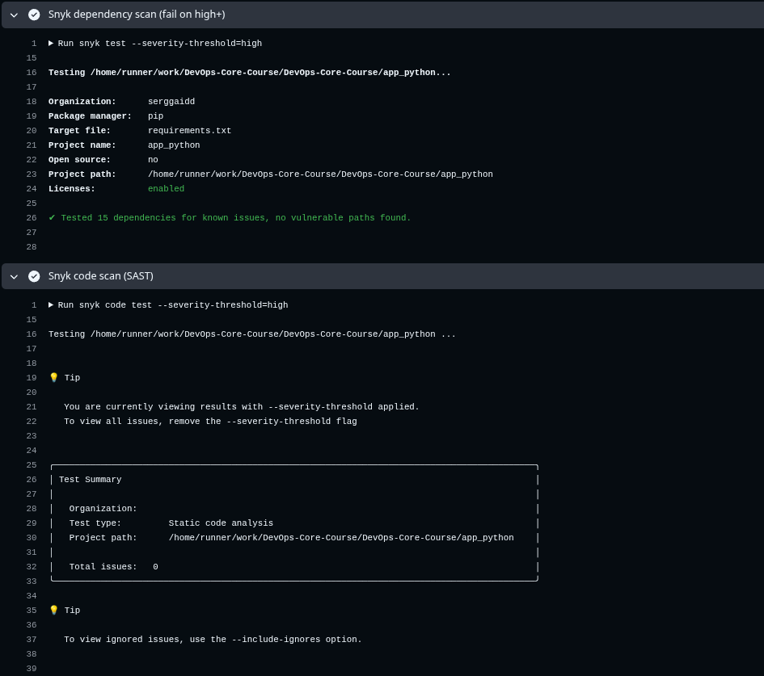

# LAB03 — Continuous Integration (CI/CD) (app_python)

---

## Overview

### Testing framework 
Pytest was chosen because it is fairly easy to set up, readable, the de facto standard for Python, and works well with Flask via `app.test_client()` (you can test endpoints without running a real server).

### Tests cover
The tests cover the key functionality of the application's HTTP layer:
- availability and correct HTTP codes for the main endpoints;
- correct responses (body/format/expected values) to typical requests;
- basic negative scenarios (e.g., invalid/missing parameters where relevant).

The `app.run(...)` command is not tested—it is the starting point of the dev server; unit tests check it using the Flask test client.

### CI workflow trigger configuration 
**Push** and **pull_request**, but only if files inside `app_python/**` (code/requirements/Dockerfile) or the workflow itself have changed. On PRs, this is necessary to ensure that the linter and tests pass before merging, and to avoid breaking the main branch. Docker builds and image pushes are performed only on pushes to `main/master` or the `lab*` branch (after successful tests).

### Versioning strategy chosen and rationale (**CalVer + SHA**:)
- `YYYY.MM.DD` (CalVer) — удобно и прозрачно для учебных/частых сборок: сразу видно “когда собрали”;
- `sha-<short>` — гарантированно уникальный тег под каждый коммит для точного отката/дебага;
- `latest` — удобный “последний стабильный билд” для быстрого `docker pull/run`.

---

## Workflow Evidence
- Successful workflow run - 
- Tests passing locally (terminal output):
- Docker image on Docker Hub:
    explanation
    img

Status badge working in README:
    link
    img
---

## Best Practices Implemented
- **Practice 1: Job Dependencies** - docker-job depends on `test` (`needs: [test]`), so the image is never pushed if the linter/tests fail.
- **Practice 2: Pull Request Checks** — A `test` (flake8 + pytest) is run on `pull_request` to catch errors before merging and avoid pulling broken code into the main branch.
- **Practice 3: Workflow Concurrency** — `concurrency` with `cancel-in-progress: true` cancels old runs if you push quickly in a row, saving minutes and eliminating "races" in results.

- **Caching:** — `setup-python` pip cache and buildx cache (GHA) are enabled. When last During pipeline runs, dependencies/layers are pulled from the cache, and repeat runs are faster due to the elimination of re-downloads/builds.

- **Snyk:** No vulnerabilities were found and no corrective actions were required. 

---

## Key Decisions
- **Questions:** SemVer or CalVer? Why did you choose it for your app?
  
  **Answer:** CalVer was chosen because it's a learning application with no public API and no release process. Clear traceability and a stable tagging scheme are more important for CI, and CalVer immediately displays the build date.

- **Questions:** What tags does your CI create? (e.g., latest, version number, etc.)
  
  **Answer:** CI pushes three tags to the same image:
  1. `latest` — the most recent successful build;
  2. `YYYY.MM.DD` — CalVer, build date in UTC;
  3. `sha-<short>` — the "traced" tag for the commit.

- **Questions:** Why did you choose those triggers?
  
  **Answer:** The main goal is to ensure that the pipeline is only triggered by changes that impact applications (`app_python/**/*.py`, `requirements*.txt`, `Dockerfile`, and `python-ci.yml` itself), that it doesn't pollute Docker Hub (thus, pushing only to the `main/master` or `lab*` branches can trigger the process), and that basic security checks are run at startup (for example, on pull requests, a quality check/test is run specifically before merging to prevent issues from being passed to the main branch).

- **Questions:** What's tested vs not tested?
  
  **Answer:** Test coverage is 98%, only the launch is not covered, as this would already lead to redundant testing.

