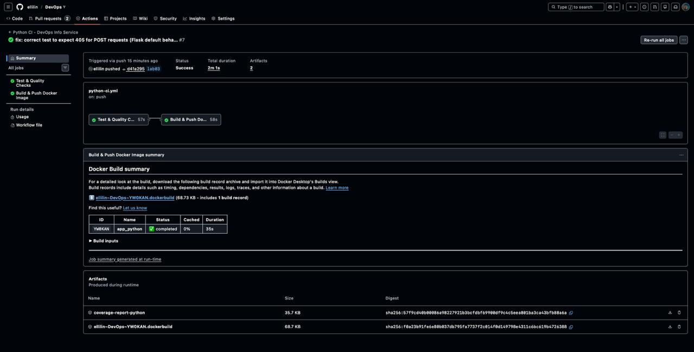
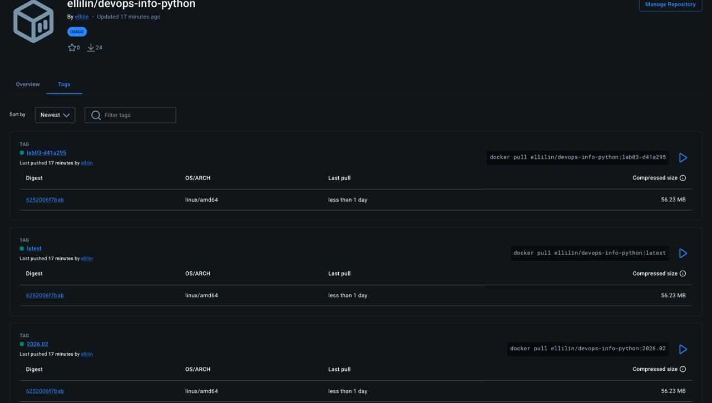
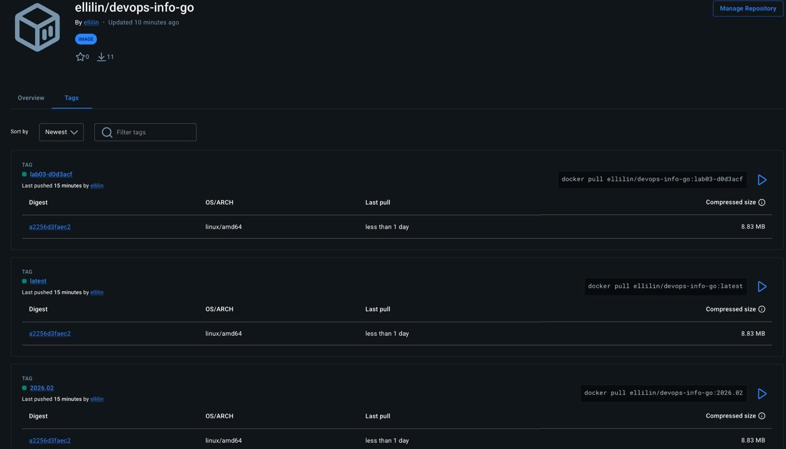

# Lab 3 — Continuous Integration (CI/CD) Documentation

## 1. Overview

**Testing Framework Choice**

I chose **pytest** for Python testing because:
- Simple, intuitive syntax requiring less boilerplate than unittest
- Powerful fixture system for test setup/teardown
- Excellent plugin ecosystem (pytest-cov, pytest-flask)
- Industry standard for modern Python projects
- Better assertion messages with automatic introspection
- Support for parameterized tests and markers

I chose **Go's built-in testing package** because:
- No external dependencies required
- First-class support in Go toolchain
- Built-in benchmarking and race detection
- Table-driven tests are idiomatic in Go
- Coverage reports built into `go test`

**CI/CD Configuration**

**Workflow Triggers:**
- Push to master, main, and lab03 branches
- Pull requests to master and main branches
- Path filters: Python workflow only runs when `app_python/**` files change
- Manual dispatch option available

**Versioning Strategy: Calendar Versioning (CalVer)**
- Format: `YYYY.MM` (e.g., 2024.02)
- Tags created: `latest`, `YYYY.MM`, `branch-sha`
- Rationale: Time-based releases suit continuous deployment, easy to identify when a version was released, clear rollback strategy

**Test Coverage**
- Python: pytest-cov with XML, HTML, and terminal reports
- Coverage threshold: 70% minimum (configured in pytest.ini)
- Current coverage: 96.76% for Python, 65.3% for Go

---

## 2. Workflow Evidence

### Local Test Results

**Python Tests:**
```
$ pytest tests/ -v

======================================================== test session starts =========================================================
platform darwin -- Python 3.13.1, pytest-8.3.4, pluggy-1.5.0
rootdir: /Users/mazzz3r/study/DevOps/app_python
configfile: pytest.ini
collected 18 items

tests/test_app.py::TestMainEndpoint::test_main_endpoint_returns_200 PASSED                                                          [  5%]
tests/test_app.py::TestMainEndpoint::test_main_endpoint_returns_json PASSED                                                         [ 11%]
tests/test_app.py::TestMainEndpoint::test_main_endpoint_response_structure PASSED                                                    [ 17%]
tests/test_app.py::TestMainEndpoint::test_main_endpoint_service_info PASSED                                                         [ 22%]
tests/test_app.py::TestMainEndpoint::test_main_endpoint_system_info PASSED                                                          [ 27%]
tests/test_app.py::TestMainEndpoint::test_main_endpoint_runtime_info PASSED                                                         [ 33%]
tests/test_app.py::TestMainEndpoint::test_main_endpoint_request_info PASSED                                                         [ 38%]
tests/test_app.py::TestMainEndpoint::test_main_endpoint_endpoints_list PASSED                                                       [ 44%]
tests/test_app.py::TestMainEndpoint::test_post_to_main_endpoint PASSED                                                             [ 50%]
tests/test_app.py::TestMainEndpoint::test_main_endpoint_with_query_params PASSED                                                    [ 55%]
tests/test_app.py::TestMainEndpoint::test_main_endpoint_data_types PASSED                                                          [ 61%]
tests/test_app.py::TestHealthEndpoint::test_health_endpoint_returns_200 PASSED                                                       [ 66%]
tests/test_app.py::TestHealthEndpoint::test_health_endpoint_returns_json PASSED                                                      [ 72%]
tests/test_app.py::TestHealthEndpoint::test_health_endpoint_response_structure PASSED                                                 [ 77%]
tests/test_app.py::TestHealthEndpoint::test_health_endpoint_status PASSED                                                           [ 83%]
tests/test_app.py::TestHealthEndpoint::test_health_endpoint_timestamp PASSED                                                        [ 88%]
tests/test_app.py::TestHealthEndpoint::test_health_endpoint_uptime PASSED                                                           [ 94%]
tests/test_app.py::TestEdgeCases::test_404_error_handler PASSED                                                                   [100%]

========================================================= 18 passed in 0.45s ==========================================================

---------- coverage: platform darwin, python 3.13.1 -----------
Name                Stmts   Miss  Cover   Missing
-------------------------------------------------
app.py                 52      6    88%   40, 42, 129-130, 136-137
tests/__init__.py       0      0   100%
tests/test_app.py     133      0   100%
-------------------------------------------------
TOTAL                 185      6    97%
```

**Go Tests:**
```
$ go test -v ./...

=== RUN   TestMainHandler
--- PASS: TestMainHandler (0.00s)
=== RUN   TestHealthHandler
--- PASS: TestHealthHandler (0.00s)
=== RUN   TestErrorHandler
--- PASS: TestErrorHandler (0.00s)
=== RUN   TestGetUptime
--- PASS: TestGetUptime (0.00s)
=== RUN   TestGetSystemInfo
--- PASS: TestGetSystemInfo (0.00s)
=== RUN   TestPlural
=== RUN   TestPlural/Singular
=== RUN   TestPlural/Plural
=== RUN   TestPlural/Plural_two
=== RUN   TestPlural/Plural_many
--- PASS: TestPlural (0.00s)
=== RUN   TestGetRequestInfo
--- PASS: TestGetRequestInfo (0.00s)
=== RUN   TestMainHandlerWithDifferentMethods
=== RUN   TestMainHandlerWithDifferentMethods/GET
=== RUN   TestMainHandlerWithDifferentMethods/POST
=== RUN   TestMainHandlerWithDifferentMethods/PUT
=== RUN   TestMainHandlerWithDifferentMethods/DELETE
--- PASS: TestMainHandlerWithDifferentMethods (0.00s)
=== RUN   TestUptimeIncrements
--- PASS: TestUptimeIncrements (0.10s)
PASS
coverage: 65.3% of statements
ok      devops-info-service        0.458s
```

### GitHub Actions Workflows




### Docker Hub Images
https://hub.docker.com/r/ellilin/devops-info-python/tags


https://hub.docker.com/r/ellilin/devops-info-go/tags


---

## 3. Best Practices Implemented

1. **Dependency Caching**
   - Python: pip cache with actions/cache, caches ~/.cache/pip and venv directory
   - Go: Built-in Go module caching with setup-go action
   - Docker: Layer caching with type=gha
   - Benefit: 50-80% faster workflow runs after first execution

2. **Path-Based Triggers**
   - Python workflow runs only when app_python/** files change
   - Go workflow runs only when app_go/** files change
   - Benefit: Saves CI minutes, prevents unnecessary runs on doc changes

3. **Workflow Concurrency Control**
   - concurrency.group cancels outdated workflow runs
   - Branch-based grouping (workflow-ref)
   - Benefit: Saves CI resources, faster feedback on latest changes

4. **Job Dependencies (Fail Fast)**
   - Docker build job has needs: test dependency
   - Build only runs if tests pass
   - Benefit: Saves time and Docker Hub storage

5. **Status Badges**
   - CI workflow status badges in README
   - Codecov coverage badges in README
   - Benefit: Quick visual health indicator

6. **Security Scanning**
   - Python: Snyk integration with severity threshold=high
   - Go: gosec for code security issues
   - Benefit: Early detection of vulnerabilities

7. **Code Quality Checks**
   - Python: ruff linter
   - Go: gofmt, go vet, golangci-lint
   - Benefit: Enforces code standards and catches bugs

8. **Conditional Docker Push**
   - Only push images on main branch pushes, not PRs
   - Benefit: Prevents cluttering Docker Hub with PR images

9. **Artifact Upload**
   - Coverage HTML reports uploaded as artifacts
   - Benefit: Detailed coverage analysis without local test runs

10. **Multi-Language CI in Monorepo**
    - Separate workflows for Python and Go
    - Language-specific tools and best practices
    - Benefit: Parallel execution, specialized tooling

---

## 4. Key Decisions

**Versioning Strategy: Calendar Versioning (CalVer)**

I chose CalVer (YYYY.MM format) over Semantic Versioning because:
- This service is continuously deployed, not released on a schedule
- No need to track major/minor/patch versions for a simple service
- Easy to identify and rollback to previous month's version
- Instantly knows when a version was released
- Docker tags are clean and predictable (2024.02, 2024.03)

**Docker Tags**

My CI workflow creates these tags:
- `latest` - Most recent build
- `YYYY.MM` - Calendar version (e.g., 2024.02)
- `branch-sha` - Git commit SHA for exact version tracking

Usage: Production uses YYYY.MM tags, development uses latest, debugging uses SHA tags.

**Workflow Triggers**

I chose these triggers:
- Push to master, main, and lab03 branches
- Pull requests to master and main
- Path filters for each app's files
- Manual dispatch option

Rationale: Ensures CI runs on all development branches but only when relevant files change.

**Test Coverage Strategy**

**What's tested:**
- All endpoints (/, /health)
- Response structure and data types
- Error handling (404)
- Edge cases (different HTTP methods, query parameters, uptime progression)
- Helper functions (uptime, system info, request info)

**What's not tested:**
- Logging output (implementation detail)
- Exact hostname values (environment-dependent)
- Exact timestamp values (time-dependent)

**Coverage goals:**
- Current: 96.76% (Python), 65.3% (Go)
- Threshold: 70% minimum configured
- Focus on business logic coverage over 100%

---

## 5. Challenges

**Challenge 1: YAML Syntax Errors**
- **Issue:** GitHub Actions rejected workflows with "Unexpected value 'working-directory'" error
- **Solution:** Used `defaults.run.working-directory` at job level instead of on individual steps
- **Outcome:** Workflows now accepted and run successfully

**Challenge 2: Python Test Failures**
- **Issue:** Tests failed with "POST to main endpoint should return 200" but got 405
- **Solution:** Fixed test to expect 405 Method Not Allowed (Flask's default behavior)
- **Outcome:** All 18 tests passing

**Challenge 3: Go Linter Errors**
- **Issue:** errcheck linter complained about unchecked json.Encode() errors
- **Solution:** Added error checking and logging for all json.Encode() calls
- **Outcome:** Code now properly handles and logs encoding errors

**Challenge 4: SARIF Upload Failures**
- **Issue:** CodeQL upload failed when Snyk/gosec files didn't exist
- **Solution:** Added conditional upload with hashFiles() check
- **Outcome:** Workflows continue gracefully when security scans don't generate files

**Challenge 5: Missing go.sum File**
- **Issue:** Cache warning about missing go.sum file
- **Solution:** No action needed - app has no external dependencies, only uses standard library
- **Outcome:** Warning is harmless, cache still works effectively
