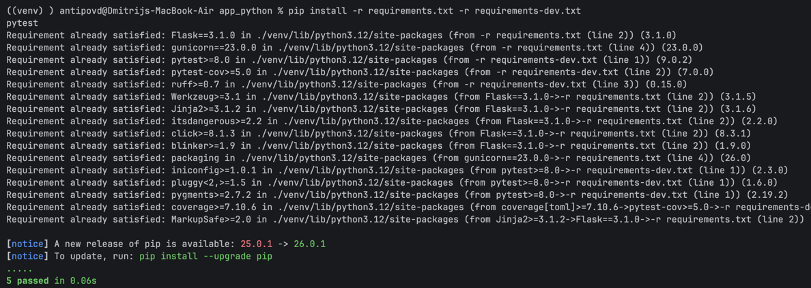
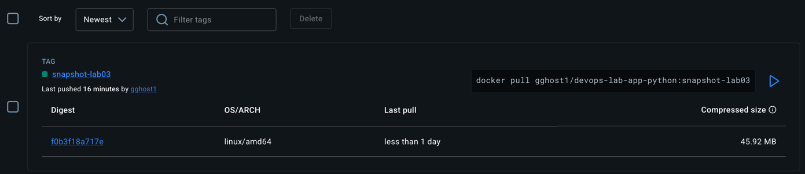
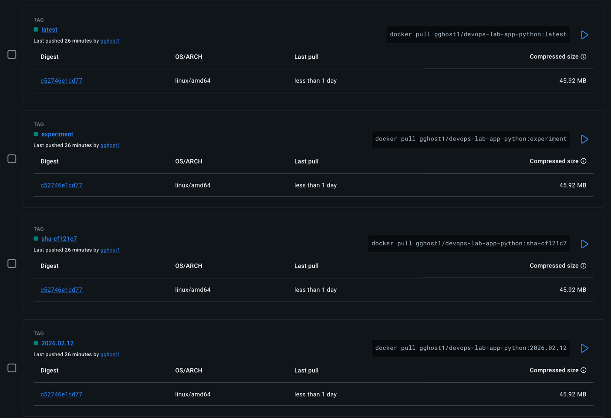
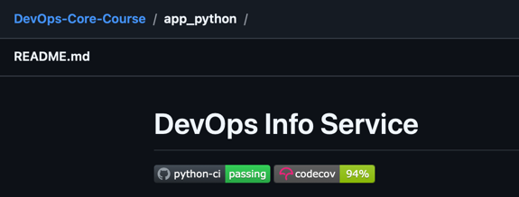
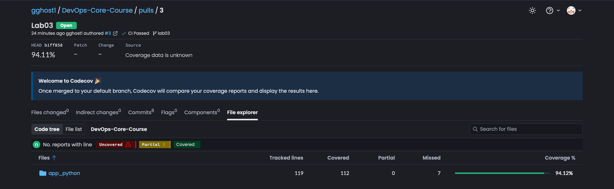

# Lab 3 — Continuous Integration (CI/CD)

## 1) Testing Framework & Test Design
### Testing framework choice
**Selected framework:** pytest  
**Why it matters:** pytest is widely used in modern Python projects, has concise assertions, fixtures, and integrates well with CI and coverage reporting.

### Test structure
**What I did:** created tests under `app_python/tests/` using Flask test client (no need to run the server).  
**Why it matters:** unit tests should be fast, deterministic, and runnable in CI without external dependencies.

**Covered endpoints / cases**
- `GET /` — checks JSON structure and required fields.
- `GET /health` — checks health payload.
- Error cases — `404 Not Found`, `405 Method Not Allowed`.


## 2) Local Test & Lint Execution
**What I did:** ran lint, formatting checks, and tests locally before pushing CI changes.  
**Why it matters:** CI should confirm quality, but local checks speed up iteration and reduce broken pipeline runs.

Lint + format check:
```terminaloutput
cd app_python
ruff check .
ruff format --check .
All checks passed!
3 files already formatted
```

Tests run:
```terminaloutput
cd app_python
pip install -r requirements.txt -r requirements-dev.txt
pytest
```


Coverage run:
```terminaloutput
cd app_python
pytest --cov=. --cov-report=term-missing --cov-report=xml
.....                                                                                                                                                                                                  [100%]
=============================================================================================== tests coverage ===============================================================================================
_____________________________________________________________________________ coverage: platform darwin, python 3.12.10-final-0 ______________________________________________________________________________

Name                      Stmts   Miss  Cover   Missing
-------------------------------------------------------
app.py                       69      7    90%   68-70, 172-173, 186-187
tests/__init__.py             0      0   100%
tests/test_endpoints.py      50      0   100%
-------------------------------------------------------
TOTAL                       119      7    94%
Coverage XML written to file coverage.xml
Required test coverage of 70% reached. Total coverage: 94.12%
5 passed in 0.25s                         
```

## 3) GitHub Actions CI Workflow (Python)
### Workflow file + triggers
Workflow file: `.github/workflows/python-ci.yml`

**What I did:** configured workflow to run on push and pull_request with path filters for `app_python/**`.  
**Why it matters:** in a monorepo it prevents running Python CI when only Java/docs change and reduces CI time/cost.

### CI stages
a) Code Quality & Testing  
**What I did:** CI installs deps, runs linter (ruff), checks formatting, runs pytest, generates coverage XML.  
**Why it matters:** catches style and functional regressions early and keeps codebase consistent.  

b) Docker Build & Push  
**What I did:** CI builds Docker image from app_python/Dockerfile and pushes to Docker Hub.  
**Why it matters:** guarantees the image in registry corresponds to code that passed tests.  

### Versioning strategy
**Chosen strategy:** CalVer (YYYY.MM.DD)  
**Why it matters:** this service is released continuously; date-based versions are simple and reduce ambiguity.  

Docker tags produced
- On push:
  - `<IMAGE>:<YYYY.MM.DD>` (CalVer)
  - `<IMAGE>:latest`
  - `<IMAGE>:sha-<SHORT_SHA>`
  - `<IMAGE>:<branch>` (sanitized)
- On PR:
  - `<IMAGE>:snapshot-<branch>`

Docker Hub link: https://hub.docker.com/r/gghost1/devops-lab-app-python

From PR one tag for image created:


From Push to temporal branch (for experiments) 4 tags for image were created:


## 4) CI Best Practices Implemented

1. Dependency caching (pip)  
   **What I did:** enabled caching for pip dependencies (requirements hash based) via actions/setup-python cache.  
   **Why it matters:** reduces repeated downloads and speeds up CI runs.

2. Docker layer caching (Buildx + gha cache)  
   **What I did:** configured docker build cache (cache-from / cache-to type=gha).  
   **Why it matters:** speeds up iterative image builds when only app code changes.  

3. Fail-fast / job dependency  
   **What I did:** Docker build/push job depends on successful lint+tests job.  
   **Why it matters:** prevents publishing broken images.  

4. Concurrency / cancel outdated runs  
   **What I did:** enabled concurrency with cancel-in-progress.  
   **Why it matters:** avoids wasting CI minutes on outdated commits when pushing multiple times quickly.  

5. Conditional pushing (PR vs push)  
   **What I did:** on PR builds/pushes only snapshot tags; on push publishes “release” tags.  
   **Why it matters:** PRs serve as preview builds; main branch pushes represent publishable artifacts.  

## 5) Security Scanning (Snyk)  
**What I did:** integrated Snyk scanning into CI to check Python dependency vulnerabilities.  
**Why it matters:** identifies known vulnerable dependencies early (supply-chain security).  

Snyk run output:
```terminaloutput
Testing /home/runner/work/DevOps-Core-Course/DevOps-Core-Course/app_python...

Organization:      dima170805b
Package manager:   pip
Target file:       requirements.txt
Project name:      app_python
Open source:       no
Project path:      /home/runner/work/DevOps-Core-Course/DevOps-Core-Course/app_python
Licenses:          enabled

✔ Tested 9 dependencies for known issues, no vulnerable paths found.
```

## 6) Status Badge + Coverage Badge
### GitHub Actions status badge
**What I did:** added workflow status badge to app_python/README.md.
**Why it matters:** makes CI state visible on the project page.

Badge line:


### Coverage reporting
**What I did:** generated coverage.xml in CI and uploaded it to Codecov; added coverage badge in README.
**Why it matters:** helps track test coverage trends and prevents coverage regressions.

Codecov report link: https://app.codecov.io/github/gghost1/DevOps-Core-Course/pull/3/tree
