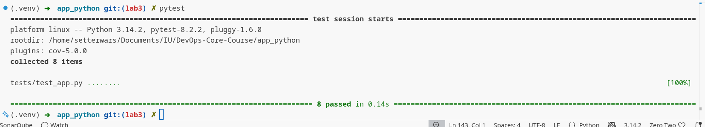

## Unit Testing

- Create unit tests for `app.py`
- Added to requirements.txt new libs
```txt
flask==3.1.0
pytest==8.2.2
pytest-cov==5.0.0
ruff==0.6.9
```
- Checked it tests locally. 



## Github Action CI workflow

- `python-ci.yml` triggered only in `lab3` and `master` branches. Because in the CI/CD I push docker image to the docker hub, but in docker hub must be only latest and working, in good practise master always has working and latest code. And docker image pushed to the docker hub only from the `master` branch.
- As actions I choose basic actions what I always use then create CI/CD pipelines.
- As tagging of images I use Calendar Versioning. Because this stragegy is usefull and if in developing process we notice what some part of app is down by this tag we can find there it will down.

- **Link to passed CI/CD:**
