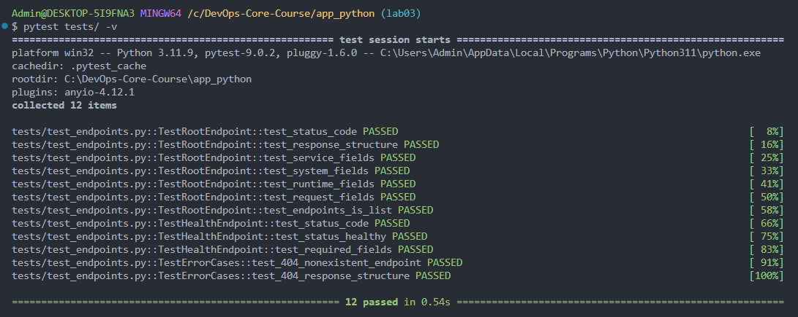

# Lab 03 — CI/CD

## 1. Overview

**Testing framework:** pytest. Simple syntax, built-in TestClient for FastAPI, Python standard.

**Test structure:** Classes TestRootEndpoint, TestHealthEndpoint, TestErrorCases. Each endpoint has status, structure, and type checks.

**Endpoints covered:** `GET /` (JSON structure, service/system/runtime/request/endpoints), `GET /health` (status, timestamp, uptime_seconds), `GET /nonexistent` → 404.

**CI triggers:** push and pull_request on main, lab03.

**Versioning:** CalVer (YYYY.MM.DD). Suits web service, continuous deployment.

**Actions used:** actions/checkout, setup-python, cache, docker/login-action, build-push-action — standard, well-maintained, pinned versions.

---

## 2. Workflow Evidence

- **Successful workflow run:** [GitHub Actions](https://github.com/TurikRoma/DevOps-Core-Course/actions)
- **Tests passing locally:** 
- **Docker image:** [roma3213/info_service](https://hub.docker.com/r/roma3213/info_service)
- **Status badge:** in README (clickable, links to Actions)

---

## 3. Best Practices Implemented

- **Job dependencies:** Docker push only after tests pass
- **Conditional push:** image only on push, not on PR
- **Caching:** actions/cache for ~/.cache/pip. With only 5 deps, no noticeable time improvement — kept for consistency and future scaling.
- **Snyk:** --severity-threshold=high. 2 vulnerabilities in starlette (ReDoS, Throttling) — upgraded fastapi to 0.129+

---

## 4. Key Decisions

**Versioning Strategy:** CalVer. Service, not library — date matters more than breaking changes.

**Docker Tags:** `roma3213/info_service:YYYY.MM.DD` and `roma3213/info_service:latest`

**Workflow Triggers:** push/PR on main, lab03 — catch issues before merge, validate on feature branches.

**Test Coverage:** endpoints / and /health, JSON structure, 404. Not covered: config, exception handlers.

---

## 5. Challenges

- Snyk 401: snyk/actions/setup auth error. Fix: `npm install -g snyk`
- Snyk "Required packages missing": snyk/actions/python runs in Docker. Fix: run in same job where deps are installed
- starlette vulnerabilities: Fix: fastapi>=0.129.0
