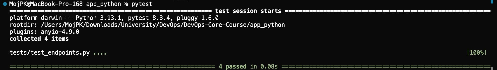
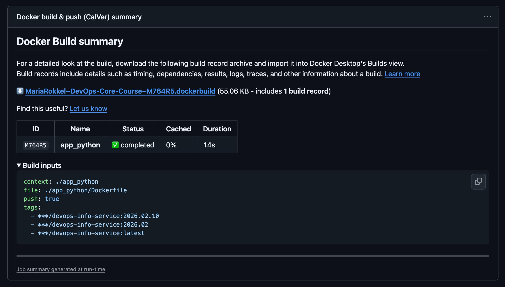
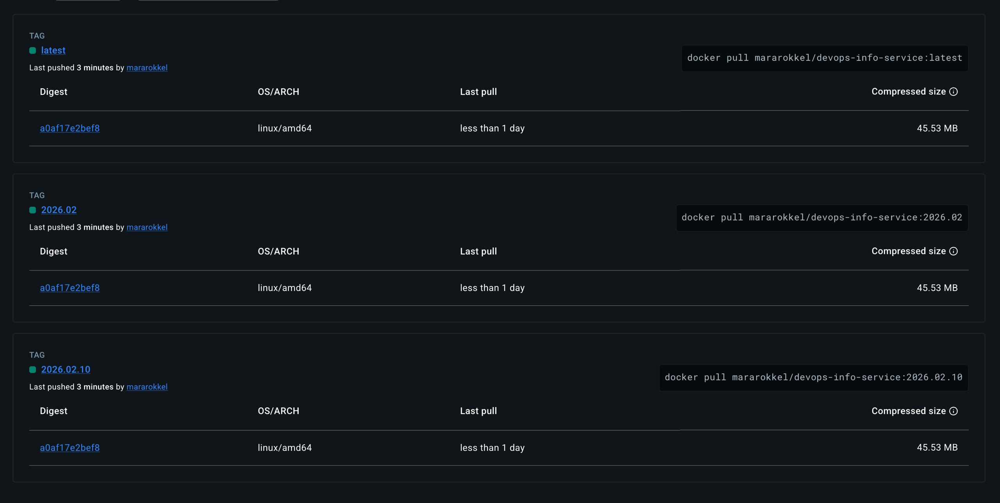

# LAB03 — Continuous Integration (CI/CD)

## Task 1 — Unit Testing

### Testing Framework Selection
**Choice:** `pytest`

**Why pytest:**
- **Simple syntax**: readable tests with minimal boilerplate.
- **Great ecosystem**: fixtures (`client`), monkeypatching, plugins.
- **Works well with Flask**: integrates cleanly with Flask’s built-in test client.

### Test Structure
- Tests are located in `app_python/tests/`
- Main test file: `app_python/tests/test_endpoints.py`
- Covered cases:
  - `GET /` — JSON structure and required fields
  - `GET /health` — health response fields
  - `404` — JSON error response for unknown endpoint
  - `500` — JSON error response on internal exception

### How to Run Tests Locally
Install dev dependencies:

```bash
pip install -r requirements-dev.txt
```

Run tests:

```bash
pytest
```

### Pytest Output (Proof)

```text
MojPK@MacBook-Pro-168 app_python % pytest
========================================================== test session starts ===========================================================
platform darwin -- Python 3.13.1, pytest-8.3.4, pluggy-1.6.0
rootdir: /Users/MojPK/Downloads/University/DevOps/DevOps-Core-Course/app_python
plugins: anyio-4.9.0
collected 4 items

tests/test_endpoints.py ....                                                                                                       [100%]

=========================================================== 4 passed in 0.08s ============================================================
```

### Screenshot



---

## Task 2 — GitHub Actions CI Workflow

### Workflow Overview
- **Workflow name:** `Python CI (app_python)`
- **Location:** `.github/workflows/python-ci.yml`
- **What it does:**
  - On every change in `app_python/**` (any branch):
    - installs dev dependencies
    - runs `ruff check .`
    - runs `pytest`
  - On `push` to `master` / `main` / `lab03`:
    - builds the Docker image for the Python app
    - pushes it to Docker Hub with CalVer tags

### Triggers (when CI runs)
- **`push`** to any branch (`branches: "**"`) when files change in:
  - `app_python/**`
  - or `.github/workflows/python-ci.yml`
- **`pull_request`** targeting any branch (`branches: "**"`) with the same paths.

**Details:**
- Job **`test`** (lint + pytest) runs on **every branch**.
- Job **`docker`** (build & push) runs **only on `push` to `master`, `main`, or `lab03`**:
  - this prevents accidentally publishing images from random feature branches.

### Actions Used and Why
- **`actions/checkout@v4`** — standard way to fetch repository code in CI.
- **`actions/setup-python@v5`** — guarantees the required Python version (`3.11`) regardless of the runner.
- **`docker/setup-buildx-action@v3`** — prepares the environment for modern Docker builds.
- **`docker/login-action@v3`** — securely logs into Docker Hub using `DOCKERHUB_USERNAME` and `DOCKERHUB_TOKEN`.
- **`docker/build-push-action@v6`** — single step to build and push the image with multiple tags.

### Versioning Strategy (CalVer)
I chose **Calendar Versioning (CalVer)** because:
- it clearly shows the **release date**;
- it is easy to see which releases happened in the same month;
- it fits **frequent CI/CD releases** without manual SemVer bumping.

In the `docker` job two tags are computed based on the current UTC date:
- `YYYY.MM.DD` — a full “daily” release, for example `2026.02.10`
- `YYYY.MM` — a “monthly” release, for example `2026.02`

Additionally, one more tag is added:
- `latest`

**Resulting Docker Hub image tags:**
- `${DOCKERHUB_USERNAME}/devops-info-service:YYYY.MM.DD`
- `${DOCKERHUB_USERNAME}/devops-info-service:YYYY.MM`
- `${DOCKERHUB_USERNAME}/devops-info-service:latest`

### Proof (CI Run)
- The **Actions** tab in GitHub shows a successful run of the `Python CI (app_python)` workflow for branch `lab03` (green check).

#### GitHub Actions — Docker build & push



#### Docker Hub — CalVer Tags



---

## Task 3 — CI Best Practices & Security

### Status Badge
- Added a GitHub Actions status badge for the `Python CI (app_python)` workflow to the top of `app_python/README.md`:
  - badge shows the current status of the CI pipeline for branch `lab03`
  - clicking the badge opens the workflow runs page in GitHub Actions
- This provides immediate visual feedback that the pipeline is passing before running or deploying the app.

### Dependency Caching
- Implemented **pip caching** via `actions/setup-python@v5`:
  - `cache: pip` enables caching for Python packages
  - `cache-dependency-path` includes `app_python/requirements.txt` and `app_python/requirements-dev.txt`
- Effect:
  - the first run installs all dependencies (cold cache)
  - subsequent runs are faster due to cache hits
  - this reduces pipeline duration and load on package registries

**Measured improvement (GitHub Actions):**
- Cold cache run: _[fill in duration from Actions]_  
- Warm cache run: _[fill in duration from Actions]_  
- Improvement: _[fill in percent]_

### Security Scanning with Snyk
- Integrated **Snyk** security scanning into the `test` job:
  - installs Snyk CLI via `snyk/actions/setup`
  - runs only when the `SNYK_TOKEN` secret is configured in the repository
  - scans Python dependencies for known vulnerabilities using:
    - `snyk test --file=requirements.txt`
- Detected vulnerabilities and remediation steps can be reviewed in the Snyk UI:
  - upgrade affected packages where possible
  - document accepted risks if upgrading is not feasible

**Snyk result (proof):**
- _[optional: add a screenshot of the Snyk step output from GitHub Actions]_ 

### CI Best Practices Applied
In this lab the following CI best practices were applied:

1. **Least privilege and scoped permissions**
   - Workflow-level `permissions: contents: read` and minimal permissions in jobs
   - Docker Hub credentials are provided via GitHub Secrets and used only in the `docker` job

2. **Path filters and branch controls**
   - Workflow triggers only when files in `app_python/**` or the workflow file change
   - Docker image publishing is limited to `master`, `main`, and `lab03` branches to avoid accidental releases

3. **Dependency caching**
   - pip caching is enabled via `actions/setup-python@v5` (`cache: pip`)
   - reduces CI time and resource usage across many pushes and pull requests

4. **Separation of concerns in jobs**
   - `test` job focuses on linting, tests, and security scanning
   - `docker` job depends on `test` and only runs after tests pass, enforcing a “test before build/publish” workflow
