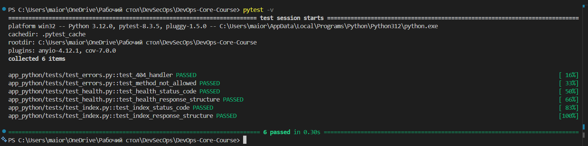
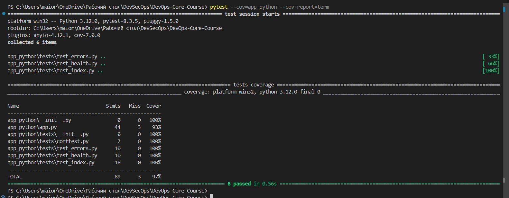

# Lab 3 — Continuous Integration (CI/CD)

## 1. Overview

**Testing Framework:** `pytest`  
**Why it was chosen:**  
- Simple and straightforward syntax
- Integrates well with Flask via test client
- Supports plugins, including `pytest-cov` for code coverage
- Modern standard for Python projects

**ЧWhat cover tests:**
- `GET /health` — status checks, JSON structure, uptime
- `GET /` — JSON structure, blocks: service, system, runtime, request, endpoints
- Error Handlers:
  - 404 Not Found
  - 500 Internal Server Error
- Edge cases:
  - Different Methods (For example, POST on GET endpoint)
- Additional:
  - checks User-Agent and IP in request in block

**CI Workflow Trigger:**
- **push:** 'app_python/' 
- **pull_request:** 'app_python/'

**Versioning Strategy:** Calendar Versioning (CalVer)  
- Version format: `YYYY.MM.DD`
- Docker image tags: `2026.02.11` and `latest`
- Why chosen: allows you to quickly and easily understand the build date, convenient for daily service updates

---

## 2. Workflow Evidence

**GitHub Actions:**

- Workflow file: `.github/workflows/python-ci.yml`
- Status of steps:
  - Linting (ruff)
  - Unit tests (pytest)
  - Docker build & push
- Workflow run (example):  

**Local tests:**

3. Best Practices Implemented
- **Dependency caching**: speeds up pip dependency installation in CI
- **Fail fast**: CI stops if tests fail, Docker does not build
- **Path filters (for bonus)**: Python workflow only runs when app_python/ changes
- **Linting (ruff)**: automatic code quality check
- **Docker push only from main**: prevents accidental publication of unstable builds
- **Snyk** (security scanning):
    - Integration into workflow
    - Checks dependencies for known vulnerabilities
    - No critical vulnerabilities found at this time

