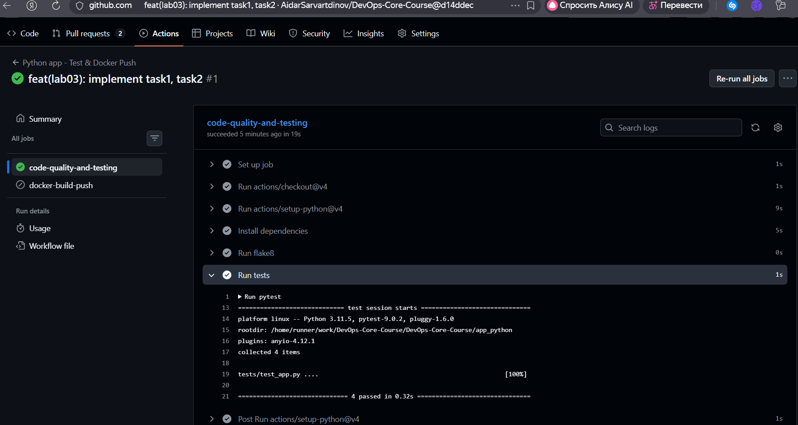

## Testing
I chose pytest because it it simple and modern standard

To run tests locally:

After installing requirements:

```bash
pytest
```

Output example:
```bash
================================================ test session starts =================================================
platform win32 -- Python 3.11.5, pytest-9.0.2, pluggy-1.6.0
rootdir: C:\Projects\DevOps\DevOps-Core-Course\app_python
plugins: anyio-4.12.1
collected 4 items

tests\test_app.py ....                                                                                          [100%]

================================================= 4 passed in 0.50s ================================================== 
```

## Workflow

### Trigger Strategy

The workflow triggers on every push to run tests and linting, ensuring code quality on each commit.

Docker build and push is triggered only when a pull request is opened. This avoids unnecessary image builds for intermediate commits or documentation updates.

### Actions

actions/checkout@v4 – supports fetch-depth: 0 to retrieve Git tags for version detection.

actions/setup-python@v4 – provides Python setup with built‑in pip caching.

actions/cache@v4 - used for Python venv caching.

docker/login-action@v3 – securely handles Docker Hub credentials via GitHub Secrets.

docker/metadata-action@v5 – generating Docker tags and labels; automatically extracts SemVer from Git tags and adds latest.

docker/setup-buildx-action@v3 – enables Buildx for efficient layer caching.

docker/build-push-action@v5 – integrates caching, tag list, and push in one step.

### Tagging Strategy

latest – always updated on every new pull request; represents the most recent stable build.

X.Y.Z (SemVer) – added only when the commit associated with the pull request has a Git tag vX.Y.Z; ensures exact versioning for releases.

### Workflow run link
https://github.com/AidarSarvartdinov/DevOps-Core-Course/actions/runs/21944641464/job/63378950422


### Output
docker-build-push job runs only on pull request, so it was skipped here



## CI Best Practices & Security

### Status Badge

[](https://github.com/AidarSarvartdinov/DevOps-Core-Course/actions/workflows/python-ci.yml)

### Dependencies caching

venv createion and dependencies installation took 11 seconds, total 27 seconds

After caching the installation took 0 seconds, total 15 seconds


### Best Practices

Matrix Builds: Test multiple Python versions (3.11, 3.12, 3.13). Ensures compatibility of the code with different versions of the interpreter

Fail Fast: Stop workflow on first failure. Gives quick feedback

Job Dependencies: Docker won't be pushed if tests fail

Workflow Concurrency: Cancel outdated workflow runs


### Found vulnerabilities
```bash
Upgrade starlette@0.38.6 to starlette@0.49.1 to fix
  ✗ Regular Expression Denial of Service (ReDoS) [High Severity][https://security.snyk.io/vuln/SNYK-PYTHON-STARLETTE-13733964] in starlette@0.38.6
    introduced by starlette@0.38.6 and 1 other path(s)
  ✗ Allocation of Resources Without Limits or Throttling [High Severity][https://security.snyk.io/vuln/SNYK-PYTHON-STARLETTE-8186175] in starlette@0.38.6
    introduced by starlette@0.38.6 and 1 other path(s)
```

## Challenges
At first, snyk ran outside the virtual environment. I changed python/@master to setup/@master

When I updated starlette, fastapi started requiring some older version, so I had to update fastapi.
