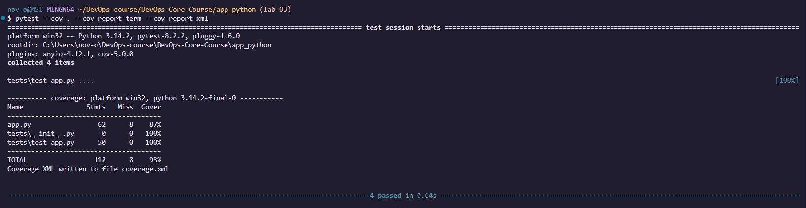

# LAB03 — Continuous Integration (Python)

## Overview
**Testing framework:** pytest
**Coverage:** pytest-cov generates `coverage.xml`, and CI can fail if coverage drops below a threshold.

**CI triggers:** workflows run on `push` and `pull_request` only when app files change (path filters).  
**Versioning:** CalVer (YYYY.MM.DD) + `latest` (and an extra tag with short commit SHA).

## Testing Framework Choice
I use **pytest** because it has simple syntax, good assertions, and works well with Flask’s test client without starting a real server.  
It also integrates well with coverage tools and CI pipelines.

## Test Structure
Tests are located in `app_python/tests/test_app.py`.  
A pytest fixture creates a Flask test client, and each test calls endpoints directly and validates status codes and the JSON structure (not environment-specific values like hostname).

## How to run tests locally
From `app_python/`:
```bash
python -m venv venv
source venv/bin/activate
pip install -r requirements.txt -r requirements-dev.txt
ruff check .
pytest --cov=. --cov-report=term --cov-report=xml
```

## Terminal output showing all tests passing




## Workflow Evidence

* Python workflow run:
* Go workflow run:
* Docker Hub Python image:
* Docker Hub Go image:

## Best Practices Implemented

* **Matrix builds:** test multiple Python versions to catch compatibility issues early.
* **Fail fast:** stops quickly on failures to save time.
* **Job dependency:** Docker push runs only if tests pass.
* **Conditional push:** images are pushed only on `master`.
* **Caching (pip + Docker layers):** speeds up repeated builds.
* **Concurrency:** cancels outdated runs when new commits are pushed.

**Caching speed:**

* First run (cache miss): seconds
* Next run (cache hit): seconds

**Snyk:** runs with severity threshold `high` and reports vulnerabilities (enabled when `SNYK_TOKEN` is configured).
If issues are found, I update dependencies and re-run CI.

## Key Decisions

**Docker tags created by CI:**

* `YYYY.MM.DD`
* `YYYY.MM.DD-<shortsha>`
* `latest`

**Workflow triggers:** path filters avoid running Python CI when only Go changes and vice versa.
**Test coverage:** tests focus on response structure and status codes; variable runtime/system values are not compared exactly.

## Challenges

* **Local env issue:** tests failed when Flask was not installed in the current environment.
  **Fix:** install dependencies with `pip install -r requirements.txt -r requirements-dev.txt` (inside venv).
* **Path filters:** I included workflow files in paths so CI runs when the workflow itself changes.
```
