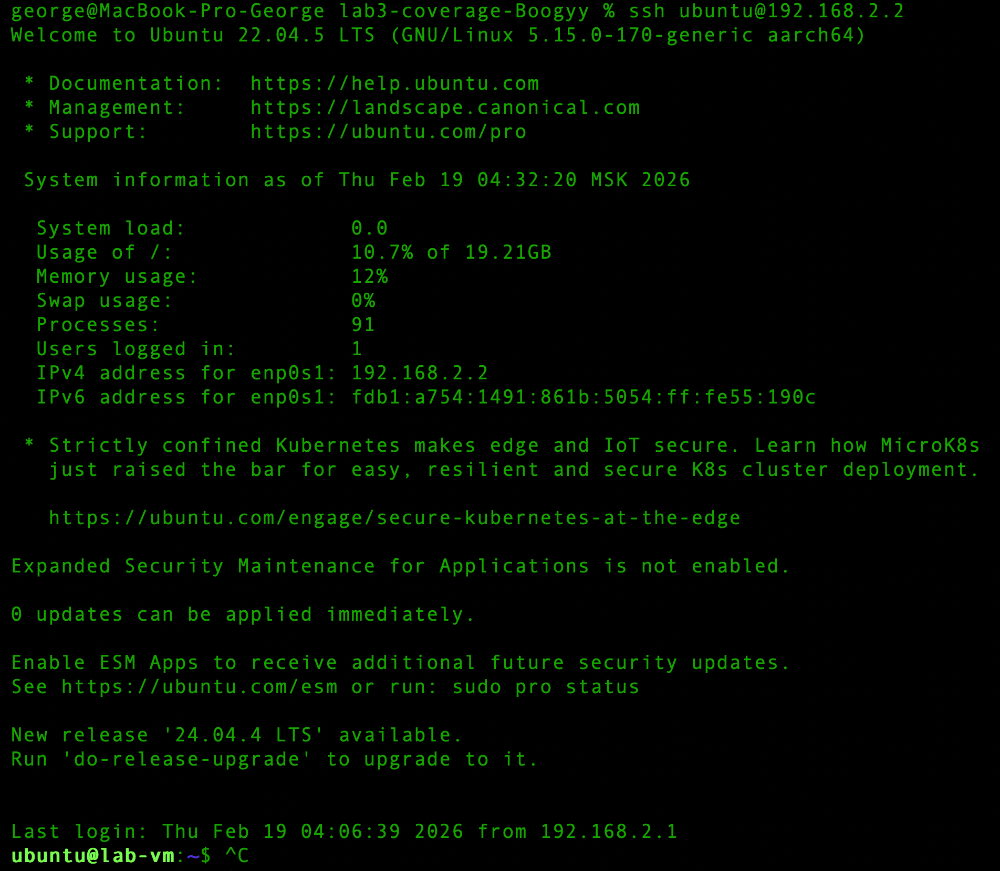
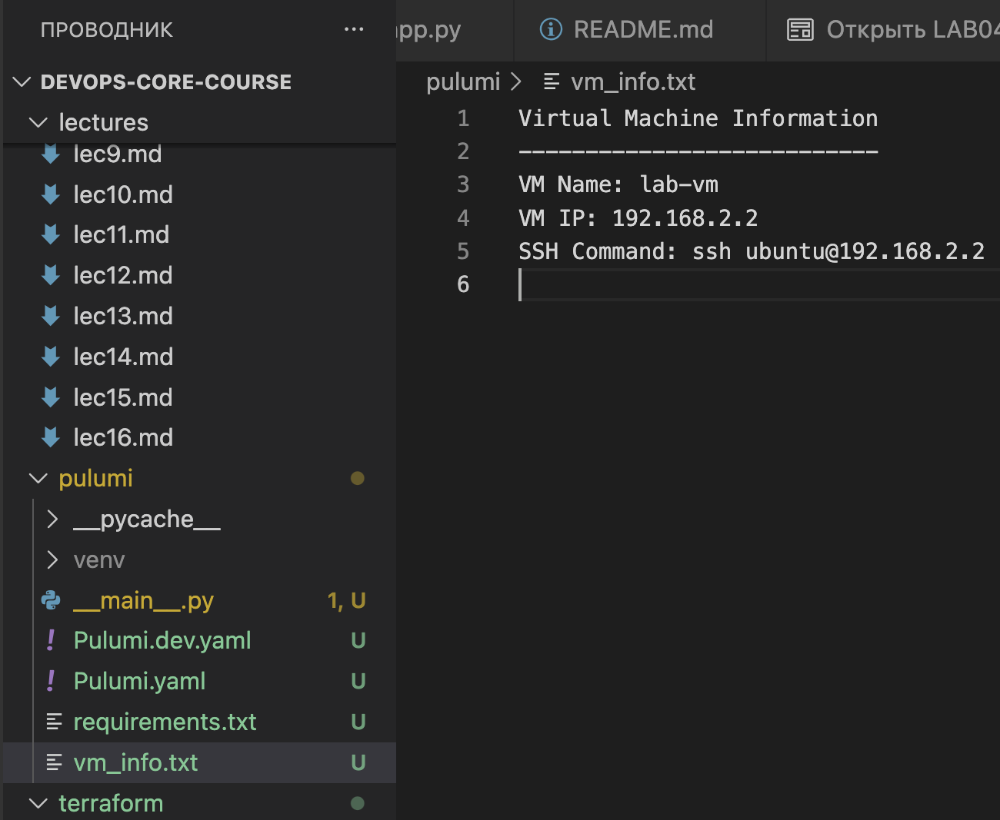

# LAB04 — Infrastructure as Code (Local VM Alternative)


# 1. Cloud Provider & Infrastructure

## Cloud Provider & Rationale

For this lab, I did **not use a cloud provider**.
Instead, I used a **local Ubuntu virtual machine created with Multipass on macOS**, which was choosen as a Local VM Alternative.

Rationale:

* Provides full control over the environment
* Some services are not working for certain reasons, making interaction difficult
* The cost is $0
* Suitable for demonstrating infrastructure in the form of code concepts

---

## Infrastructure Details

### Virtual Machine:

* Platform: Multipass on macOS
* OS: Ubuntu 22.04 LTS
* RAM: 2 GB
* Disk: 20 GB
* CPU: Default (Multipass standard)
* IP Address: `192.168.2.2`
* SSH User: `ubuntu`

### Firewall Configuration:

Ports opened using UFW:

* 22 (SSH)
* 80 (HTTP)
* 5000 (Custom app port)

Commands used:

```bash
sudo apt install ufw
sudo ufw allow 22/tcp
sudo ufw allow 80/tcp
sudo ufw allow 5000/tcp
sudo ufw enable
```

Output:

```bash
Firewall is active and enabled on system startup
ubuntu@lab-vm:~$ sudo ufw status
Status: active
```

### Region / Zone

Since a local VM was used via Multipass, no cloud region or availability zone was required.
The VM runs locally on macOS host using NAT networking.

### Infrastructure Mapping (Local Alternative)

In a typical cloud deployment, the following resources would be created:

- Virtual Machine
- Virtual Network
- Security Group (Firewall)
- Public IP Address

In this lab, these components were implemented locally:

- VM → Multipass Ubuntu instance
- Network → NAT provided by Multipass
- Security Group → UFW firewall rules
- Public IP → Local network IP address

Terraform was used to manage infrastructure metadata and demonstrate IaC principles.


## Cost

Total cost: **$0**

Since a local VM was used, no cloud resources were billed.


## Resources Created

Although no cloud provider was used, the following logical infrastructure components were defined:

* Virtual Machine (Ubuntu)
* Network (local NAT via Multipass)
* Firewall rules (UFW)
* Public-access equivalent IP (local network IP)


# 2. Terraform Implementation

## Terraform Version

```bash
terraform version
Terraform v1.14.3
```


## Project Structure

```
terraform/
 ├── main.tf
 ├── variables.tf
 ├── outputs.tf
 ├── vm_info.txt (was created, but then removed before pulumi creation)
 └── terraform.tfvars
```


#### Variables

Input variables are defined in `variables.tf`:

* `vm_name`
* `vm_ip`
* `ssh_user`

Values are provided through `terraform.tfvars`.

---

#### Outputs

Outputs display:

* VM name
* VM IP
* SSH connection command

---

## Key Configuration Decisions

Since a local VM was used instead of cloud resources:

* Terraform was used to describe infrastructure conceptually
* Variables were used for configurable values
* Outputs were used to expose VM name and IP
* State file was kept locally
* No secrets were committed

---

## .gitignore Configuration

```
.terraform/
*.tfstate
*.tfstate.*
terraform.tfvars
```

No secrets were committed.

---

## Terraform Command Outputs

### terraform init

```bash
terraform init

Initializing the backend...
Initializing provider plugins...
...
Terraform has been successfully initialized!

You may now begin working with Terraform. Try running "terraform plan" to see
any changes that are required for your infrastructure. All Terraform commands
should now work.
```

---

### terraform plan

```bash
terraform plan

Terraform will perform the following actions:
# local_file.vm_info will be created
  + resource "local_file" "vm_info" {
  ...

Plan: 1 to add, 0 to change, 0 to destroy.
```

---

### terraform apply

```bash
terraform apply

Apply complete! Resources: 1 added, 0 changed, 0 destroyed.

Outputs:

ssh_command = "ssh ubuntu@192.168.2.2"
vm_ip = "192.168.2.2"
vm_name = "lab-vm"
```

---

## SSH Proof

```bash
ssh ubuntu@192.168.2.2
```
Output:

```bash
ubuntu@lab-vm:~$
```


---

## Challenges Encountered

* Ensuring no secrets were committed.
* Understanding state file management.
* Terraform normally provisions real cloud resources, so adapting it for local VM required conceptual implementation.

---

# 3. Pulumi Implementation

## Pulumi Version & Language

* Pulumi CLI: (v3.222.0)
* Language: Python

## Terraform Resource Cleanup

Before recreating infrastructure with Pulumi, Terraform-managed resources were destroyed.

Command executed:

```
terraform destroy
```
```bash
Terraform will perform the following actions:

  # local_file.vm_info will be destroyed
  - resource "local_file" "vm_info" {
      ...
      - filename = "./vm_info.txt" -> null
    }

Plan: 0 to add, 0 to change, 1 to destroy.
...
local_file.vm_info: Destroying...
local_file.vm_info: Destruction complete after 0s

Destroy complete! Resources: 1 destroyed.
```

Result:

The generated file `vm_info.txt` was successfully removed.

Since a local VM was used instead of a cloud provider, no cloud resources required destruction.

---


## Project Structure

```
pulumi/
 ├── __main__.py
 ├── requirements.txt
 ├── vm_info.txt (temp file, to show that pulumi work and can create)
 ├── Pulumi.yaml
 └── Pulumi.dev.yaml
```

---

## pulumi preview

```bash
pulumi preview

Previewing update (dev):
    Type                 Name
    pulumi:pulumi:Stack  lab-pulumi-dev

Resources:
    2 unchanged
```

---

## pulumi up

```bash
pulumi up

Do you want to perform this update? yes
Updating (dev):
     Type                      Name              Status              
 +   pulumi:pulumi:Stack       lab-pulumi-dev    created (0.05s)     
 +   └─ command:local:Command  createVmInfoFile  created (0.01s)     

Outputs:
    ssh_command: "ssh ubuntu@192.168.2.2"
    vm_ip      : "192.168.2.2"
    vm_name    : "lab-vm"

Resources:
    + 2 created

Duration: 1s
```


---

## SSH Proof

```bash
ssh ubuntu@192.168.2.2
```

Output:

```bash
ubuntu@lab-vm:~$
```


## Advantages Discovered

* More flexible logic
* Easier to extend with conditionals and loops


## Challenges Encountered

* Managing Pulumi state
* Stack configuration understanding

## How Pulumi Code Differs from Terraform

Pulumi uses an imperative programming model (Python in this case), allowing infrastructure to be defined using real programming constructs such as variables, loops, and conditionals. Terraform uses declarative HCL syntax where the desired state is described.

Terraform uses .tfvars files for configuration, while Pulumi uses stack configuration (`pulumi config`).

---

# 4. Terraform vs Pulumi Comparison

## Ease of Learning

Terraform was easier initially because it uses a simple declarative syntax (HCL). Pulumi requires understanding of both infrastructure concepts and a programming language.

---

## Code Readability

Terraform configuration is more concise and purpose-built for infrastructure.
Pulumi is more flexible but can become more verbose.

---

## Debugging

Pulumi provides better debugging capabilities because it runs in a real programming environment. Terraform errors are sometimes less descriptive.

---

## Documentation

Terraform has more mature documentation and a larger community. Pulumi documentation is modern but less extensive.

---

## Use Case

Terraform is ideal for standardized, declarative cloud infrastructure.
Pulumi is better when complex logic or integration with application code is required.

---

# 5. Lab 5 Preparation & Cleanup

## VM for Lab 5

The VM being kept for Lab 5 was created manually using Multipass.
Terraform and Pulumi managed only local metadata resources.
* All Terraform-managed resources were destroyed.
* All Pulumi-managed resources were destroyed.

The VM remains running and accessible via SSH.

VM being kept:

* Multipass Ubuntu VM
* IP: 192.168.2.2
* Status: Running

Proof:

```bash
multipass list
```

Output:

```bash
Name      State    IPv4            Image
lab-vm    Running  192.168.2.2     Ubuntu 22.04 LTS
```

---

## Cleanup Status

Since a local VM was used and no cloud resources were created:

* No cloud cleanup required
* No billing resources exist
* Terraform and Pulumi state files remain local
* No secrets committed

