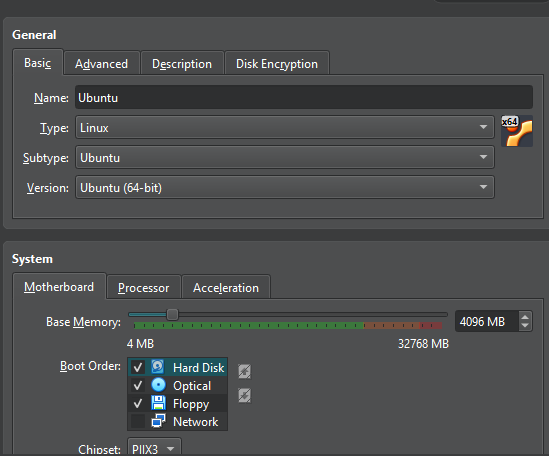
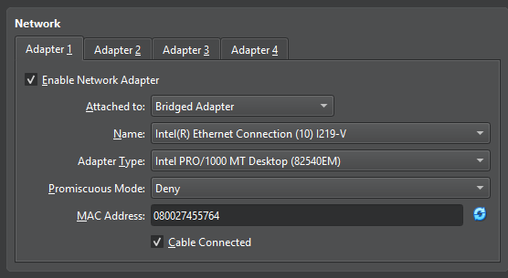
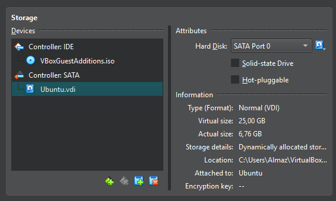

## Local VM Choice
I chose to use local VM (Ubuntu) because I cannot find any free cloud service provider.
#### Total cost - 0

## Local VM Setup
### Step 1: Install Ubuntu to VirtualBox
I downloaded the Ubuntu ISO file and installed it on VirtualBox. 
I allocated 4096 MB of RAM, 25 GB of storage and set Bridget mode as Network adapter for the VM.




### Step 2: 
After installing Ubuntu, I run following commands to setup ssh:
```bash
sudo apt update
sudo apt install openssh-server

mkdir -p ~/.ssh
echo "public-key" >> ~/.ssh/authorized_keys
chmod 700 ~/.ssh
chmod 600 ~/.ssh/authorized_keys
```
After running the above commands, I can successfully connect to the VM using ssh from my local machine.
```bash
ssh -i private.key almaz@192.168.1.24
Welcome to Ubuntu 24.04.4 LTS (GNU/Linux 6.17.0-14-generic x86_64)

 * Documentation:  https://help.ubuntu.com
 * Management:     https://landscape.canonical.com
 * Support:        https://ubuntu.com/pro

Expanded Security Maintenance for Applications is not enabled.

0 updates can be applied immediately.

Enable ESM Apps to receive additional future security updates.
See https://ubuntu.com/esm or run: sudo pro status

Last login: Thu Feb 19 08:08:14 2026 from 192.168.1.7
```
## Tools used
| Tool       | Version                 |
|------------|-------------------------|
| VirtualBox | 7.1.4 r165100 (Qt6.5.3) |
| Ubuntu     | 24.04.4 LTS             |
| OpenSSH    | 1:9.6p1-3ubuntu13.14    |

## Terraform Implementation
I did not use Terraform because I used local VM and according to the lab instructions I can skip this section.

## Pulumi Implementation
I did not use Pulumi because I used local VM and according to the lab instructions I can skip this section.

## Terraform vs Pulumi Comparison
I did not use both Terraform and Pulumi, so I cannot compare them.

## Lab 5 Preparation & Cleanup
- Are you keeping your VM for Lab 5? - Yes
- If yes: Which VM (Terraform or Pulumi created)? - Local VM (Ubuntu)