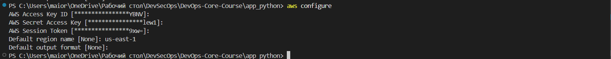
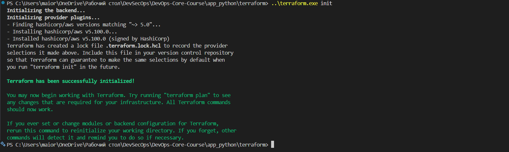
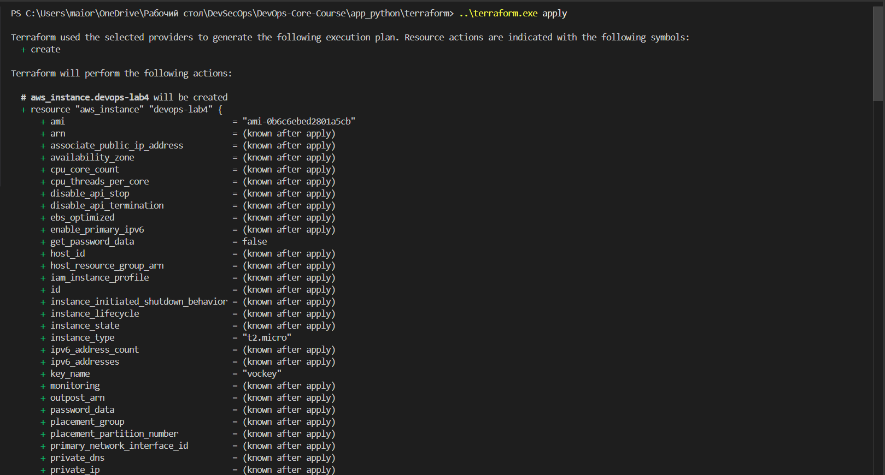
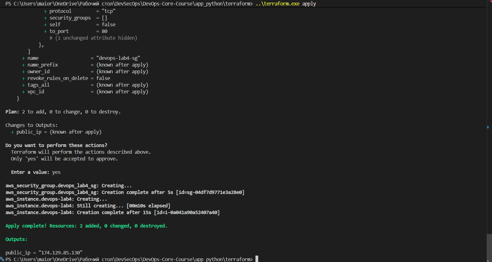
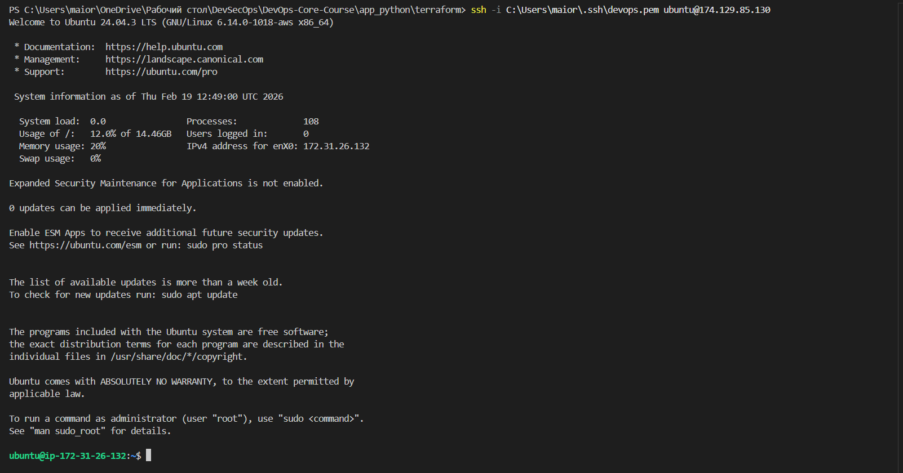
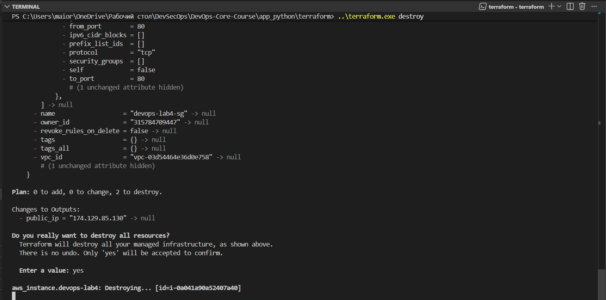
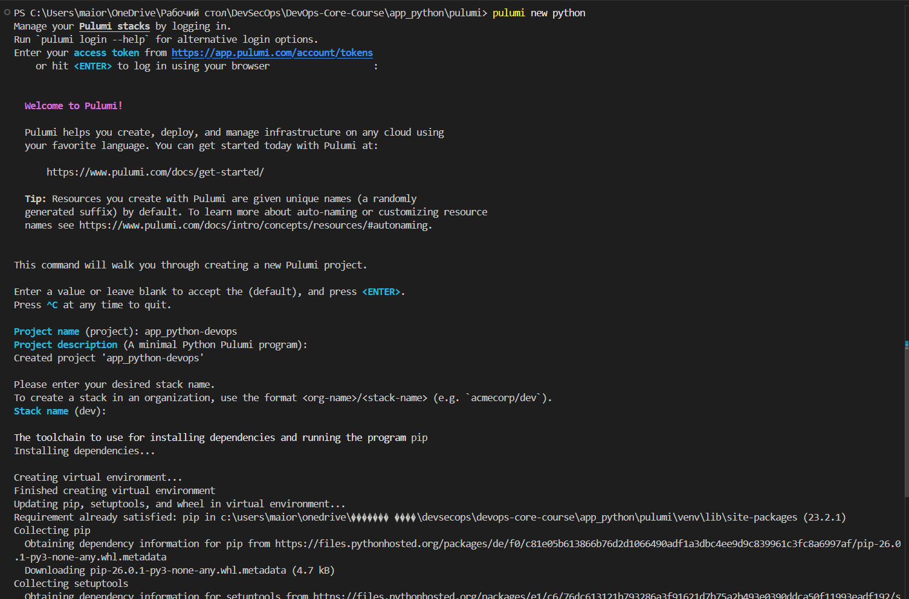
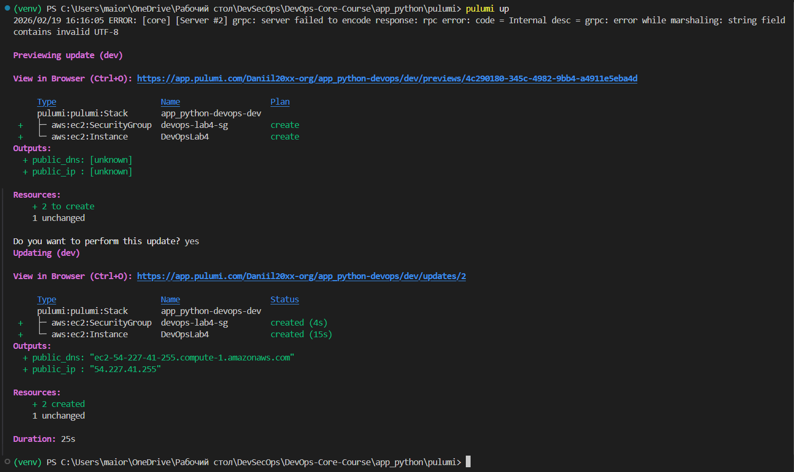
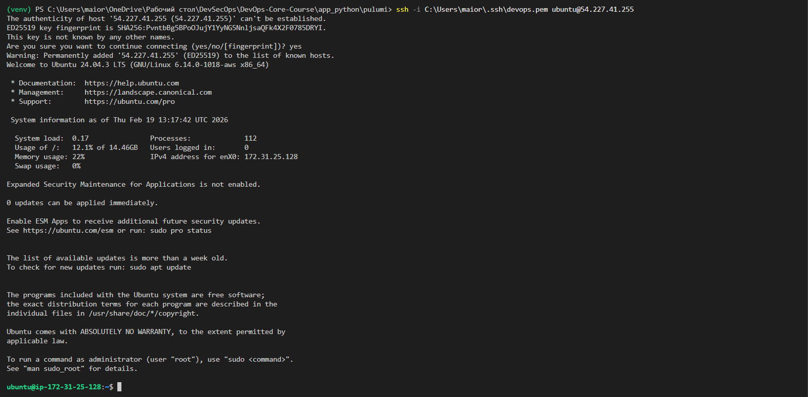
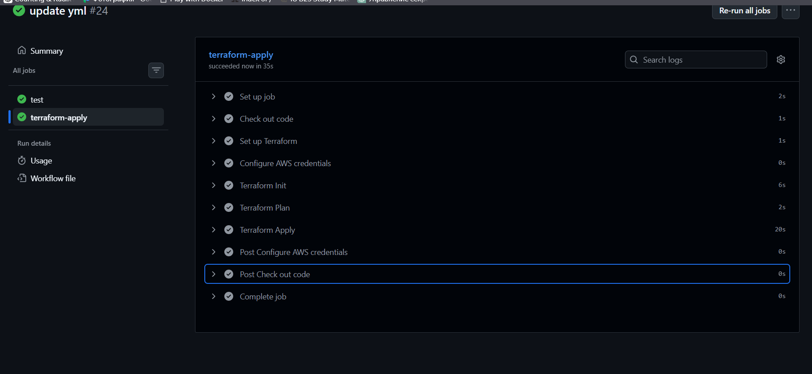

# Lab 4 — Terraform VM Creation (AWS)

## 1. Cloud Provider & Infrastructure

- **Cloud Provider:** AWS
- **Region:** us-east-1
- **Availability Zone:** default
- **Instance Type:** t2.micro (free tier)
- **Operating System:** Ubuntu 22.04 LTS
- **Total Cost:** $0 (within free tier limits)
- **Resources Created:**
  - EC2 Instance: `DevOpsLab4`
  - Security Group: `devops-lab4-sg`
    - Ingress:
      - SSH 22 (from all IPs `0.0.0.0/0`)
      - HTTP 80 (from all IPs)
      - HTTPS 443 (from all IPs)
    - Egress:
      - All traffic allowed (0.0.0.0/0)
  - Public IP attached to EC2 instance

---

## 2. Terraform Implementation

- **Terraform Version:** v1.9+
- **Project Structure:**

```
terraform/
 ─ main.tf # Provider + resources
 ─ outputs.tf # Outputs (public IP, instance ID)
```

- **Key Configuration Decisions:**
  - Security group allows SSH only to my IP (for better security)
  - Outputs configured to easily access Public IP

- **Challenges Encountered:**
  - Selecting correct AMI ID
  - Selecting cloud for free trial use

---

## 3. Terminal Output

### AWS config


### Terraform Initialization


### Terraform Apply


### Terraform Apply finish


### Connection via SSH


### Terraform Destroy



---

## 3. Pulumi Implementation

### Pulumi Version and Language

* **Pulumi CLI version:** v3.222.0
* **Programming language:** Python
* **Stack name:** `dev`

### Project Structure

```
pulumi/
├── __main__.py          # Main infrastructure code
├── requirements.txt     # Python dependencies
├── Pulumi.yaml          # Project metadata
```

### Resources Created

* **EC2 Instance:** `DevOpsLab4`

  * AMI: `ami-0b6c6ebed2801a5cb`
  * Instance type: `t2.micro`
  * Root volume: 16 GB
* **Security Group:** `devops-lab4-sg`

  * Ingress rules: SSH (22), HTTP (80), HTTPS (443)
  * Egress: all traffic allowed
* **Public IP:** automatically assigned and outputted
* **Public DNS:** automatically assigned and outputted

### Key Configuration Decisions

* Python was used for full programmatic control.
* SSH, HTTP, and HTTPS ports were opened for demonstration and future app deployment.
* `t2.micro` free-tier instance chosen to satisfy lab requirements.
* Output variables (`public_ip`, `public_dns`) for easy connection and verification.

### Challenges Encountered

* No challandes. After terraform, it more simpler.

### Terminal Output

#### Pulumi init


#### Pulumi up


#### Pulumi ssh



### Comparison with Terraform

* **Code:** Pulumi uses Python (imperative), Terraform uses HCL (declarative).
* **Ease of Use:** Pulumi allows loops, functions, and IDE autocomplete.
* **State Management:** Pulumi stores state locally or in Pulumi Service; Terraform uses local or remote state.
* **Outputs:** Pulumi outputs are accessible directly in Python.
* **Preference:** Pulumi is better for dynamic configurations and conditional logic; Terraform is faster for simple declarative VM setups.

---


## Bonus Task — Terraform CI/CD Integration

Objective: Automatically validate and apply infrastructure changes using GitHub Actions.

Workflow Overviews

- Trigger: Runs on pull requests for preview (terraform plan) and on main branch for applying (terraform apply).

- Steps for Terraform Validation:
  * Checkout code.
  * Set up Terraform
  * Terraform Init
  * Terraform Apply 

Applies the infrastructure automatically (terraform apply -auto-approve) using stored AWS credentials.



   