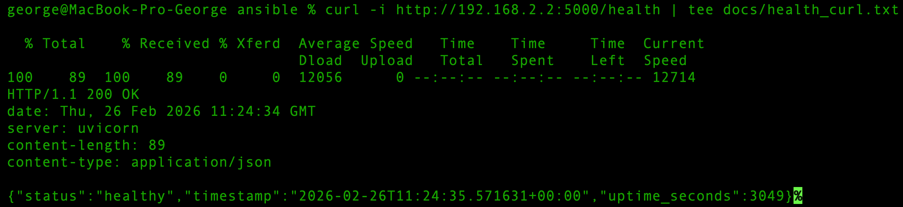
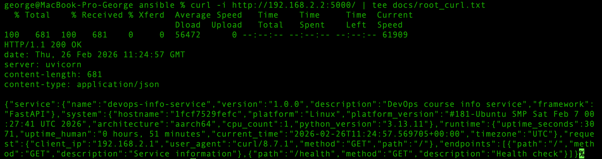

# LAB05 — Ansible Fundamentals

## 1. Architecture Overview

**Ansible version used**

```
ansible [core 2.20.3]
```

(Installed via Homebrew on macOS)

**Target VM**

* Platform: Multipass (local VM)
* OS: **Ubuntu 22.04 LTS**
* IP address: `192.168.2.2`
* SSH user: `ubuntu`
* Python: preinstalled (`/usr/bin/python3`)

**Role Structure**

The project uses a role-based architecture:

```
roles/
 ├── common
 ├── docker
 └── app_deploy
```

* **common** → baseline system configuration
* **docker** → container runtime installation and configuration
* **app_deploy** → application deployment and verification

**Why roles instead of monolithic playbooks?**

Roles provide clear separation of concerns, improve maintainability, and allow reuse across multiple environments. 

---

## 2. Roles Documentation

### Role: `common`

**Purpose**

Configures base system state required for all servers:

* Updates apt cache
* Installs essential packages
* Configures timezone

**Key Variables**

* `common_packages` → list of packages (curl, git, vim, htop, etc.)
* `common_timezone`
* `common_set_timezone`

**Handlers**

None (no services require restart).

**Dependencies**

None (standalone baseline role).

---

### Role: `docker`

**Purpose**

Installs and configures Docker Engine using the official Docker repository:

* Adds Docker GPG key and repository
* Installs Docker packages
* Enables and starts Docker service
* Adds user to docker group
* Installs `python3-docker` for Ansible modules

**Key Variables**

* `docker_packages`
* `docker_users`
* Docker repo configuration values

**Handlers**

* `restart docker` (triggered when repo or config changes)

**Dependencies**

None (but logically builds on the system prepared by `common`).

---

### Role: `app_deploy`

**Purpose**

Deploys the containerized FastAPI application:

* Pulls Docker image
* Ensures container is running
* Recreates container only if image changes
* Waits for port readiness
* Executes health check

**Key Variables (Vault)**

* `dockerhub_username`
* `dockerhub_password`
* `docker_image`
* `docker_image_tag`
* `app_port`
* `app_health_path`
* `app_env`

**Handlers**

Not required in final implementation (deployment is idempotent without forced restarts).

**Dependencies**

Requires Docker runtime from `docker` role.

---

## 3. Idempotency Demonstration

### Provision — First Run

On the first execution of:

```
ansible-playbook playbooks/provision.yml
```

Multiple tasks showed `changed`:

* apt cache update
* package installation
* Docker repository configuration
* Docker installation

This is expected because the system was converging to the desired state.

```bash
PLAY RECAP *********************************************************************
lab-vm                     : ok=13   changed=4    unreachable=0    failed=0    skipped=0    rescued=0    ignored=0   
```

---

### Provision — Second Run

Re-running the same playbook produced:

```bash
PLAY RECAP *********************************************************************
lab-vm                     : ok=13   changed=0    unreachable=0    failed=0    skipped=0    rescued=0    ignored=0   

```

No tasks required modification because the target state was already achieved.

---

### Analysis

**What changed on the first run**

* System packages installed
* Docker runtime configured
* Repository added
* Services enabled

**What did not change on the second run**

* Package state
* Docker service state
* Repository configuration
* User group membership

---

### Explanation: What makes the roles idempotent?

Idempotency is achieved by using state-based modules (`apt`, `service`, `user`, `docker_container`) rather than imperative commands. Each task declares the desired end state, so running the playbook repeatedly results in no changes once that state is reached.

---

## 4. Ansible Vault Usage

**How credentials are stored**

Sensitive variables are stored in:

```
group_vars/all.yml
```

This file is encrypted using **Ansible Vault (AES256)**.

**Vault password management**

* Vault password is provided interactively or via a local password file
* Password file is excluded from version control (`.gitignore`)

**Example encrypted file**

```
$ANSIBLE_VAULT;1.1;AES256
6462343331643932613539323...
```

**Why Ansible Vault is important**

Vault allows secrets to be safely stored in version control while preventing unauthorized access. It ensures credentials such as registry tokens are never exposed in plaintext.

---

## 5. Deployment Verification

### Deploy Playbook Execution

```
ansible-playbook playbooks/deploy.yml
```
```bash
...
TASK [app_deploy : Show health response (for logs)] ****************************
ok: [lab-vm] => {
    "msg": [
        "Health status: 200",
        "Health body: {\"status\":\"healthy\",\"timestamp\":\"2026-02-26T10:33:47.520273+00:00\",\"uptime_seconds\":1}"
    ]
}

PLAY RECAP *********************************************************************
lab-vm                     : ok=7    changed=2    unreachable=0    failed=0    skipped=1    rescued=0    ignored=0   
```

Result:

* Image pulled successfully
* Container started
* Health check passed

---

### Container Status

```
docker ps
```

Output:

```
CONTAINER ID   IMAGE                                   STATUS         PORTS
1fcf7529fefc   egorlazutkin/devops-info-service:lab2   Up 6 minutes   0.0.0.0:5000->5000/tcp
```

---

### Health Check

```
curl http://192.168.2.2:5000/health
```

Output:


---

### Root Endpoint

```
curl http://192.168.2.2:5000/
```

Output:


Returns service metadata JSON confirming the application is operational.

---

## 6. Key Decisions

### **Why use roles instead of plain playbooks?**

Roles provide modularization and separation of concerns, making automation easier to maintain and extend. They also align with Ansible best practices and allow reuse across environments.

### **How do roles improve reusability?**

Roles expose configurable variables and defaults, allowing the same logic to be reused for different hosts or applications without rewriting playbooks.

### **What makes a task idempotent?**

A task is idempotent when it ensures a desired state rather than executing an action blindly. Re-running the task does not change the system if the state is already correct.

### **How do handlers improve efficiency?**

Handlers run only when notified, preventing unnecessary service restarts and reducing system disruption.

### **Why is Ansible Vault necessary?**

Vault protects sensitive data such as tokens and passwords while still allowing automation code to be stored safely in version control.

---

## 7. Challenges

* Docker image pull initially failed due to VPN/network interference
  → resolved by adjusting network settings / disabling VPN

* Apt lock conflicts during installation
  → resolved by waiting for background apt processes to finish

* Ensuring deploy idempotency
  → fixed by removing unconditional container removal and recreating only when image changes


