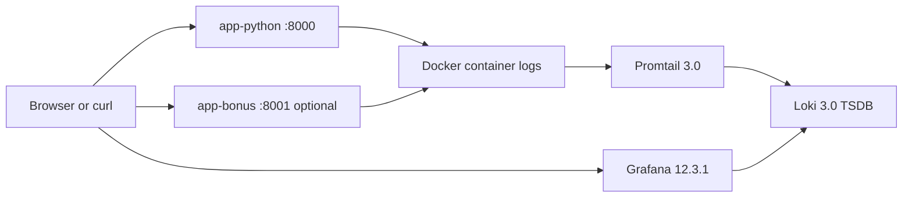

# Lab 7: Observability & Logging with Loki Stack

**Name:** Savva Ponomarev

---

## Architecture



### Research Notes

1. Loki stores compressed log streams indexed by labels, while Elasticsearch indexes full document contents. Loki is cheaper to run and faster for label-based log searches because it avoids full-text indexing of every field.
2. Labels are indexed metadata like `app`, `container`, and `job`. Good labels make queries fast; high-cardinality labels make Loki expensive and slow.
3. Promtail discovers containers through Docker service discovery via `/var/run/docker.sock`, then relabels Docker metadata into Loki labels.

---

## Setup Guide

### Project Structure

```text
monitoring/
├── .env.example
├── docker-compose.yml
├── docs/
│   └── LAB07.md
├── grafana/
│   ├── dashboards/
│   │   └── lab07-logs-dashboard.json
│   └── provisioning/
│       ├── dashboards/
│       │   └── dashboards.yml
│       └── datasources/
│           └── datasource.yml
├── loki/
│   └── config.yml
└── promtail/
    └── config.yml
```

### Deployment Steps

```bash
cd monitoring
cp .env.example .env
# edit GRAFANA_ADMIN_PASSWORD before first run
docker compose up -d
docker compose ps
```

### Verification Commands

```bash
curl http://localhost:3100/ready
curl http://localhost:9080/targets
curl http://localhost:3000/api/health
curl http://localhost:8000/
curl http://localhost:8000/health
```

### Generate Traffic

```bash
for i in {1..20}; do curl -s http://localhost:8000/ >/dev/null; done
for i in {1..20}; do curl -s http://localhost:8000/health >/dev/null; done
```

### Optional Bonus App

The repository does not include bonus app source code, so the compose stack includes `app-bonus` behind the `bonus` profile and pulls the image from `BONUS_APP_IMAGE`.

```bash
docker compose --profile bonus up -d
```

---

## Configuration

### Docker Compose

Key implementation choices in `monitoring/docker-compose.yml`:

- Loki, Promtail, Grafana, and the Python app run on a dedicated `logging` bridge network.
- Grafana provisioning is mounted read-only so the Loki data source and dashboard appear automatically.
- `deploy.resources` limits and reservations are applied to every service.
- Anonymous Grafana access is disabled and admin credentials come from `.env`.
- Health checks are defined for Loki, Promtail, and Grafana.
- `app-python` is built locally from `../app_python` so logging changes are tested directly from this repository.

### Loki

Snippet:

```yaml
schema_config:
  configs:
    - from: 2024-01-01
      store: tsdb
      object_store: filesystem
      schema: v13
      index:
        prefix: index_
        period: 24h

limits_config:
  retention_period: 168h
```

Why this config:

- `tsdb` with `filesystem` matches the Loki 3 single-node recommendation.
- Schema `v13` is the current TSDB schema for Loki 3.
- `retention_period: 168h` keeps seven days of logs.
- The compactor is enabled so expired data is actually removed.

### Promtail

Snippet:

```yaml
scrape_configs:
  - job_name: docker
    docker_sd_configs:
      - host: unix:///var/run/docker.sock
        filters:
          - name: label
            values: ["logging=promtail"]
    relabel_configs:
      - source_labels: ['__meta_docker_container_name']
        regex: '/(.*)'
        target_label: container
      - source_labels: ['__meta_docker_container_label_app']
        target_label: app
```

Why this config:

- Only containers explicitly labeled `logging=promtail` are scraped.
- `container` and `app` labels are extracted for clean LogQL filtering.
- Docker pipeline parsing makes JSON container log envelopes readable in Loki.

---

## Application Logging

The Python app now emits JSON logs through a custom formatter built on the standard `logging` module.

Example output:

```json
{"timestamp":"2026-03-12T10:15:22.413Z","level":"INFO","logger":"devops-info-service","message":"request completed","service":"devops-info-service","event":"http_request","method":"GET","path":"/health","status_code":200,"client_ip":"172.19.0.1","duration_ms":0.84}
```

Implemented log events:

- Startup and shutdown lifecycle events
- Every HTTP request with `method`, `path`, `status_code`, `client_ip`, and `duration_ms`
- Unhandled exceptions with traceback data

This format is intentionally flat so LogQL `| json` parsing works without extra transforms.

---

## Dashboard

Grafana provisioning creates the Loki data source and the dashboard automatically.

### Panels

1. `Recent Logs`
   Query:
   ```logql
   {app=~"devops-.*"}
   ```
   Shows live logs from all labeled applications.

2. `Request Rate by App`
   Query:
   ```logql
   sum by (app) (rate({app=~"devops-.*"} [1m]))
   ```
   Shows per-app log throughput as a time series.

3. `Error Logs`
   Query:
   ```logql
   {app=~"devops-.*"} | json | level="ERROR"
   ```
   Filters only error events after JSON parsing.

4. `Log Level Distribution`
   Query:
   ```logql
   sum by (level) (count_over_time({app=~"devops-.*"} | json [5m]))
   ```
   Aggregates log counts by level for a pie chart.

### Useful Explore Queries

```logql
{job="docker"}
{app="devops-python"}
{app="devops-python"} |= "ERROR"
{app="devops-python"} | json | method="GET"
{app="devops-python"} | json | status_code="404"
```

---

## Production Config

Implemented production-oriented changes:

- Grafana anonymous authentication disabled
- Admin password sourced from `.env`
- Explicit resource limits and reservations for every service
- Loki retention set to seven days
- Persistent named volumes for Loki, Promtail positions, and Grafana
- Health checks for core services

Security note: Promtail needs access to the Docker socket and container log directory. That is acceptable for this lab but should be reviewed carefully in a real production environment.

---

## Testing

### Local Validation Commands

```bash
cd monitoring
docker compose config
docker compose up -d
docker compose ps
curl http://localhost:3100/ready
curl http://localhost:9080/targets
curl http://localhost:3000/api/health
curl http://localhost:8000/
```

### Expected Grafana Flow

1. Open `http://localhost:3000`
2. Log in with the admin credentials from `.env`
3. Open `Explore` and choose the `Loki` data source
4. Run `{job="docker"}` and confirm logs are visible
5. Open the provisioned dashboard `Lab 07 - Loki Logs`

### Evidence Checklist

- [ ] Screenshot of Grafana Explore showing logs from at least three containers
- [ ] Screenshot of raw JSON logs from `app-python`
- [ ] Screenshot of the dashboard with all four panels populated
- [ ] Screenshot of `docker compose ps` with healthy services
- [ ] Screenshot of the Grafana login page with anonymous access disabled

---

## Challenges

1. The existing app logged plain text, which is hard to query in Loki. I replaced it with JSON logging so LogQL can parse fields reliably.
2. The existing Docker health check used `curl`, which is not present in the slim Python image. I changed it to a Python standard-library health probe.
3. Manual Grafana setup is easy to forget or misconfigure. I used Grafana provisioning so the data source and dashboard are reproducible.