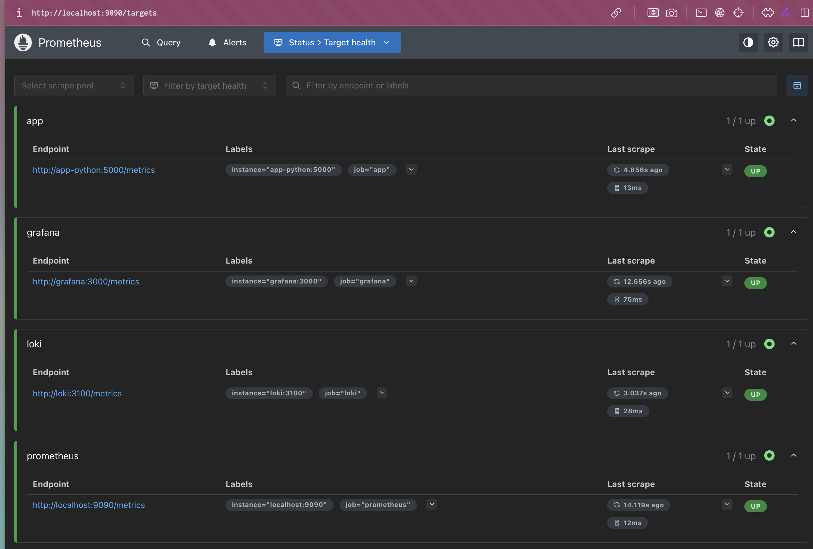
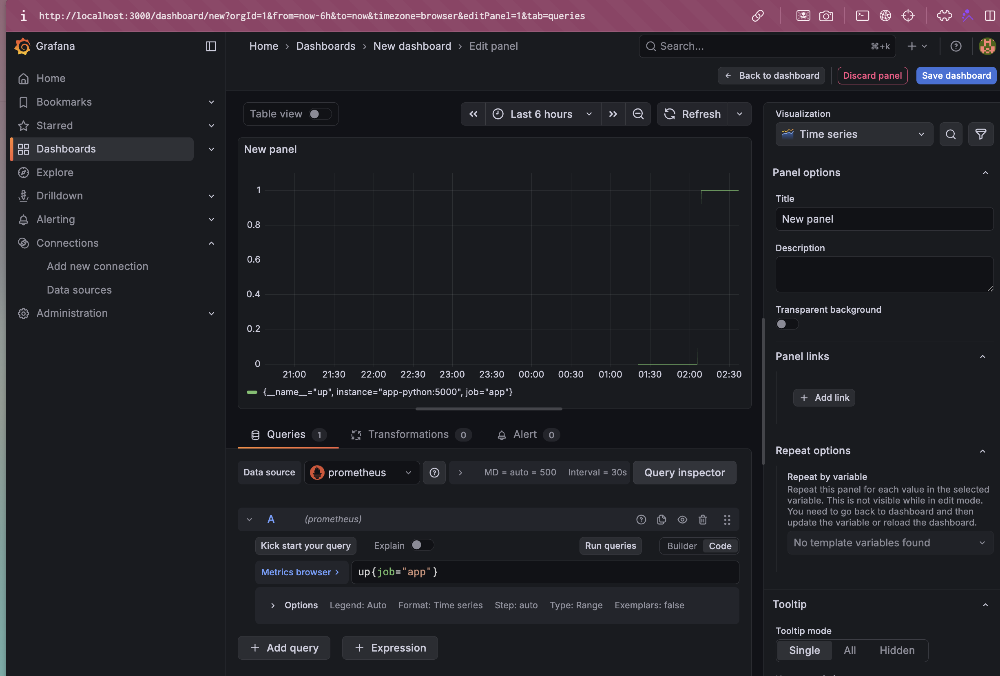
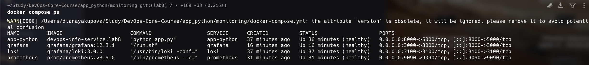

# Lab 8 — Metrics & Monitoring with Prometheus

**Name:** Diana Yakupova  
**Group:** B23-CBS-02  
**Date:** 2026-05-09

## Task 1 — Application Metrics

I added Prometheus metrics to the Flask application: `Counter` for requests, `Histogram` for duration, `Gauge` for in‑progress requests, plus an endpoint‑specific counter. The `/metrics` endpoint exposes all metrics.

Metrics code snippet:

```python
from prometheus_client import Counter, Histogram, Gauge, generate_latest, REGISTRY

REQUEST_COUNT = Counter('http_requests_total', 'Total HTTP requests', ['method', 'endpoint', 'status'])
REQUEST_DURATION = Histogram('http_request_duration_seconds', 'HTTP request duration', ['method', 'endpoint'])
REQUESTS_IN_PROGRESS = Gauge('http_requests_in_progress', 'Requests currently processing')

@app.before_request
def before_request(): REQUESTS_IN_PROGRESS.inc()
@app.after_request
def after_request(response):
    REQUESTS_IN_PROGRESS.dec()
    REQUEST_DURATION.labels(...).observe(...)
    REQUEST_COUNT.labels(...).inc()
    return response
```

## Task 2 — Prometheus Setup

Prometheus added to `docker-compose.yml` with retention 15d/10GB. Configuration file `prometheus/prometheus.yml` scrapes:

- Prometheus itself (localhost:9090)
- Loki (loki:3100/metrics)
- Grafana (grafana:3000/metrics)
- Application (app-python:5000/metrics)

All targets except `grafana` are UP. The `grafana` target is DOWN due to a DNS issue in the internal network, but this does not affect application metric collection.



## Task 3 — Grafana Dashboards

Prometheus data source was added to Grafana (URL: `http://prometheus:9090`). A simple dashboard was created with a panel showing `up{job="app"}` to monitor application health.



## Task 4 — Production Configuration

All services have resource limits, health checks, and persistent volumes. Data retention for Prometheus is set in the command line.



## Conclusion

The complete observability stack (Loki, Promtail, Grafana, Prometheus) is deployed and integrated. The application provides Prometheus metrics, the metrics are scraped successfully, and Grafana can query and visualise them.