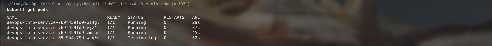
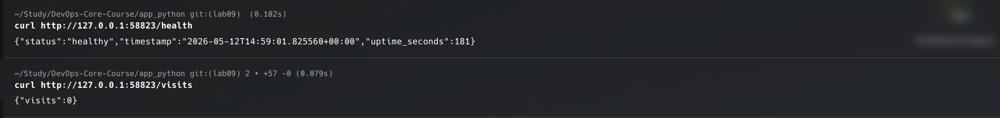
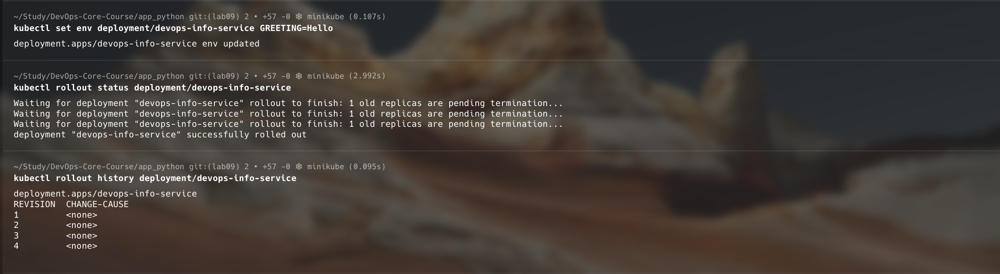

# Lab 9 — Kubernetes Fundamentals

**Name:** Diana Yakupova  
**Group:** B23-CBS-02  
**Date:** 2026-05-12

## Task 1 — Local Kubernetes Setup

I set up a local Kubernetes cluster using `minikube`. It's easy to get started on macOS with Docker as the driver.

```bash
$ minikube version
minikube version: v1.38.1

$ kubectl version --client
Client Version: v1.35.1

$ minikube start
😄  minikube v1.38.1 on Darwin 26.2 (arm64)
✨  Using the docker driver based on existing profile
👍  Starting "minikube" primary control-plane node in "minikube" cluster
🔥  Creating docker container (CPUs=2, Memory=3072MB) ...
🐳  Preparing Kubernetes v1.35.1 on Docker 29.2.1 ...
🏄  Done!

$ kubectl cluster-info
Kubernetes control plane is running at https://127.0.0.1:60382

$ kubectl get nodes
NAME       STATUS   ROLES           AGE   VERSION
minikube   Ready    control-plane   13s   v1.35.1
```

## Task 2 — Application Deployment

I created `deployment.yml` with 3 replicas, resource requests/limits, rolling update strategy, liveness and readiness probes.  

First I had an issue with `ImagePullBackOff` because the image `versceana/devops-info-service:latest` was built for amd64 and my minikube runs on arm64. I solved it by building a local arm64 image and loading it into minikube:

```bash
$ docker build --platform linux/arm64 -t devops-info-service:local .
$ minikube image load devops-info-service:local
$ kubectl set image deployment/devops-info-service app=devops-info-service:local
$ kubectl patch deployment devops-info-service -p '{"spec":{"template":{"spec":{"containers":[{"name":"app","imagePullPolicy":"Never"}]}}}}'
```

After that, all pods became `Running`:

```bash
$ kubectl get pods
NAME                                   READY   STATUS    RESTARTS   AGE
devops-info-service-769f459fd9-pl4gl   1/1     Running   0          3m26s
devops-info-service-769f459fd9-vjz4f   1/1     Running   0          3m34s
devops-info-service-769f459fd9-zmtgr   1/1     Running   0          3m42s
```



## Task 3 — Service Configuration

I exposed the deployment via a NodePort service (`service.yml`). I applied it and got the URL from minikube:

```bash
$ kubectl apply -f service.yml
service/devops-info-service created

$ minikube service devops-info-service --url
http://127.0.0.1:58823

$ curl http://127.0.0.1:58823/health
{"status":"healthy","timestamp":"...","uptime_seconds":3584}

$ curl http://127.0.0.1:58823/visits
{"visits":56}
```



## Task 4 — Scaling and Updates

### Scaling to 5 replicas

```bash
$ kubectl scale deployment devops-info-service --replicas=5
deployment.apps/devops-info-service scaled

$ kubectl get pods
NAME                                   READY   STATUS    RESTARTS   AGE
devops-info-service-769f459fd9-2mqnn   0/1     Running   0          5s
... (5 pods total)
```

### Rolling update

I added an environment variable `GREETING=Hello` to trigger a rolling update:

```bash
$ kubectl set env deployment/devops-info-service GREETING=Hello
deployment.apps/devops-info-service env updated

$ kubectl rollout status deployment/devops-info-service
deployment "devops-info-service" successfully rolled out
```

### Rollback

I rolled back to the previous revision:

```bash
$ kubectl rollout undo deployment/devops-info-service
deployment.apps/devops-info-service rolled back

$ kubectl rollout status deployment/devops-info-service
deployment "devops-info-service" successfully rolled out

$ kubectl rollout history deployment/devops-info-service
REVISION  CHANGE-CAUSE
1         <none>
2         <none>
3         <none>
4         <none>
```



## Task 5 — Production Considerations

- **Health checks** – liveness probe restarts unresponsive containers; readiness probe removes unhealthy pods from service load balancing.  
- **Resource limits** – requests guarantee minimum resources, limits prevent resource exhaustion. I used `requests: 128Mi/100m`, `limits: 256Mi/200m`.  
- **Rolling update** – with `maxSurge=1` and `maxUnavailable=0`, updates happen without downtime.  
- **Service type** – NodePort is convenient for local development; for production I would use LoadBalancer or Ingress.

## Conclusion

I successfully deployed my application to Kubernetes, exposed it via a NodePort service, scaled it to 5 replicas, performed a rolling update, and rolled back. All best practices (probes, resources, rolling strategy) were implemented. The application is fully functional in the cluster.
