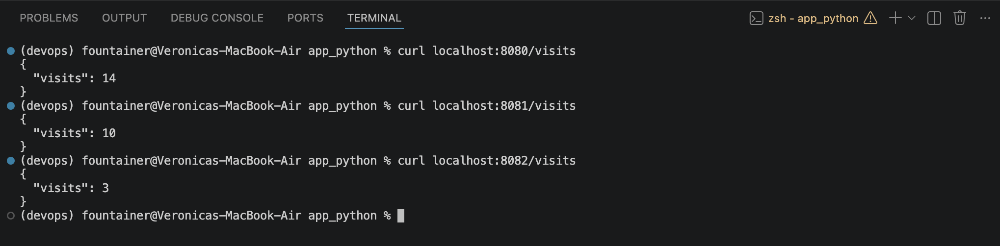
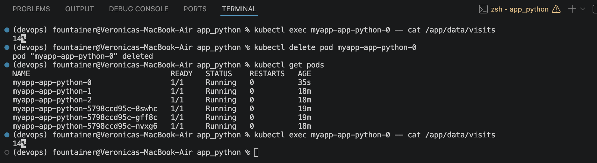

# Documentation

## StatefulSet Overview

### Why StatefulSet

It is used when pods need stable identity and storage, like each pod keeping its own data and name even after restart.

### Differences from Deployment

Key differences:
- deployment pods are interchangeable and can change names/storage after restarts, while statefulset pods have fixed names (pod-0, pod-1) and their own persistent storage.

When to use Deployment vs StatefulSet: 
- deployment is used for stateless apps (like web servers), and statefulset for apps that need stable data and identity (like databases).

Examples of stateful workloads: 
- databases like mysql/postgresql, message queues, systems like elasticsearch

### Headless Services

What is a headless service (clusterIP: None)?
- a service without a cluster ip that lets you directly access individual pods instead of load balancing

How DNS works with StatefulSets? 
- each pod gets its own dns name like pod-0.service-name.namespace.svc.cluster.local, and they can be addressed individually

## Resource Verification

### Output of kubectl get pod,sts,svc,pvc

```bash
(devops) fountainer@Veronicas-MacBook-Air app_python % kubectl get statefulset
NAME               READY   AGE
myapp-app-python   3/3     38s
(devops) fountainer@Veronicas-MacBook-Air app_python % kubectl get pods
NAME                                 READY   STATUS    RESTARTS       AGE
my-app-app-python-5f57899757-4phmz   1/1     Running   1 (7d4h ago)   7d6h
my-app-app-python-5f57899757-6sj7k   1/1     Running   1 (7d4h ago)   7d5h
my-app-app-python-5f57899757-75mlj   1/1     Running   1 (7d4h ago)   7d5h
myapp-app-python-0                   1/1     Running   0              42s
myapp-app-python-1                   1/1     Running   0              25s
myapp-app-python-2                   1/1     Running   0              16s
myapp-app-python-5bc87cfdf6-dhkt6    1/1     Running   0              42s
myapp-app-python-5bc87cfdf6-mxpkd    1/1     Running   0              42s
myapp-app-python-5bc87cfdf6-wpc68    1/1     Running   0              42s
myapp-app-python-7dc6cbf89f-46pbw    1/1     Running   0              42s
myapp-app-python-7dc6cbf89f-9krh8    1/1     Running   0              42s
myapp-app-python-7dc6cbf89f-lp4rh    1/1     Running   0              42s
(devops) fountainer@Veronicas-MacBook-Air app_python % kubectl get pvc
NAME                             STATUS   VOLUME                                     CAPACITY   ACCESS MODES   STORAGECLASS   VOLUMEATTRIBUTESCLASS   AGE
data-volume-myapp-app-python-0   Bound    pvc-2a043668-bbae-4c8d-86dc-ae89242a4b28   100Mi      RWO            standard       <unset>                 53s
data-volume-myapp-app-python-1   Bound    pvc-f9152007-9fff-4292-bc28-d1bc16b0214e   100Mi      RWO            standard       <unset>                 36s
data-volume-myapp-app-python-2   Bound    pvc-cec60c23-bdb5-44df-bf9f-9e2938726dc6   100Mi      RWO            standard       <unset>                 27s
my-app-app-python-data           Bound    pvc-a5009930-2af6-4223-8fad-16257b59e9aa   100Mi      RWO            standard       <unset>                 7d6h
myapp-app-python-data            Bound    pvc-22a66b4f-e1f6-486f-a528-76f27f090535   100Mi      RWO            standard       <unset>                 53s
(devops) fountainer@Veronicas-MacBook-Air app_python % 
```
```bash
(devops) fountainer@Veronicas-MacBook-Air app_python % kubectl get pod,sts,svc,pvc
NAME                                     READY   STATUS    RESTARTS       AGE
pod/my-app-app-python-5f57899757-4phmz   1/1     Running   1 (7d4h ago)   7d6h
pod/my-app-app-python-5f57899757-6sj7k   1/1     Running   1 (7d4h ago)   7d5h
pod/my-app-app-python-5f57899757-75mlj   1/1     Running   1 (7d4h ago)   7d5h
pod/myapp-app-python-0                   1/1     Running   0              99s
pod/myapp-app-python-1                   1/1     Running   0              82s
pod/myapp-app-python-2                   1/1     Running   0              73s
pod/myapp-app-python-5bc87cfdf6-dhkt6    1/1     Running   0              99s
pod/myapp-app-python-5bc87cfdf6-mxpkd    1/1     Running   0              99s
pod/myapp-app-python-5bc87cfdf6-wpc68    1/1     Running   0              99s
pod/myapp-app-python-7dc6cbf89f-46pbw    1/1     Running   0              99s
pod/myapp-app-python-7dc6cbf89f-9krh8    1/1     Running   0              99s
pod/myapp-app-python-7dc6cbf89f-lp4rh    1/1     Running   0              99s

NAME                                READY   AGE
statefulset.apps/myapp-app-python   3/3     99s

NAME                               TYPE        CLUSTER-IP       EXTERNAL-IP   PORT(S)        AGE
service/kubernetes                 ClusterIP   10.96.0.1        <none>        443/TCP        7d8h
service/myapp-app-python-preview   ClusterIP   10.98.51.97      <none>        80/TCP         99s
service/myapp-app-python-service   NodePort    10.110.182.139   <none>        80:30009/TCP   99s

NAME                                                   STATUS   VOLUME                                     CAPACITY   ACCESS MODES   STORAGECLASS   VOLUMEATTRIBUTESCLASS   AGE
persistentvolumeclaim/data-volume-myapp-app-python-0   Bound    pvc-2a043668-bbae-4c8d-86dc-ae89242a4b28   100Mi      RWO            standard       <unset>                 99s
persistentvolumeclaim/data-volume-myapp-app-python-1   Bound    pvc-f9152007-9fff-4292-bc28-d1bc16b0214e   100Mi      RWO            standard       <unset>                 82s
persistentvolumeclaim/data-volume-myapp-app-python-2   Bound    pvc-cec60c23-bdb5-44df-bf9f-9e2938726dc6   100Mi      RWO            standard       <unset>                 73s
persistentvolumeclaim/my-app-app-python-data           Bound    pvc-a5009930-2af6-4223-8fad-16257b59e9aa   100Mi      RWO            standard       <unset>                 7d6h
persistentvolumeclaim/myapp-app-python-data            Bound    pvc-22a66b4f-e1f6-486f-a528-76f27f090535   100Mi      RWO            standard       <unset>                 99s
(devops) fountainer@Veronicas-MacBook-Air app_python % 
```

## Network Identity

### DNS resolution outputs

the naming pattern is ```<pod-name>.<headless-service-name>```

```bash
(devops) fountainer@Veronicas-MacBook-Air app_python % kubectl exec -it myapp-app-python-0 -- /bin/sh
$ getent hosts myapp-app-python-0.myapp-app-python-headless    
10.244.0.177    myapp-app-python-0.myapp-app-python-headless.default.svc.cluster.local
$ getent hosts myapp-app-python-1.myapp-app-python-headless
10.244.0.179    myapp-app-python-1.myapp-app-python-headless.default.svc.cluster.local
$ getent hosts myapp-app-python-2.myapp-app-python-headless
10.244.0.180    myapp-app-python-2.myapp-app-python-headless.default.svc.cluster.local
```

## Per-Pod Storage Evidence 

### Different visit counts per pod

```bash
(devops) fountainer@Veronicas-MacBook-Air DevOps-Core-Course % kubectl port-forward pod/myapp-app-python-0 8080:12345
Forwarding from 127.0.0.1:8080 -> 12345
Forwarding from [::1]:8080 -> 12345
Handling connection for 8080
Handling connection for 8080
Handling connection for 8080
Handling connection for 8080
Handling connection for 8080
Handling connection for 8080
Handling connection for 8080
Handling connection for 8080
```

```bash
fountainer@Veronicas-MacBook-Air DevOps-Core-Course %  pyenv shell devops
(devops) fountainer@Veronicas-MacBook-Air DevOps-Core-Course % kubectl port-forward pod/myapp-app-python-1 8081:12345
Forwarding from 127.0.0.1:8081 -> 12345
Forwarding from [::1]:8081 -> 12345
Handling connection for 8081
Handling connection for 8081
Handling connection for 8081
Handling connection for 8081
Handling connection for 8081
```

```bash
(devops) fountainer@Veronicas-MacBook-Air DevOps-Core-Course % kubectl port-forward pod/myapp-app-python-2 8082:12345
Forwarding from 127.0.0.1:8082 -> 12345
Forwarding from [::1]:8082 -> 12345
Handling connection for 8082
Handling connection for 8082
Handling connection for 8082
Handling connection for 8082
```
```bash
(devops) fountainer@Veronicas-MacBook-Air app_python % curl localhost:8080/visits
{
  "visits": 13
}
(devops) fountainer@Veronicas-MacBook-Air app_python % curl localhost:8081/visits
{
  "visits": 7
}
(devops) fountainer@Veronicas-MacBook-Air app_python % curl localhost:8082/visits
{
  "visits": 2
}
```



## Persistence Test

### data survives pod deletion

