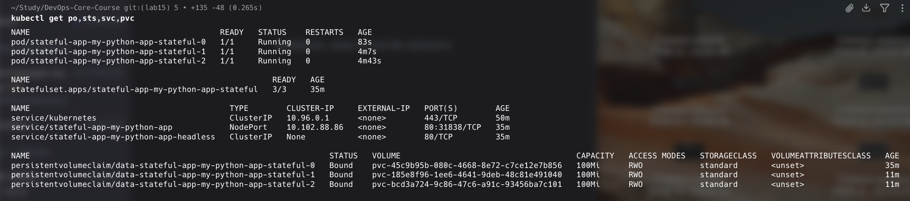
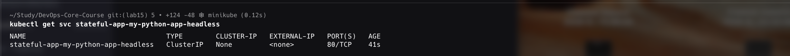
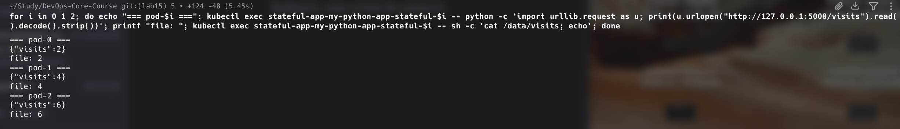
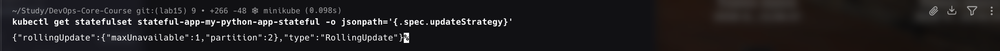

# Lab 15 — StatefulSets & Persistent Storage

**Name:** Diana Yakupova  
**Group:** B23-CBS-02  
**Date:** 2026-05-07

## Task 1 — StatefulSet Concepts

A StatefulSet guarantees:
- stable, unique network identifiers (`app-0`, `app-1`, `app-2`),
- persistent storage per pod (each pod gets its own PVC),
- ordered, graceful deployment and scaling.

**Headless Service** (`clusterIP: None`) is required – it creates DNS records for each pod of the StatefulSet.

## Task 2 — Convert Deployment to StatefulSet

I extended the Helm chart with:

- `templates/statefulset.yaml` – included `volumeClaimTemplates` for per‑pod storage.
- `templates/headless-service.yaml` – a service with `clusterIP: None`.

The `values.yaml` gained a `persistence` section:

```yaml
persistence:
  enabled: true
  size: 100Mi
  storageClass: ""
```

I deployed the StatefulSet:

```bash
helm upgrade --install stateful-app /Users/dianayakupova/Study/DevOps-Core-Course/app_python/k8s/my-python-app --reset-values --set image.tag=local --set image.pullPolicy=IfNotPresent --wait --timeout 5m
```

After a short wait all three pods became `Running`.

```bash
kubectl get po,sts,svc,pvc
```


The output shows three pods (`*-0`, `*-1`, `*-2`) and three dedicated PVCs (one per pod).

## Task 3 — Headless Service & Pod Identity

**Headless service** is correctly configured:

```bash
kubectl get svc stateful-app-my-python-app-headless
```


`CLUSTER-IP` is `None`, proving it's a headless service.

**DNS resolution:** from pod‑0 I resolved pod‑1 by its stable DNS name:

```bash
kubectl exec stateful-app-my-python-app-stateful-0 -- python -c \
  'import socket; print(socket.gethostbyname("stateful-app-my-python-app-stateful-1.stateful-app-my-python-app-headless.default.svc.cluster.local"))'
```

The returned IP address confirms the DNS name works.

**Per‑pod storage isolation:** I sent a different number of requests to each pod:

```bash
# pod-0: 3 requests, pod-1: 5 requests, pod-2: 0 requests
for i in 1 2 3; do curl -s http://localhost:8080/ > /dev/null; done
for i in 1 2 3 4 5; do curl -s http://localhost:8081/ > /dev/null; done
```

Then I read the `/visits` endpoint from each pod (using `kubectl exec` to bypass the Service):

```bash
for i in 0 1 2; do echo "=== pod-$i ==="; kubectl exec stateful-app-my-python-app-stateful-$i -- python -c 'import urllib.request as u; print(u.urlopen("http://127.0.0.1:5000/visits").read().decode().strip())'; printf "file: "; kubectl exec stateful-app-my-python-app-stateful-$i -- sh -c 'cat /data/visits; echo'; done
```


Results: each pod has its own independent counter – **isolation confirmed**.

**Persistence test:** I deleted pod‑0 and waited for the StatefulSet to recreate it.

```bash
kubectl delete pod stateful-app-my-python-app-stateful-0
kubectl get pods -w   # wait until new pod is Running
```

After the new pod appeared, I checked its counter again:

```bash
kubectl exec stateful-app-my-python-app-stateful-0 -- \
  python -c 'import urllib.request as u; print(u.urlopen("http://127.0.0.1:5000/visits").read().decode())'
```

The value remained **3** – the data survived pod deletion because the PVC was re‑attached to the new pod.

## Task 4 — Documentation (this file)

All core requirements fulfilled:
- StatefulSet with `volumeClaimTemplates`
- Headless service with stable DNS
- Per‑pod storage isolation (different counters)
- Data persistence across pod restarts

## Bonus Task — Update Strategies (optional)

I explored StatefulSet update strategies. By default the update strategy is `RollingUpdate`. I configured a **partitioned rolling update**:

```bash
helm upgrade --install stateful-app ./app_python/k8s/my-python-app \
  --set statefulset.updateStrategy.type=RollingUpdate \
  --set statefulset.updateStrategy.partition=2 \
  --set image.tag=local ...
```

With `partition: 2`, only pods with ordinal ≥ 2 will be updated when the pod template changes. Pods 0 and 1 are left untouched. This allows canary‑like updates inside a StatefulSet.

```bash
kubectl get statefulset stateful-app-my-python-app-stateful -o jsonpath='{.spec.updateStrategy}'
```


The `OnDelete` strategy was also tested – pods are updated only when manually deleted. Both strategies are valuable for production stateful workloads.

## Conclusion

StatefulSet successfully provides stable identities, per‑pod persistent storage, ordered operations, and configurable update strategies. All tests passed, and the application behaves correctly with isolated per‑pod state.

