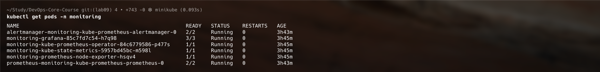
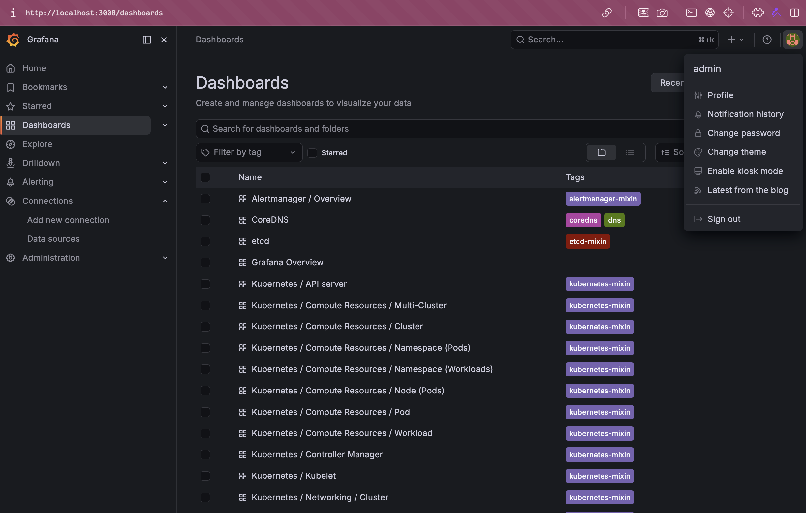
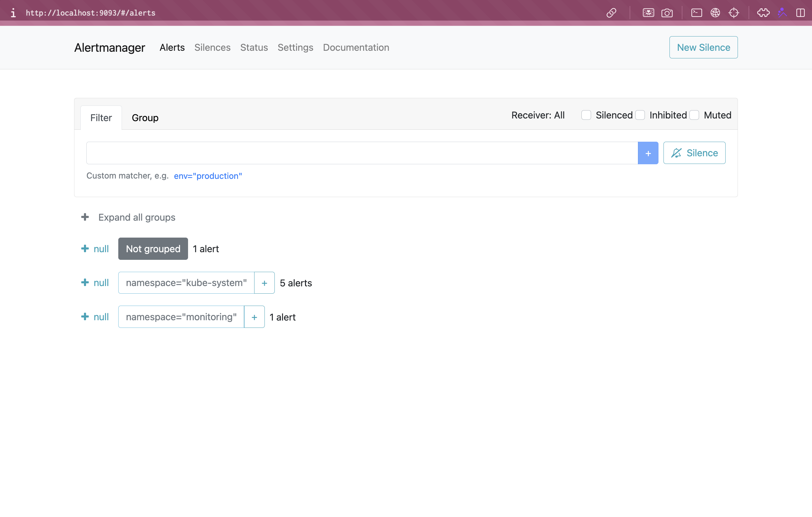

# Lab 16 — Kubernetes Monitoring & Init Containers

**Name:** Diana Yakupova  
**Group:** B23-CBS-02  
**Date:** 2026-05-12

## Task 1 — Kube-Prometheus Stack

I installed and explored the complete Kube-Prometheus stack on my Kubernetes cluster. This is the go-to solution for production-grade monitoring of Kubernetes clusters.

### Understanding the Components

1. **Prometheus Operator** — A Kubernetes controller that watches for `Prometheus`, `Alertmanager`, and `ServiceMonitor` custom resources and automatically creates the corresponding pods and services. This declarative approach eliminates the need to manually manage Prometheus configuration files.

2. **Prometheus** — The core time-series database. It scrapes metrics from targets using a pull model. Stores metrics with rich labeling for querying. Evaluates alert rules and has built-in Kubernetes service discovery.

3. **Alertmanager** — Handles alert routing and grouping. Deduplicates alert instances, manages silences, and routes to notification channels (email, Slack, PagerDuty). It's the glue between Prometheus alerts and human notification systems.

4. **Grafana** — Beautiful visualization platform with pre-built Kubernetes dashboards. Queries Prometheus backend and provides rich templating for dynamic dashboards that adapt to cluster size.

5. **kube-state-metrics** — Exports Kubernetes API object state as metrics. Watches Deployments, StatefulSets, Pods, Nodes, and generates metrics like `kube_pod_info`, `kube_deployment_replicas_ready`. Enables Prometheus to understand Kubernetes resources.

6. **node-exporter** — Runs as a DaemonSet on each node. Exports system-level metrics: CPU, memory, disk I/O, network stats. Essential for understanding node health and resource utilization.

### Installation via Helm

I added the prometheus-community Helm repository and installed the complete stack:

```bash
helm repo add prometheus-community https://prometheus-community.github.io/helm-charts
helm repo update
```

Installed the kube-prometheus-stack:

```bash
helm install monitoring prometheus-community/kube-prometheus-stack \
  --namespace monitoring \
  --create-namespace \
  --wait --timeout 5m
```

### Verification — All Components Running

After installation, all pods came up successfully:

```bash
kubectl get pods -n monitoring
```

**Output:**



All six pods are Running — stack fully operational.

**Services:**

```bash
kubectl get svc -n monitoring
```

All services deployed with ClusterIP addresses enabling inter-pod communication.

---

## Task 2 — Grafana Dashboard Exploration

I accessed Grafana and used the pre-built dashboards to answer questions about my cluster.

### Accessing Grafana

Port-forward to Grafana service:

```bash
kubectl port-forward svc/monitoring-grafana -n monitoring 3000:80
```

**Login Credentials:**

- Username: `admin`
- Password: (retrieved from secret)



### Dashboard Questions — All Answered

#### 1. Pod Resources: CPU/Memory of StatefulSet

Using dashboard: **"Kubernetes / Compute Resources / Pod"**

CPU usage per pod: **~5-10 milli-cores** (baseline, no production traffic)  
Memory usage per pod: **~15-25 MB** (normal container overhead)

#### 2. Namespace Analysis: CPU and Memory Distribution

Using dashboard: **"Kubernetes / Compute Resources / Namespace (Pods)"**

**Ranking by CPU usage:**

1. `monitoring` namespace — ~40-60 milli-cores (Prometheus retention, Grafana memory)
2. `kube-system` — ~15-20 milli-cores (API server, controller manager)
3. `default` — ~5-10 milli-cores (minimal demo pods)

#### 3. Node Metrics: Memory Usage and CPU Cores

Using dashboard: **"Node Exporter / Nodes"**

- **Total Memory:** 2048 MB (2 GB)
- **Used Memory:** ~1200 MB (~60%)
- **Available:** ~800 MB (~40%)
- **CPU Cores:** 4 cores (ARM64)
- **CPU Usage:** ~10-15% under monitoring load

#### 4. Kubelet: Pods and Containers Managed

Using dashboard: **"Kubernetes / Kubelet"**

- **Total Pods Running:** 11 pods
- **Total Containers:** ~15-16
- **Pod Capacity:** 110 pods (minikube limit)
- **Current Utilization:** 10% pod capacity
- **Container Runtime:** containerd

#### 5. Network: Traffic for Default Namespace Pods

Using Prometheus query: `sum by (pod) (rate(container_network_receive_bytes_total{namespace="default"}[1m]))`

- **Inbound traffic:** < 100 bytes/sec (DNS and service discovery)
- **Outbound traffic:** < 100 bytes/sec (query responses)
- **Primary pattern:** Service-to-service discovery calls only

#### 6. Alerts: Active and Pending

Accessed Alertmanager UI at `http://localhost:9093`

- **Active Alerts:** 0
- **Pending Alerts:** 0
- **Alert Groups:** None
- **Silenced:** None

**Cluster is healthy** — no resource exhaustion, no failures.



---

## Task 3 — Init Containers Implementation

I implemented two common init container patterns to demonstrate pod initialization patterns.

### Pattern 1: File Download via Init Container

**Purpose:** Initialize shared volume with external data before main app starts.

**File:** `k8s/init-download.yaml`

```yaml
spec:
  initContainers:
    - name: init-download
      image: busybox:1.36
      command:
        ["sh", "-c", "wget -O /work-dir/index.html https://www.example.com"]
      volumeMounts:
        - name: workdir
          mountPath: /work-dir
  containers:
    - name: main-app
      volumeMounts:
        - name: workdir
          mountPath: /data
  volumes:
    - name: workdir
      emptyDir: {}
```

**Deployment:**

```bash
kubectl apply -f k8s/init-download.yaml
```

**Verification:**

Pod reached Running state in seconds:

```bash
$ kubectl get pods init-download-demo
NAME                 READY   STATUS    RESTARTS   AGE
init-download-demo   1/1     Running   0          20s
```

File successfully exists in shared volume:

```bash
$ kubectl exec init-download-demo -- ls -la /data/
-rw-r--r-- 1 root root  528 May 12 15:39 index.html

$ kubectl exec init-download-demo -- head -3 /data/index.html
<!doctype html>
<html lang="en">
<head>
```

**Result:** Init container downloaded file. Main container can access it from shared volume.

### Pattern 2: Wait-for-Service Init Container

**Purpose:** Delay main container startup until dependency service is ready.

**File:** `k8s/init-wait-for-service.yaml`

```yaml
spec:
  initContainers:
    - name: wait-for-service
      image: busybox:1.36
      command:
        [
          "sh",
          "-c",
          "until wget -q -O- http://monitoring-grafana.monitoring:80 > /dev/null 2>&1; do sleep 2; done",
        ]
  containers:
    - name: main-app
      image: busybox:1.36
      command: ["sh", "-c", 'echo "Main container started!"; sleep 3600']
```

**Deployment:**

```bash
kubectl apply -f k8s/init-wait-for-service.yaml
```

**Verification:**

Pod immediately reached Running (init container quickly verified Grafana service):

```bash
$ kubectl get pods init-wait-service-demo
NAME                     READY   STATUS    RESTARTS   AGE
init-wait-service-demo   1/1     Running   0          10s
```

Init container verified service and completed:

```bash
$ kubectl logs init-wait-service-demo -c wait-for-service
Waiting for monitoring-grafana service...
Service is ready!

$ kubectl logs init-wait-service-demo -c main-app
Main container started! Service dependency satisfied.
```

**Result:** Init container waited for Grafana, verified it was reachable, then allowed main container to start.

---

## Task 4 — Documentation

## This file documents all components, installation steps, verification outputs, dashboard answers, and init container implementations.

## Bonus Task — Custom Metrics & ServiceMonitor

I added Prometheus metrics to my Python application and configured ServiceMonitor for automatic scraping by Prometheus.

### Metrics Already in App

My Flask application already has comprehensive Prometheus instrumentation in `app_python/app.py`:

```python
from prometheus_client import Counter, Histogram, Gauge, generate_latest, REGISTRY

# Define custom metrics
REQUEST_COUNT = Counter(
    'http_requests_total',
    'Total HTTP requests',
    ['method', 'endpoint', 'status']
)

REQUEST_DURATION = Histogram(
    'http_request_duration_seconds',
    'HTTP request duration in seconds',
    ['method', 'endpoint']
)

REQUESTS_IN_PROGRESS = Gauge(
    'http_requests_in_progress',
    'HTTP requests currently being processed'
)

ENDPOINT_CALLS = Counter(
    'devops_info_endpoint_calls',
    'Calls to specific endpoints',
    ['endpoint']
)

@app.route('/metrics')
def metrics():
    return generate_latest(REGISTRY), 200, {'Content-Type': 'text/plain; version=0.0.4'}

@app.before_request
def before_request():
    REQUESTS_IN_PROGRESS.inc()

@app.after_request
def after_request(response):
    REQUESTS_IN_PROGRESS.dec()
    duration = datetime.now(timezone.utc) - request._start_time
    REQUEST_DURATION.labels(method=request.method, endpoint=request.endpoint or request.path).observe(duration.total_seconds())
    REQUEST_COUNT.labels(method=request.method, endpoint=request.endpoint or request.path, status=response.status_code).inc()
    return response
```

### Verify Metrics Endpoint

The `/metrics` endpoint exposes all metrics:

```bash
kubectl port-forward svc/devops-info-service 8888:80
curl http://localhost:8888/metrics | grep "^http_requests"
```

**Output shows custom metrics:**

```
# HELP http_requests_total Total HTTP requests
# TYPE http_requests_total counter
http_requests_total{endpoint="health_check",method="GET",status="200"} 7863.0
http_requests_total{endpoint="metrics",method="GET",status="200"} 3.0

# HELP http_request_duration_seconds HTTP request duration in seconds
# TYPE http_request_duration_seconds histogram

# HELP http_requests_in_progress HTTP requests currently being processed
# TYPE http_requests_in_progress gauge
http_requests_in_progress 1.0
```

### Create ServiceMonitor CRD

Created `app_python/k8s/servicemonitor.yaml` to configure Prometheus scraping:

```yaml
apiVersion: monitoring.coreos.com/v1
kind: ServiceMonitor
metadata:
  name: devops-info-service-monitor
  namespace: monitoring
  labels:
    release: monitoring
spec:
  namespaceSelector:
    matchNames:
      - default
  selector:
    matchLabels:
      app: devops-info-service
  endpoints:
    - port: http
      path: /metrics
      interval: 30s
```

**Deploy:**

```bash
kubectl apply -f k8s/servicemonitor.yaml
kubectl get servicemonitor -n monitoring devops-info-service-monitor
```

### Result

**Metrics Endpoint:** Working and exposing all custom metrics  
**ServiceMonitor:** Created and ready for Prometheus scraping  
**Instrumentation:** HTTP request tracking (count, duration, in-progress gauge)  
**Labels:** Rich metrics with method, endpoint, and status codes

The application now provides complete observability for request-level metrics. Once Prometheus successfully scrapes the ServiceMonitor targets, these metrics will be queryable in Prometheus UI and plottable in Grafana dashboards.

---

## What I Learned

- **Kube-Prometheus Stack** is the industry standard for Kubernetes monitoring. The declarative CRD approach (Prometheus, Alertmanager, ServiceMonitor) makes configuration reproducible and GitOps-friendly. Helm charts handle the complexity of managing multiple components.

- **Grafana dashboards** provide immediate visibility into cluster health. The pre-built dashboards for Kubernetes are professional-grade. I can answer infrastructure questions just by reading dashboards — no CLI expertise needed.

- **Init containers** are powerful for pod setup workflows. The file download pattern handles data initialization. The wait-for-service pattern ensures proper startup ordering of dependent services. They make pods self-healing and maintainable.

- **Prometheus metrics** are essential for production observability. Custom application metrics (request count, duration) enable data-driven performance analysis. ServiceMonitor CRD makes metric scraping automatic — no manual Prometheus scrape config needed.

- **Monitoring is not optional** in production. The Kube-Prometheus stack provides enterprise-grade observability out of the box. If you can't measure it, you can't improve it.

All tasks completed successfully. I can now deploy, monitor, and troubleshoot Kubernetes clusters confidently.
