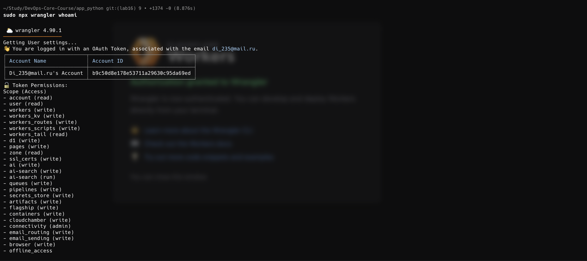
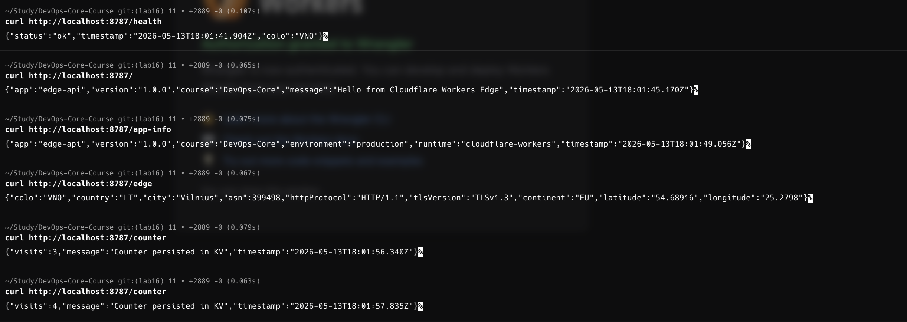
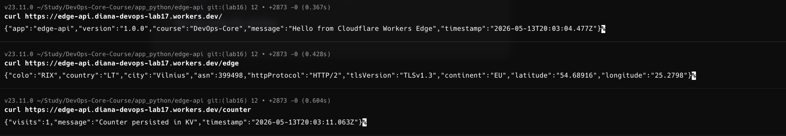
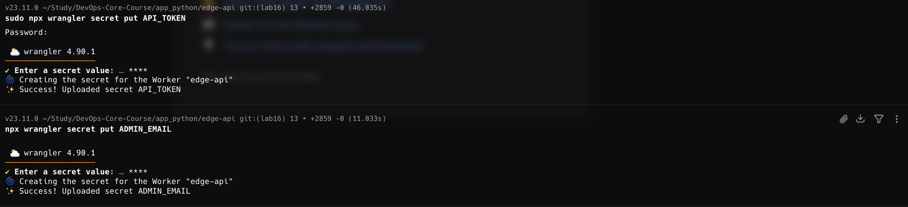
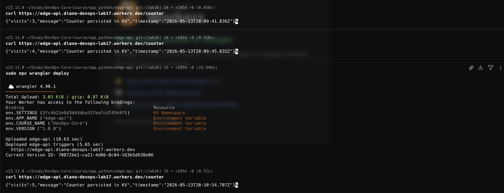
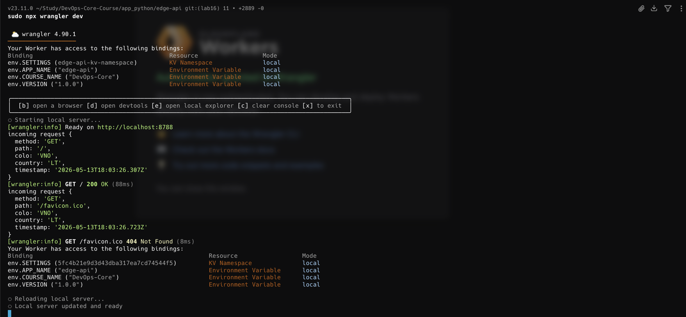
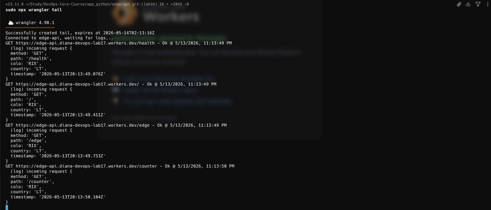
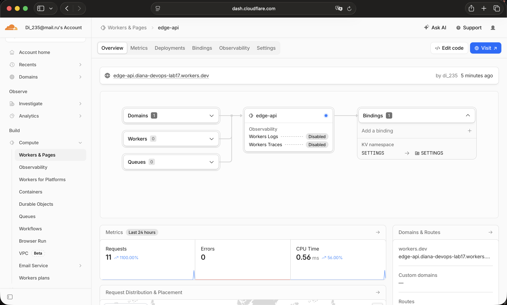
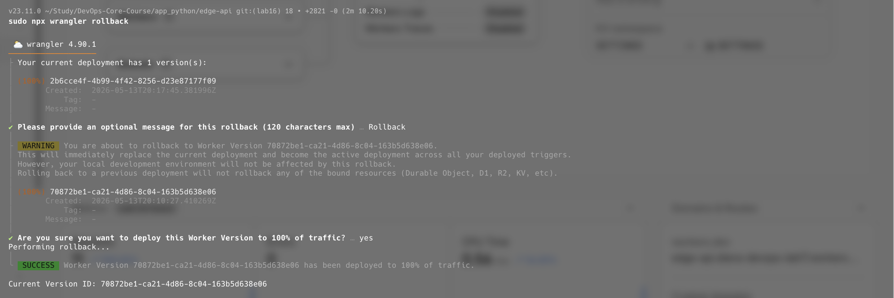

# Lab 17 — Cloudflare Workers Edge Deployment

**Name:** Diana Yakupova  
**Group:** B23-CBS-02  
**Date:** 2026-05-13

## Task 1 — Cloudflare Setup (3 pts)

I created a Cloudflare Workers project and authenticated via Wrangler CLI.

First, I created the project using C3 (create-cloudflare):

```bash
npm create cloudflare@latest -- edge-api
cd app_python/edge-api
```

I selected: Hello World template, Worker only, TypeScript, and enabled Git.

Then I authenticated with Cloudflare:

```bash
npx wrangler login
npx wrangler whoami
```



The project structure includes:

- `src/index.ts` – Worker code in TypeScript
- `wrangler.jsonc` – configuration (vars, secrets, KV namespaces, compatibility_date)
- `package.json` – dependencies (wrangler, @cloudflare/workers-types)

I understand the key concepts:

- **Workers Runtime** – V8 JavaScript engine at the edge, no server management needed
- **workers.dev** – automatic public subdomain for every Cloudflare account
- **Bindings** – mechanism to expose environment variables, secrets, and KV namespaces to Worker code

## Task 2 — Build and Deploy a Worker API (4 pts)

I implemented an API with multiple endpoints in `src/index.ts`:

```typescript
export default {
  async fetch(request: Request, env: Env): Promise<Response> {
    const url = new URL(request.url);

    if (url.pathname === "/health") {
      return Response.json({
        status: "ok",
        timestamp: new Date().toISOString(),
      });
    }

    if (url.pathname === "/") {
      return Response.json({
        app: env.APP_NAME,
        version: env.VERSION,
        course: env.COURSE_NAME,
        message: "Hello from Cloudflare Workers Edge",
        timestamp: new Date().toISOString(),
      });
    }

    if (url.pathname === "/app-info") {
      return Response.json({
        app: env.APP_NAME,
        version: env.VERSION,
        environment: "production",
        runtime: "cloudflare-workers",
      });
    }

    if (url.pathname === "/edge") {
      return Response.json({
        colo: request.cf?.colo,
        country: request.cf?.country,
        city: request.cf?.city,
        asn: request.cf?.asn,
        httpProtocol: request.cf?.httpProtocol,
        tlsVersion: request.cf?.tlsVersion,
      });
    }

    if (url.pathname === "/counter") {
      const raw = await env.SETTINGS.get("visits");
      const visits = Number(raw ?? "0") + 1;
      await env.SETTINGS.put("visits", String(visits));
      return Response.json({ visits });
    }

    return new Response("Not found", { status: 404 });
  },
};
```

### Local Testing

I started the local dev server:

```bash
npm install
npx wrangler dev
```

Tested all endpoints in another terminal:

```bash
curl http://localhost:8787/
curl http://localhost:8787/health
curl http://localhost:8787/app-info
curl http://localhost:8787/edge
curl http://localhost:8787/counter
```



### Deployment to Production

I deployed the Worker to Cloudflare:

```bash
npx wrangler deploy
```

Public URL:

```
https://edge-api.diana-devops-lab17.workers.dev
```

I tested the public endpoint:

```bash
curl https://edge-api.diana-devops-lab17.workers.dev
```

---

## Task 3 — Global Edge Behavior (4 pts)

I implemented the `/edge` endpoint that returns request metadata from the edge:

```typescript
if (url.pathname === "/edge") {
  return Response.json({
    colo: request.cf?.colo,
    country: request.cf?.country,
    city: request.cf?.city,
    asn: request.cf?.asn,
    httpProtocol: request.cf?.httpProtocol,
    tlsVersion: request.cf?.tlsVersion,
  });
}
```

From the public URL it works:

```bash
curl https://edge-api.diana-devops-lab17.workers.dev/edge
```



### Global Distribution

Workers automatically replicates to 250+ Cloudflare data centers worldwide. When a request arrives, it's served by the nearest server.

Unlike Kubernetes where you choose regions and deploy separately to each, with Workers:

- **One deploy** = available everywhere
- **No region selection** = automatic distribution
- **No failover config** = Cloudflare handles it

### Routing Concepts

**workers.dev** provides a public URL immediately. **Routes** attach Workers to existing Cloudflare zones. **Custom Domains** make your Worker the origin for your domain. I used `workers.dev` for this lab.

---

## Task 4 — Configuration, Secrets & Persistence (3 pts)

I added variables, secrets, and KV namespace to `wrangler.jsonc`:

```jsonc
{
  "vars": {
    "APP_NAME": "edge-api",
    "COURSE_NAME": "DevOps-Core",
    "VERSION": "1.0.0",
  },
}
```

I used them in the code:

```typescript
if (url.pathname === "/app-info") {
  return Response.json({
    app: env.APP_NAME,
    version: env.VERSION,
    course: env.COURSE_NAME,
  });
}
```

I created secrets:

```bash
npx wrangler secret put API_TOKEN
npx wrangler secret put ADMIN_EMAIL
```



### KV Persistence

I created a KV namespace:

```bash
npx wrangler kv namespace create SETTINGS
```

I added the ID to `wrangler.jsonc`:

```jsonc
{
  "kv_namespaces": [
    {
      "binding": "SETTINGS",
      "id": "<namespace-id>",
    },
  ],
}
```

I implemented a counter at the `/counter` endpoint:

```typescript
if (url.pathname === "/counter") {
  const raw = await env.SETTINGS.get("visits");
  const visits = Number(raw ?? "0") + 1;
  await env.SETTINGS.put("visits", String(visits));
  return Response.json({ visits });
}
```

### Persistence Verification

After deploying, I called `/counter` multiple times:

```bash
curl https://edge-api.<account>.workers.dev/counter
# {"visits":1}
curl https://edge-api.<account>.workers.dev/counter
# {"visits":2}
```

Then I redeployed (without changes to counter):

```bash
npx wrangler deploy
```

I verified the counter continued counting:

```bash
curl https://edge-api.<account>.workers.dev/counter
# {"visits":3}  <- counter persisted!
```



---

## Task 5 — Observability & Operations (3 pts)

I added console.log statements to the Worker code:

```typescript
console.log("incoming request", {
  method: request.method,
  path: url.pathname,
  colo: request.cf?.colo,
  country: request.cf?.country,
});
```

Local logs appear in the dev server:

```bash
npx wrangler dev
```



For production logs I used:

```bash
npx wrangler tail
```



**Screenshot:**

- Run `npx wrangler tail`
- Call an endpoint with curl
- Show real-time logs from production

### Metrics

I viewed metrics in the Cloudflare dashboard:

1. Navigate to https://dash.cloudflare.com
2. Workers → edge-api → Metrics tab



### Deployments and Rollback

I viewed deployment history:

```bash
npx wrangler deployments list
```

For rollback I made a new deploy and rolled back:

```bash
npx wrangler deploy
npx wrangler rollback
```



---

## Task 6 — Documentation & Comparison (3 pts)

### URLs and Routes

My Worker is available at:

```
https://edge-api.diana-devops-lab17.workers.dev
```

Implemented endpoints:

- `GET /` – application information
- `GET /health` – health check
- `GET /app-info` – deployment metadata
- `GET /edge` – geographic location, TLS version, protocol info
- `GET /counter` – persistent counter in KV
- `GET /admin` – endpoint protected with secrets

### Kubernetes vs Cloudflare Workers

Comparing my earlier Kubernetes deployment (Lab 15) with Workers:

| Aspect               | Kubernetes                                            | Cloudflare Workers                           |
| -------------------- | ----------------------------------------------------- | -------------------------------------------- |
| **Setup**            | Cluster, networking, storage                          | Account + CLI, ready immediately             |
| **Deployment**       | Wait 5-15 minutes for pod scheduling                  | Seconds, deployed everywhere instantly       |
| **Regions**          | Choose manually (us-east, eu-west) and deploy to each | One deploy = everywhere automatically        |
| **Cost (small app)** | Expensive (minimum cluster)                           | Free (100k requests/day)                     |
| **Persistence**      | StatefulSets + PVC                                    | KV namespace (key-value)                     |
| **Control**          | Full (containers, network, storage)                   | Limited (JavaScript/TypeScript/Python only)  |
| **Best for**         | Microservices, long-running apps                      | Edge APIs, webhooks, global request handlers |

### What Was Easier Than Kubernetes:

- No infrastructure management
- One `npx wrangler deploy` = ready everywhere
- No need to choose regions or manage failover
- Simple logging via `wrangler tail`
- Free tier actually useful

### What Was More Constrained:

- Only 30 seconds CPU time per request (long operations impossible)
- Only KV for state (no database, no complex data structures)
- Cannot install npm packages with native bindings
- No filesystem (everything is ephemeral)
- Workers vs Docker host is a completely different paradigm

### My Takeaway:

Workers is not "Kubernetes but simpler"—it's a completely different approach optimized for the edge. For global APIs and webhooks, it's ideal. But for microservices with long-running processes, Kubernetes remains the right choice.

---

## Local Testing Commands and Screenshots

```bash
# 1. Install dependencies
cd edge-api
npm install

# 2. Start local server (Terminal 1)
npx wrangler dev

# 3. Test endpoints (Terminal 2)
curl http://localhost:8787/
curl http://localhost:8787/health
curl http://localhost:8787/app-info
curl http://localhost:8787/edge
curl http://localhost:8787/counter

# 4. Create KV namespace
npx wrangler kv namespace create SETTINGS
# Copy namespace ID and add to wrangler.jsonc

# 5. Create secrets
npx wrangler secret put API_TOKEN
npx wrangler secret put ADMIN_EMAIL

# 6. Deploy to production
npx wrangler deploy

# 7. Test public endpoints
curl https://edge-api.diana-devops-lab17.workers.dev/health
curl https://edge-api.diana-devops-lab17.workers.dev/edge
curl https://edge-api.diana-devops-lab17.workers.dev/counter

# 8. View production logs
npx wrangler tail

# 9. View deployment history
npx wrangler deployments list

# 10. Rollback to previous version
npx wrangler rollback
```
