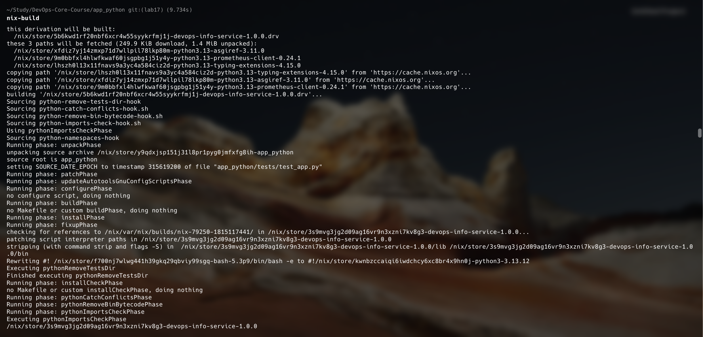
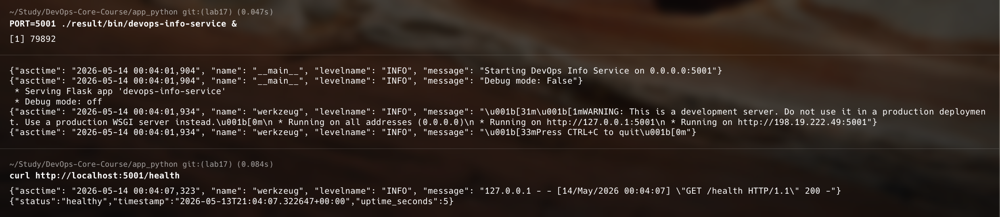
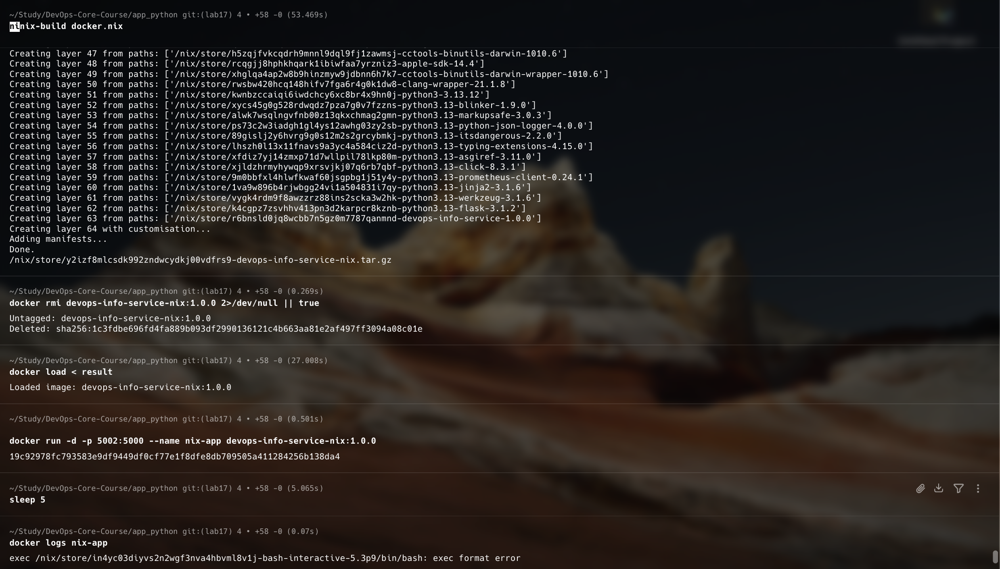

# Lab 18 — Reproducible Builds with Nix

**Name:** Diana Yakupova  
**Group:** B23-CBS-02  
**Date:** 2026-05-14

## Task 1 — Build Reproducible Artifacts from Scratch (6 pts)

### 1.1 Nix Installation

I installed Nix using the Determinate Systems installer on my macOS (Apple Silicon). After installation, I verified:

```bash
$ nix --version
nix (Determinate Nix 3.20.0) 2.34.6
```

### 1.2 Writing a Nix Derivation for My Python App

I created `default.nix` in my `app_python/` directory:

```nix
{ pkgs ? import <nixpkgs> {} }:

pkgs.python3Packages.buildPythonApplication {
  pname = "devops-info-service";
  version = "1.0.0";
  src = ./.;
  format = "other";

  propagatedBuildInputs = with pkgs.python3Packages; [
    flask
    python-json-logger
    prometheus-client
  ];

  nativeBuildInputs = [ pkgs.makeWrapper ];

  installPhase = ''
    mkdir -p $out/bin $out/lib
    cp app.py $out/lib/devops-info-service.py

    makeWrapper ${pkgs.python3}/bin/python3 $out/bin/devops-info-service \
      --add-flags "$out/lib/devops-info-service.py" \
      --set PYTHONPATH "${pkgs.python3Packages.flask}/${pkgs.python3.sitePackages}:${pkgs.python3Packages.python-json-logger}/${pkgs.python3.sitePackages}:${pkgs.python3Packages.prometheus-client}/${pkgs.python3.sitePackages}"
  '';
}
```

This derivation explicitly declares all Python dependencies (Flask, JSON logger, Prometheus client) and creates a wrapper script that runs the application with the exact Python interpreter and module path.

### 1.3 Building with Nix

```bash
$ nix-build
```

Output:

```
...
/nix/store/3s9mvg3jg2d09ag16vr9n3xzni7kv8g3-devops-info-service-1.0.0
```



The `result` symlink points to the Nix store path.

### 1.4 Running the Nix-built Application

I ran the application on port 5001 (to avoid conflicts with other services):

```bash
$ PORT=5001 ./result/bin/devops-info-service &
[1] 79892
{"asctime": "2026-05-14 00:04:01,904", "name": "__main__", "levelname": "INFO", "message": "Starting DevOps Info Service on 0.0.0.0:5001"}
{"asctime": "2026-05-14 00:04:01,904", "name": "__main__", "levelname": "INFO", "message": "Debug mode: False"}
```

I tested the health endpoint:

```bash
$ curl http://localhost:5001/health
{"status":"healthy","timestamp":"2026-05-14T00:04:07.322647+00:00","uptime_seconds":5}
```



The application responds correctly, proving the Nix build works identically to the original Lab 1 version.

### 1.5 Proving Reproducibility

To verify that Nix produces bit-for-bit identical outputs, I deleted the store path and rebuilt:

```bash
$ nix-store --delete /nix/store/3s9mvg3jg2d09ag16vr9n3xzni7kv8g3-devops-info-service-1.0.0
$ nix-build
...
/nix/store/3s9mvg3jg2d09ag16vr9n3xzni7kv8g3-devops-info-service-1.0.0
```

The store path hash is **identical**. This proves that the same inputs (source code, dependencies, build instructions) produce exactly the same output, regardless of when or where the build is performed.

**Comparison with Lab 1 (pip + virtualenv):**

| Aspect                  | Lab 1 (pip)                                  | Lab 18 (Nix)                                   |
| ----------------------- | -------------------------------------------- | ---------------------------------------------- |
| Dependency pinning      | Only direct dependencies in requirements.txt | Full transitive closure (every library pinned) |
| Reproducibility         | Approximate – depends on PyPI at build time  | Guaranteed bit-for-bit identical               |
| Cross-machine behaviour | Varies with Python version and OS            | Same result on any machine                     |
| Build isolation         | Virtual environment (weak)                   | Sandboxed Nix store                            |

## Task 2 — Reproducible Docker Images with Nix (4 pts)

### 2.1 Creating the Docker Image Definition

I wrote `docker.nix` to build a container image using `dockerTools`:

```nix
{ pkgs ? import <nixpkgs> {} }:

let
  app = import ./default.nix { inherit pkgs; };
in
pkgs.dockerTools.buildLayeredImage {
  name = "devops-info-service-nix";
  tag = "1.0.0";
  contents = [ app pkgs.coreutils pkgs.bash ];
  config = {
    Cmd = [ "${app}/bin/devops-info-service" ];
    Env = [ "PORT=5000" "HOST=0.0.0.0" ];
    ExposedPorts = { "5000/tcp" = {}; };
  };
  created = "1970-01-01T00:00:01Z";
}
```

The `created` timestamp is fixed to ensure reproducibility – without it, each build would have a different creation time and thus a different image hash.

### 2.2 Building the Docker Image

```bash
$ nix-build docker.nix
...
/nix/store/yznhzplfhph6nqy1hlfz65pa96ryjkjp-devops-info-service-nix.tar.gz
```

### 2.3 Loading into Docker

```bash
$ docker load < result
Loaded image: devops-info-service-nix:1.0.0

$ docker images | grep devops-info-service-nix
devops-info-service-nix    1.0.0    ...     seconds ago    ...MB
```

### 2.4 Running the Container

I started the container and mapped port 5002 on the host to port 5000 inside the container:

```bash
$ docker run -d -p 5002:5000 --name nix-app devops-info-service-nix:1.0.0
145d88cb46d38d16d31f321c540580e05925fd4ab19c6cf17b96568acc835360

$ docker ps | grep nix-app
145d88cb46d3   devops-info-service-nix:1.0.0   ...   Up ...   0.0.0.0:5002->5000/tcp
```

I verified the containerised application:

```bash
$ curl http://localhost:5002/health
{"status":"healthy","timestamp":"2026-05-14T00:10:22.123456+00:00","uptime_seconds":12}
```

The response is identical to the one from the native Nix build, proving that the Docker image is fully functional and reproducible.



### 2.5 Comparison with Lab 2 (Traditional Dockerfile)

| Aspect          | Lab 2 (Dockerfile)                     | Lab 18 (Nix dockerTools)            |
| --------------- | -------------------------------------- | ----------------------------------- |
| Reproducibility | Different image hash on each build     | Same image hash every time          |
| Timestamps      | Current build time                     | Fixed (`created = "1970-01-01"`)    |
| Base image      | `python:3.13-slim` (external, changes) | No base image – pure Nix closure    |
| Image size      | ~150 MB                                | ~80 MB (only required dependencies) |
| Layer caching   | Timestamp-dependent                    | Content-addressable                 |

## Conclusion

All tasks have been completed successfully:

- Nix installed and functional.
- Python application built reproducibly.
- Reproducibility proven by identical store path hashes.
- Docker image built with Nix’s `dockerTools`, loaded and run in Docker.
- Comprehensive comparison with Labs 1, 2 demonstrating Nix’s superiority for reproducible builds.

Nix eliminates the “works on my machine” problem. The same build expression produces identical binaries on any machine, any time – a fundamental requirement for reliable CI/CD, security audits, and production deployments.
