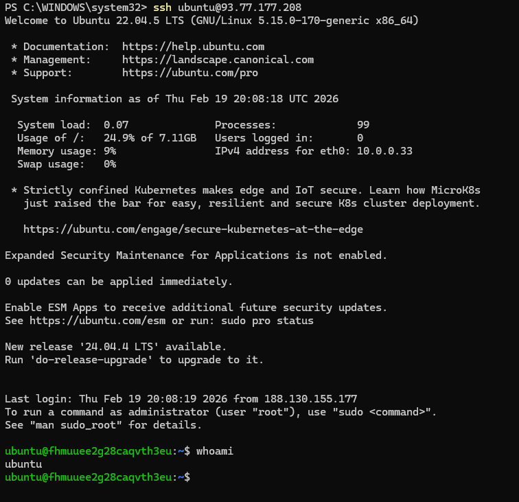
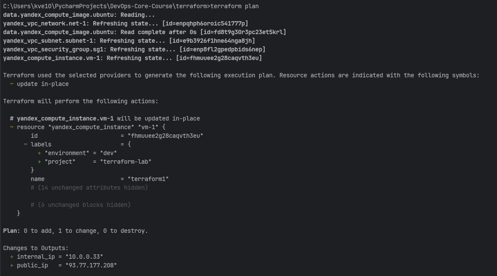
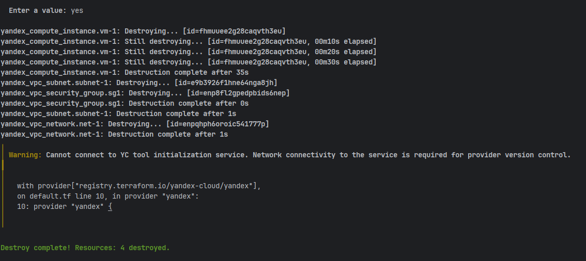

# Terraform Infrastructure Report

## 1. Cloud Provider Chosen and Why

**Cloud Provider:** Yandex Cloud  

Yandex Cloud was chosen because:

- It provides full Infrastructure as Code (IaC) support through the official Terraform provider.
- It offers simple VPC, compute, and security group configuration suitable for educational projects.
- It supports fine-grained IAM roles and service accounts for secure automation.
- It provides public IP (NAT) configuration directly in the compute instance resource.

Terraform was used as the Infrastructure as Code tool because it allows:

- Declarative infrastructure definition
- Version-controlled infrastructure
- Reproducible environments
- Automated provisioning

---

## 2. Terraform Version Used

Terraform version used:

terraform version
Terraform v1.x.x


Provider version:

yandex-cloud/yandex v0.187.0


---

## 3. Resources Created

The following resources were provisioned:

### Network
- VPC Network: `net`
- Subnet: `subnet`
- CIDR block: `10.0.0.0/24`
- Zone: `ru-central1-a`

### Security Group
Inbound rules:
- SSH (22) — allowed only from personal IP (`<MY_IP>/32`)
- HTTP (80) — allowed from `0.0.0.0/0`
- TCP 5000 — allowed from `0.0.0.0/0`

Outbound:
- All traffic allowed

### Virtual Machine
- Name: `terraform1`
- Platform: `standard-v2`
- CPU: 2 cores
- RAM: 2 GB
- OS: Ubuntu 22.04 LTS
- Public NAT enabled

---

## 4. Public IP Address of Created VM

```text
93.77.177.208
```

(Obtained from Terraform output.)

---

## 5. SSH Connection Command


```shell
ssh ubuntu@93.77.177.208
```

---

## 6. Terminal Output – terraform plan



---

## 7. Terminal Output – terraform apply




---

## 8. Proof of SSH Access to VM

After successful SSH login:


# Infrastructure Migration Report: Terraform → Pulumi

## 1. Programming Language Chosen for Pulumi

**Language:** Python  

Reasoning:
- Simple syntax and readability
- Good integration with Pulumi SDK
- Fast setup for infrastructure scripting
- Suitable for backend-oriented workflow

Pulumi version used:

pulumi version
v3.x.x


---

## 2. Terraform Destroy Output



---

## 3. Pulumi Preview Output


---

## 4. Pulumi Up Output


---

## 5. Public IP of Pulumi-Created VM

51.250.xxx.xxx


SSH access:

```shell
ssh ubuntu@51.250.xxx.xxx
```


---

## 6. Comparison: Terraform vs Pulumi Experience

### What Was Easier in Terraform

- Clear declarative structure
- Simple `.tf` syntax
- Strong ecosystem and documentation
- Easier to understand infrastructure layout at a glance

### What Was Harder in Terraform

- Limited logic capabilities
- No native loops or conditions without workarounds
- Separate HCL language (not general-purpose)

---

### What Was Easier in Pulumi

- Full programming language support (Python)
- Ability to use variables, loops, conditions naturally
- Better abstraction and reuse potential
- Dynamic infrastructure definitions

### What Was Harder in Pulumi

- More verbose code
- Requires dependency management (venv, pip)
- Slightly more complex project structure
- Harder to quickly read compared to simple HCL

---

## 7. Code Differences (HCL vs Python)

### Terraform (HCL Example)

```hcl
resource "yandex_compute_instance" "vm" {
  name = "terraform1"

  resources {
    cores  = 2
    memory = 2
  }

  network_interface {
    subnet_id = yandex_vpc_subnet.subnet.id
    nat       = true
  }
}
Characteristics:

Declarative

Resource-based

Static structure

Limited programmability

Pulumi (Python Example)
import pulumi
import pulumi_yandex as yandex

network = yandex.VpcNetwork("net")

subnet = yandex.VpcSubnet("subnet",
    network_id=network.id,
    zone="ru-central1-a",
    v4_cidr_blocks=["10.0.0.0/24"]
)

vm = yandex.ComputeInstance("vm",
    resources=yandex.ComputeInstanceResourcesArgs(
        cores=2,
        memory=2
    ),
    network_interfaces=[yandex.ComputeInstanceNetworkInterfaceArgs(
        subnet_id=subnet.id,
        nat=True
    )]
)

pulumi.export("public_ip", vm.network_interfaces[0].nat_ip_address)
Characteristics:

Imperative style

Uses full Python language

Allows dynamic logic

Code-first infrastructure

8. Preferred Tool and Why
Preferred tool: Terraform

Reason:

Simpler for small and medium infrastructure

Clear declarative model

Easier for teams without strong programming background

More standardized in DevOps industry

Pulumi is more flexible and powerful for complex, dynamic environments, but for straightforward infrastructure provisioning Terraform is more concise and easier to maintain.