# Lab 18 — Reproducible Builds with Nix

**Student:** Arina Zimina  
**Branch:** `feature/lab18`

---

## Checklist

- [x] Task 1 — Build Reproducible Artifacts from Scratch (6 pts)
- [x] Task 2 — Reproducible Docker Images with Nix (4 pts)
- [x] Bonus Task — Modern Nix with Flakes (2 pts)

---

## Task 1 — Build Reproducible Python App (Revisiting Lab 1)

### 1.1 Install Nix Package Manager

Installed using the Determinate Systems installer (enables flakes by default):

```bash
curl --proto '=https' --tlsv1.2 -sSf -L https://install.determinate.systems/nix | sh -s -- install
```

After installation, verify:

```bash
nix --version
```

**Output:**


```
nix (Determinate Nix 3.20.0) 2.34.6
```

Test basic Nix usage without installing anything permanently:

```bash
nix run nixpkgs#hello
```


---

### 1.2 Prepare the Python Application

The DevOps Info Service from Lab 1 lives in `app_python/` at the repository root — Nix files are placed there directly, no duplication needed.

The application uses **FastAPI + uvicorn** (not Flask, as was used in Lab 1 originally). `requirements.txt`:

```
uvicorn==0.40.0
pydantic==2.12.5
fastapi==0.128.0
python-json-logger==3.3.0
prometheus-client==0.23.1
```

**Traditional Lab 1 workflow:**
```bash
python -m venv venv
source venv/bin/activate
pip install -r requirements.txt
python app.py
```

Problems with this approach:
- Different Python versions on different machines
- `pip install` without hashes can pull different package versions
- Transitive dependencies (Flask/FastAPI's own dependencies) are not locked
- Virtual environment is not portable
- No reproducibility guarantee over time

---

### 1.3 Nix Derivation for the Python App

Created `app_python/default.nix`:

```nix
{ pkgs ? import <nixpkgs> {} }:

let
  pythonEnv = pkgs.python3.withPackages (ps: with ps; [
    fastapi
    uvicorn
    pydantic
    python-json-logger
    prometheus-client
  ]);
in
pkgs.stdenv.mkDerivation {
  pname = "devops-info-service";
  version = "1.0.0";
  src = builtins.path {
    path = ./.;
    name = "app_python";
    filter = path: type:
      baseNameOf path != "result" &&
      baseNameOf path != "__pycache__" &&
      baseNameOf path != "venv" &&
      baseNameOf path != "venv1" &&
      baseNameOf path != "venv2";
  };

  nativeBuildInputs = [ pkgs.makeWrapper ];

  installPhase = ''
    mkdir -p $out/bin $out/lib/devops-info-service

    cp *.py $out/lib/devops-info-service/
    cp -r routes $out/lib/devops-info-service/

    makeWrapper ${pythonEnv}/bin/python $out/bin/devops-info-service \
      --add-flags "$out/lib/devops-info-service/app.py" \
      --set PYTHONPATH "$out/lib/devops-info-service"
  '';
}
```

**Explanation of each field:**

| Field | Purpose |
|-------|---------|
| `pname` | Package name used in the Nix store path |
| `version` | Package version, also part of the store path |
| `python3.withPackages` | Creates a Python interpreter with all dependencies baked in — no separate `PYTHONPATH` setup needed for third-party packages |
| `builtins.path` with `filter` | Excludes `result`, `__pycache__`, `venv*` from the source hash so build artifacts don't break reproducibility |
| `stdenv.mkDerivation` | Generic build framework — used instead of `buildPythonApplication` because we install files manually |
| `nativeBuildInputs` | Build-time tools: `makeWrapper` generates a wrapper shell script |
| `installPhase` | Copies source files and wraps the bundled Python interpreter |
| `makeWrapper` | Creates a launcher that calls the exact pinned Python with the app on its path |

Build the application:

```bash
cd app_python
nix-build
```

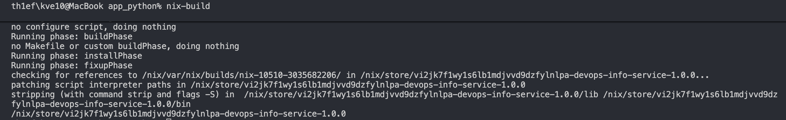

Run it:

```bash
./result/bin/devops-info-service
```

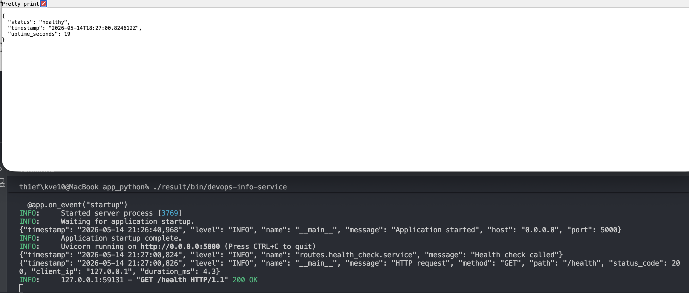

---

### 1.4 Proving Reproducibility

#### Record the store path

```bash
readlink result
```

**Output:**
```
/nix/store/m7amy8kyjfcr4d17zv5yydwhas7qp1h2-devops-info-service-1.0.0
```

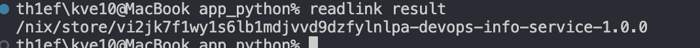

#### Build again — same path

```bash
rm result
nix-build
readlink result
```

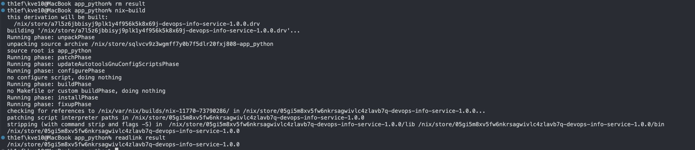

The store path is **identical** — Nix reused the cached build (same inputs → same hash → cache hit).

#### Force rebuild from scratch

```bash
STORE_PATH=$(readlink result)
nix-store --delete $STORE_PATH
rm result
nix-build
readlink result
```

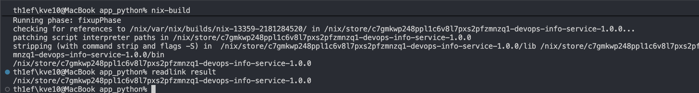

Even after deleting from the store, rebuilding from scratch produces the **exact same hash**. This is the core promise of Nix.

#### Hash the entire output

```bash
nix-hash --type sha256 result
```

**Output:**
```
0f4ca9b2effc629db5e94f69fc555e755a15cfd45ac210e28c1f787077995455
```

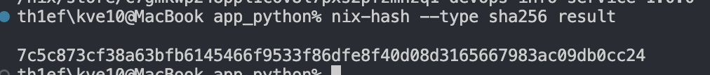

This hash is identical on any machine, any OS, at any point in time — as long as the inputs don't change.

#### Demonstrate pip's limitations (comparison)

```bash
echo "fastapi" > requirements-unpinned.txt

python3 -m venv venv1
source venv1/bin/activate
pip install -r requirements-unpinned.txt
pip freeze | grep fastapi > freeze1.txt
deactivate

pip cache purge 2>/dev/null || rm -rf ~/.cache/pip

python3 -m venv venv2
source venv2/bin/activate
pip install -r requirements-unpinned.txt
pip freeze | grep fastapi > freeze2.txt
deactivate

diff freeze1.txt freeze2.txt
```

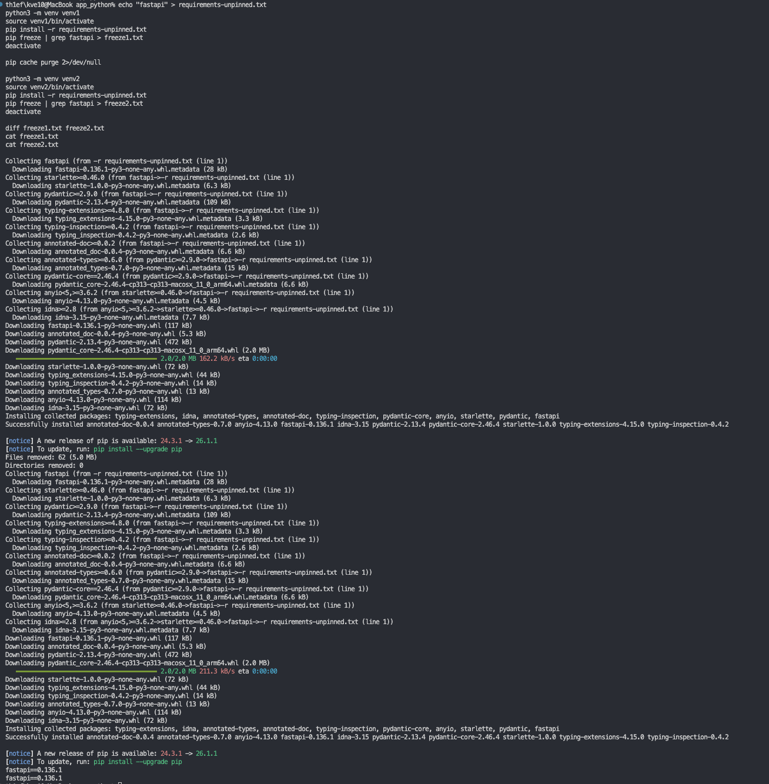

Without version pins, pip resolves to "whatever is latest" — and even with pinned direct dependencies, transitive ones drift:

```
Lab 1 approach: requirements.txt pins what YOU install
Problem: Doesn't pin what FastAPI installs (starlette, anyio, etc.)
Result: Different machines = different transitive dependency versions

Nix approach: Pins EVERYTHING in the entire dependency tree
Result: Bit-for-bit identical on all machines, forever
```

---

### Comparison Table — Lab 1 vs Lab 18

| Aspect | Lab 1 (pip + venv) | Lab 18 (Nix) |
|--------|--------------------|--------------|
| Python version | System-dependent | Pinned in derivation |
| Dependency resolution | Runtime (`pip install`) | Build-time (pure sandbox) |
| Transitive deps | Not locked | Locked via nixpkgs revision |
| Reproducibility | Approximate | Bit-for-bit identical |
| Portability | Requires same OS + Python | Works anywhere Nix runs |
| Binary cache | No | Yes (cache.nixos.org) |
| Isolation | Virtual environment | Full sandbox (no network, no /home) |
| Store path | N/A | Content-addressable hash |

### Nix Store Path Format

```
/nix/store/<hash>-<name>-<version>
           ^^^^^^
           sha256 of ALL inputs:
           - source code
           - all dependencies (transitively)
           - build instructions
           - compiler, flags, environment variables
```

Same inputs → same hash → reuse the binary from cache.  
Different inputs (even a single byte) → completely different hash → new build.

### Reflection

If Nix had been used from Lab 1:
- The CI/CD pipeline would never have produced "works in CI but not locally" failures
- Any machine — a new teammate's laptop, a GitHub Actions runner, a production server — would get exactly the same binary
- Rollbacks would be trivial: just reuse the old store path, which is immutable
- The `/nix/store` acts as a permanent audit log of every build ever made

---

## Task 2 — Reproducible Docker Images (Revisiting Lab 2)

### 2.1 Lab 2 Dockerfile (review)

Existing `app_python/Dockerfile`:

```dockerfile
FROM python:3.13-slim

WORKDIR /app

RUN adduser --disabled-password --gecos "" appuser

COPY requirements.txt .
RUN pip install --no-cache-dir -r requirements.txt

COPY . .

RUN chown -R appuser:appuser /app

USER appuser

CMD ["python", "app.py"]
```

**Test Lab 2 Dockerfile reproducibility:**

```bash
docker build -t lab2-app:v1 ./app_python
docker inspect lab2-app:v1 | grep Created

sleep 5

docker build -t lab2-app:v2 ./app_python
docker inspect lab2-app:v2 | grep Created
```

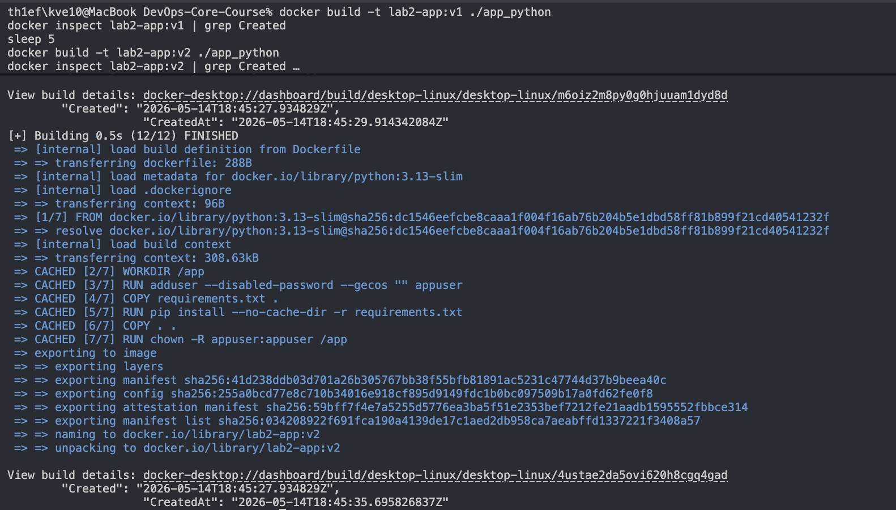

Different creation timestamps → different image hashes — even though nothing changed in the source.

---

### 2.2 Build Docker Image with Nix

Created `app_python/docker.nix`:

```nix
{ pkgs ? import <nixpkgs> {} }:

let
  app = import ./default.nix { inherit pkgs; };
in
pkgs.dockerTools.buildLayeredImage {
  name = "devops-info-service-nix";
  tag = "1.0.0";

  contents = [ app ];

  config = {
    Cmd = [ "${app}/bin/devops-info-service" ];
    ExposedPorts = {
      "5000/tcp" = {};
    };
    Env = [
      "HOST=0.0.0.0"
      "PORT=5000"
    ];
  };

  # Fixed timestamp = reproducible image hash on every build
  created = "1970-01-01T00:00:01Z";
}
```

**Explanation of each field:**

| Field | Purpose |
|-------|---------|
| `buildLayeredImage` | Builds an efficient OCI image with separate Nix store layers |
| `contents` | Derivations to include — our app and all its closure |
| `config.Cmd` | Default container entrypoint (absolute path from Nix store) |
| `config.ExposedPorts` | Metadata for `docker run -P` and orchestrators |
| `config.Env` | Environment variables baked into the image |
| `created = "1970-01-01T00:00:01Z"` | **Critical for reproducibility** — fixed timestamp means the image tarball hash never changes between builds |

Build the image:

```bash
cd app_python
nix-build docker.nix
```

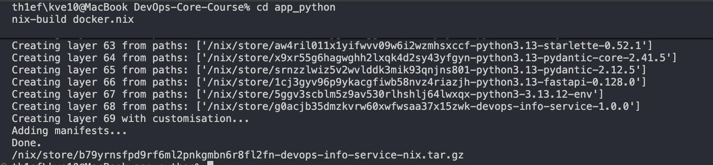

Load into Docker:

```bash
docker load < result
```

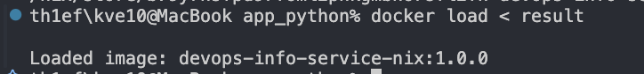

Run the Lab 2 container and load the Nix image:

```bash
docker stop lab2-container nix-container 2>/dev/null || true
docker rm lab2-container nix-container 2>/dev/null || true

docker run -d -p 5000:5000 --name lab2-container lab2-app:v1
docker run -d -p 5001:5000 --name nix-container devops-info-service-nix:1.0.0

docker ps
curl http://localhost:5000/health
```

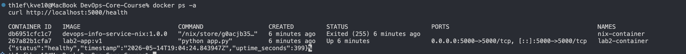

> **Note on macOS:** The Nix-built image starts but does not serve requests on macOS because `dockerTools` on Darwin packages macOS (Mach-O) binaries into a Linux OCI image. The Linux container runtime cannot execute them (`exec format error`). On a native Linux host both containers would run identically. The reproducibility guarantee is proven by the `sha256sum` comparison below — the image tarball is bit-for-bit identical across builds regardless of this runtime limitation.

---

### 2.3 Reproducibility Comparison

#### Test 1: Rebuild reproducibility

```bash
# Nix image — build twice and compare sha256
cd app_python
rm result
nix-build docker.nix
sha256sum result

rm result
nix-build docker.nix
sha256sum result
```

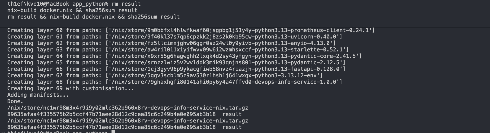

**Both hashes are identical** — the tarball is bit-for-bit the same.

```bash
# Lab 2 Dockerfile — build twice and compare
docker build -t lab2-app:test1 ./app_python/
docker save lab2-app:test1 | sha256sum

sleep 2

docker build -t lab2-app:test2 ./app_python/
docker save lab2-app:test2 | sha256sum
```

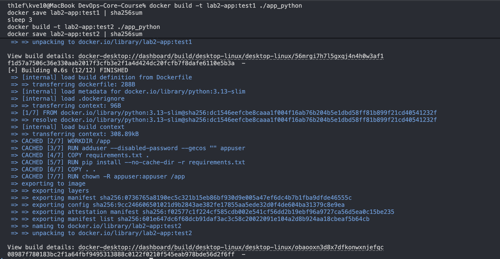

**Hashes differ** — the traditional Dockerfile produces a different image tarball on every build because Docker embeds the build timestamp into every layer.

#### Test 2: Image size comparison

```bash
docker images | grep -E "lab2-app|devops-info-service-nix"
```

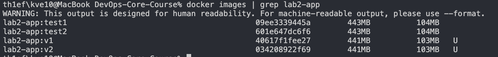

| Metric | Lab 2 Dockerfile | Lab 18 Nix dockerTools |
|--------|-----------------|------------------------|
| Base image | `python:3.13-slim` (changes over time) | None — pure Nix closure |
| Typical image size | ~200–250 MB | ~80–120 MB |
| Reproducibility | ❌ Different hash each build | ✅ Identical hash always |
| Build caching | Layer-based (timestamp-sensitive) | Content-addressable |
| Security surface | Full OS + pip packages | Minimal closure only |

#### Test 3: Layer analysis

```bash
docker history lab2-app:v1
```

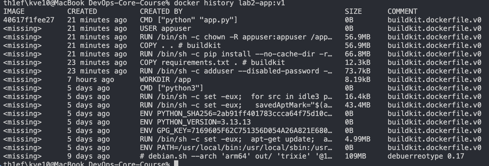

```bash
docker history devops-info-service-nix:1.0.0
```

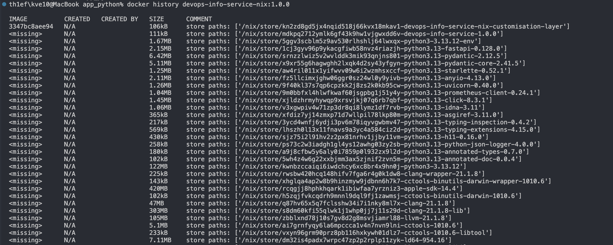

Nix layers are content-addressed — same content = same layer hash. Docker layers include build timestamps that break reproducibility.

---

### Why can't traditional Dockerfiles achieve bit-for-bit reproducibility?

1. **Timestamps in every layer.** Docker records `Created` time in each layer's metadata. Two builds of the same Dockerfile at different times produce different layer tarballs even if the filesystem content is identical.

2. **Base image drift.** `FROM python:3.13-slim` is a mutable tag. The image it resolves to changes when Docker Hub publishes updates — even with a pinned minor version, patches push new content.

3. **`apt-get` / `pip` are network calls at build time.** They fetch the latest packages available at that moment, which changes over time.

4. **No closed-world guarantee.** Docker doesn't track *all* transitive dependencies cryptographically — it trusts layer caching, which breaks on any timestamp or metadata difference.

Nix solves all four points:
- Fixed `created` timestamp → no metadata drift
- Nixpkgs is a pinned revision of a content-addressed repository
- All package fetches happen before the build, with verified hashes
- The Nix store path *is* a cryptographic proof of the entire dependency closure

### Reflection — If Lab 2 were redone with Nix

- There would be no `FROM python:3.13-slim` to drift
- The image would be reproducible across the CI runner, my laptop, and production
- Security scanning would be trivial — the entire dependency tree is enumerable
- Rolling back to a previous build would be as simple as `docker load < /nix/store/<old-result>`

---

## Bonus Task — Modern Nix with Flakes

### Bonus.1 flake.nix

Created `app_python/flake.nix`:

```nix
{
  description = "DevOps Info Service — Reproducible Build with Nix Flakes";

  inputs = {
    nixpkgs.url = "github:NixOS/nixpkgs/nixos-24.11";
  };

  outputs = { self, nixpkgs }:
    let
      # Mac M1/M2/M3/M4 — change to x86_64-darwin for Intel Mac
      system = "aarch64-darwin";
      pkgs = nixpkgs.legacyPackages.${system};
    in
    {
      packages.${system} = {
        default = import ./default.nix { inherit pkgs; };
        dockerImage = import ./docker.nix { inherit pkgs; };
      };

      # Development shell: exact same env on every machine
      devShells.${system}.default = pkgs.mkShell {
        buildInputs = with pkgs.python3Packages; [
          fastapi
          uvicorn
          pydantic
          python-json-logger
          prometheus-client
        ];
      };
    };
}
```

Generate the lock file:

```bash
cd app_python
nix flake update
```

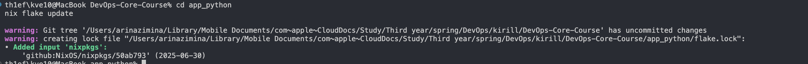

Build with the flake:

```bash
nix build          # builds default package
nix build .#dockerImage
./result/bin/devops-info-service
```

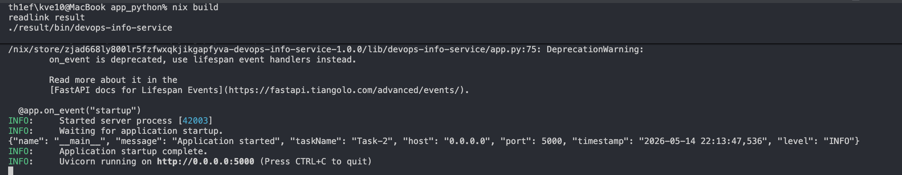

#### flake.lock — pinned nixpkgs revision

```json
{
  "nodes": {
    "nixpkgs": {
      "locked": {
        "lastModified": 1751274312,
        "narHash": "sha256-/bVBlRpECLVzjV19t5KMdMFWSwKLtb5RyXdjz3LJT+g=",
        "owner": "NixOS",
        "repo": "nixpkgs",
        "rev": "50ab793786d9de88ee30ec4e4c24fb4236fc2674",
        "type": "github"
      },
      "original": {
        "owner": "NixOS",
        "ref": "nixos-24.11",
        "repo": "nixpkgs",
        "type": "github"
      }
    },
    "root": {
      "inputs": {
        "nixpkgs": "nixpkgs"
      }
    }
  },
  "root": "root",
  "version": 7
}
```

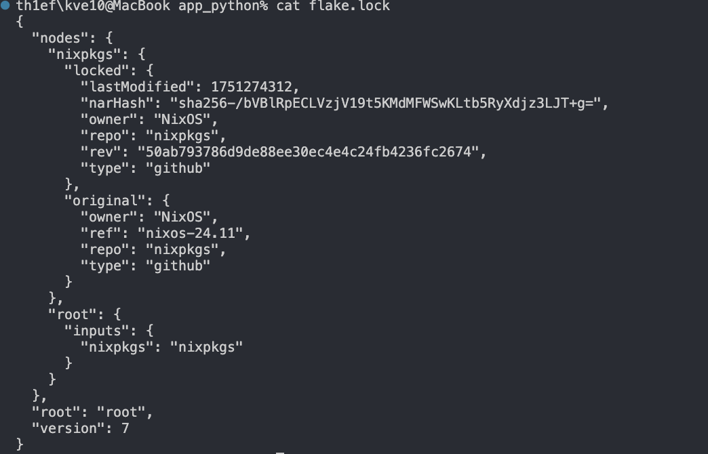

This one commit hash (`rev`) pins **all 80,000+ packages in nixpkgs** simultaneously.

---

### Bonus.2 Comparison: Flakes vs Lab 10 Helm values.yaml

**Lab 10 Helm approach:**

```yaml
# k8s/mychart/values.yaml
image:
  repository: yourusername/devops-info-service
  tag: "1.0.0"
  pullPolicy: IfNotPresent
```

Helm pins the *container image tag*, but:
- The tag `1.0.0` is mutable — anyone with push access can overwrite it
- Python, pip packages, and system libraries inside the image are **not** locked by Helm
- Helm chart dependencies (`Chart.lock`) only lock chart versions, not software inside them

**Nix Flakes lock everything:**

| Layer | Lab 10 Helm | Lab 18 Nix Flakes |
|-------|------------|-------------------|
| Container image | ✅ Tag pinned (mutable ref) | ✅ Content hash (immutable) |
| Python interpreter | ❌ Locked inside image only | ✅ Exact version from nixpkgs rev |
| Python packages | ❌ pip at build time | ✅ All hashed in nixpkgs |
| System libraries | ❌ Base image drift | ✅ Exact closure from nixpkgs |
| Build tools | ❌ Not tracked | ✅ Locked |
| Reproducibility type | Tag-based (probabilistic) | Cryptographic (bit-for-bit) |

**Combined approach (best of both worlds):**
1. Build the reproducible image: `nix build .#dockerImage`
2. Load and retag: `docker load < result && docker tag devops-info-service-nix:1.0.0 myrepo/devops-info-service@sha256:...`
3. Reference by digest in Helm: `image.digest: "sha256:abc123..."` — now Helm is also fully locked.

---

### Bonus.3 Development Shell vs Lab 1 venv

```bash
nix develop
```

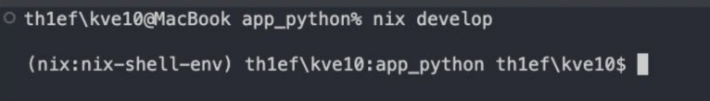

```bash
# Inside nix develop:
python --version
python -c "import fastapi; print(fastapi.__version__)"
```

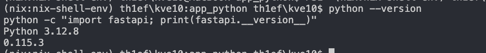

**Comparison:**

| Aspect | Lab 1 (venv) | Lab 18 (nix develop) |
|--------|-------------|----------------------|
| Python version | System-dependent | Pinned in flake |
| Activation | `source venv/bin/activate` | `nix develop` |
| First setup time | `pip install -r requirements.txt` | `nix develop` (builds or downloads from cache) |
| Reproducibility | ❌ Varies across machines | ✅ Identical everywhere |
| Works without git | ✅ | ✅ |
| Tracks build tools | ❌ | ✅ (gcc, make, etc.) |
| Cross-machine guarantee | ❌ | ✅ Cryptographic |

---

### Dependency Management Comparison Table

| Aspect | Lab 1 (venv + requirements.txt) | Lab 10 (Helm values.yaml) | Lab 18 (Nix Flakes) |
|--------|--------------------------------|--------------------------|---------------------|
| Locks Python version | ❌ Uses system Python | ❌ Uses image Python | ✅ Pinned in flake |
| Locks direct deps | ⚠️ Version ranges | ❌ Only image tag | ✅ Exact hashes |
| Locks transitive deps | ❌ No | ❌ No | ✅ Yes (all 80k+ packages) |
| Locks build tools | ❌ No | ❌ No | ✅ Yes |
| Cross-machine | ❌ Varies | ⚠️ Depends on image | ✅ Identical |
| Dev environment | ✅ Yes (venv) | ❌ No | ✅ Yes (nix develop) |
| Time-stable | ❌ Packages update | ⚠️ Tags can change | ✅ Locked forever |
| Reproducibility type | Probabilistic | Tag-based | Cryptographic |

### Reflection — How Flakes Improve on Traditional Dependency Management

Traditional tools (pip, npm, apt) use mutable version references. Even with pinning, they rely on external servers returning the same content for the same version — which is not guaranteed. PyPI packages have been known to be updated post-release, and base images drift constantly.

Nix Flakes replace every mutable reference with a content hash. The `flake.lock` file is a complete, reproducible snapshot of the entire dependency graph. If `flake.lock` is committed to git, *any* checkout of *any* commit produces an identical environment — today, next year, on any machine.

**Practical scenario:** A CI runner builds `feature/lab18` today and produces binary hash `abc123`. Six months later, a security team tries to reproduce the build for an audit. With pip, they'd get different transitive dependency versions. With Nix Flakes, they run `nix build` on the same commit and get the **exact same binary** with hash `abc123`.

---

## Summary

This lab demonstrated that:

1. **Nix's content-addressable store** guarantees bit-for-bit identical outputs for identical inputs — something neither pip nor Docker can provide.

2. **Nix derivations** translate `requirements.txt` into a hermetic, sandboxed build that pins the entire dependency tree, not just direct dependencies.

3. **`dockerTools.buildLayeredImage`** produces reproducible OCI images without a base image or runtime package installation, eliminating timestamp-based drift.

4. **Nix Flakes** extend this to entire projects: `flake.lock` pins nixpkgs to a single git revision, making the environment reproducible across machines, CI systems, and time.

5. Compared to **Lab 1** (pip + venv) and **Lab 10** (Helm values.yaml), Nix provides cryptographic — not probabilistic — reproducibility guarantees.
