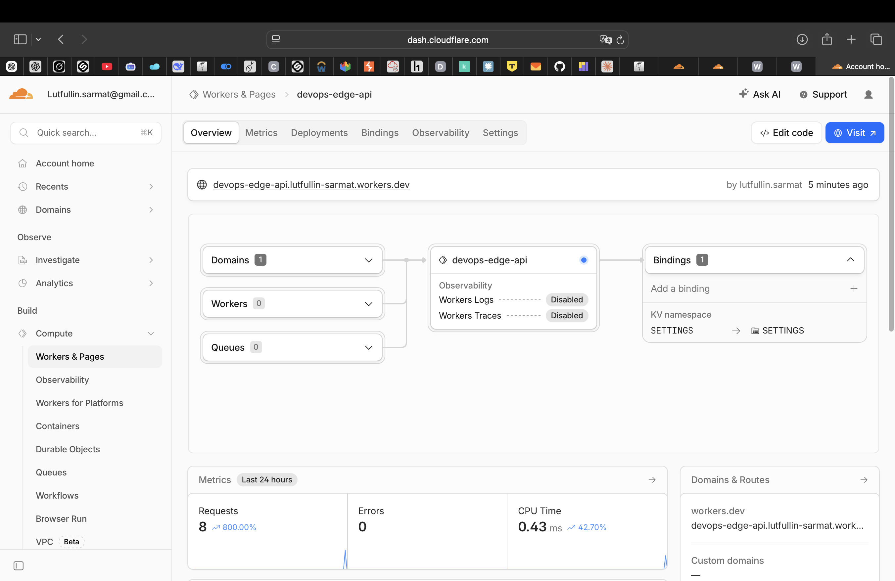
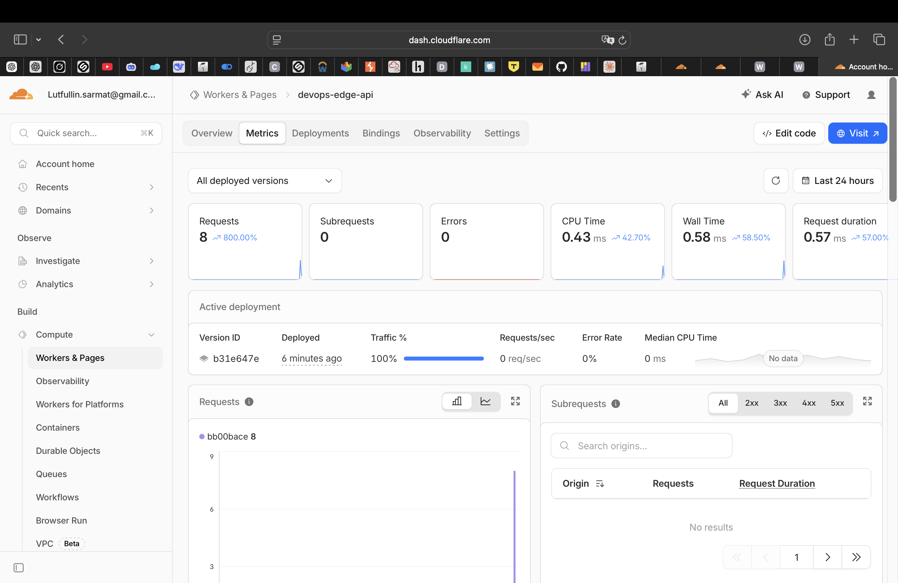
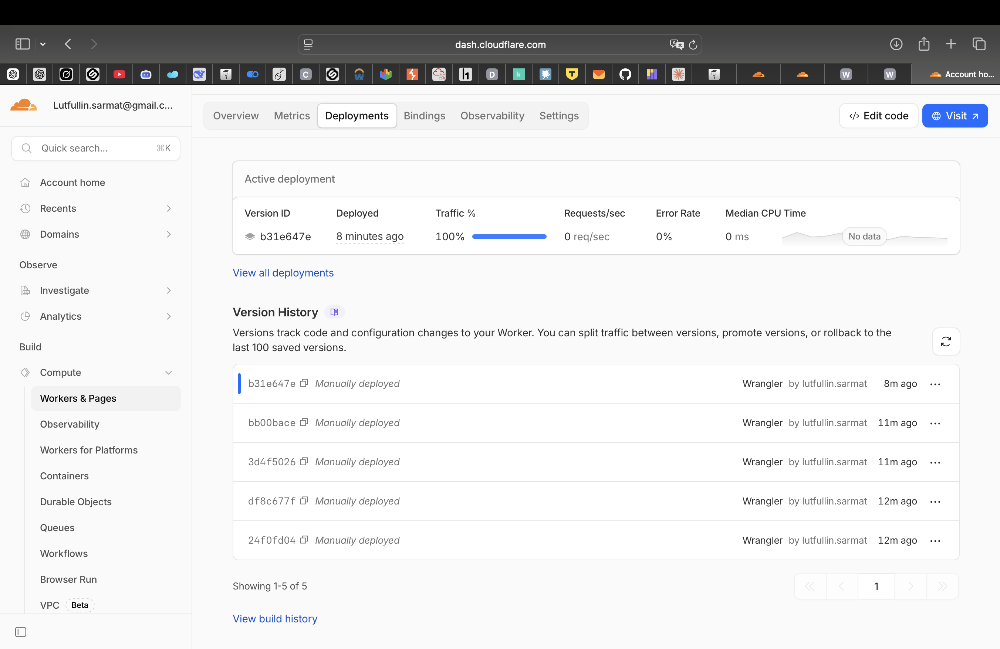

# Lab 17 — Cloudflare Workers Edge Deployment

## Deployment Summary

- **Worker URL:** https://devops-edge-api.lutfullin-sarmat.workers.dev
- **Worker name:** `devops-edge-api`
- **Runtime:** Cloudflare Workers (V8 isolates)
- **Language:** TypeScript

### Routes

| Endpoint | Description |
|----------|-------------|
| `GET /` | App info, version, timestamp |
| `GET /health` | Health check |
| `GET /edge` | Edge metadata (colo, country, city, ASN, TLS) |
| `GET /counter` | KV-backed persistent visit counter |

---

## Task 1 — Setup

```bash
npx wrangler login
npx wrangler whoami
# 👋 You are logged in with an OAuth Token, associated with lutfullin.sarmat@gmail.com
```

---

## Task 2 — Worker API

### Local dev
```bash
npx wrangler dev
```

### Deploy
```bash
npx wrangler deploy
# Deployed devops-edge-api triggers
# https://devops-edge-api.lutfullin-sarmat.workers.dev
```

### Endpoint responses

```bash
$ curl https://devops-edge-api.lutfullin-sarmat.workers.dev/health
{"status":"healthy","timestamp":"2026-05-07T21:07:56.415Z","app":"devops-edge-api"}

$ curl https://devops-edge-api.lutfullin-sarmat.workers.dev/
{"app":"devops-edge-api","course":"devops-core","version":"2.0.0","message":"Hello from Cloudflare Workers edge!","routes":["/","/health","/edge","/counter"]}
```

---

## Task 3 — Global Edge Behavior

### /edge response
```json
{
  "colo": "ARN",
  "country": "FI",
  "city": "Helsinki",
  "asn": 56971,
  "httpProtocol": "HTTP/2",
  "tlsVersion": "TLSv1.3",
  "note": "Served from Cloudflare edge node closest to the requester"
}
```

`colo: ARN` = Stockholm data center (closest to Finland).

### How global distribution works

Workers runs on **300+ Cloudflare PoPs worldwide**. When a request arrives, Cloudflare's Anycast network routes it to the nearest data center automatically. There is no "deploy to 3 regions" step — the Worker is deployed globally in one command. This is fundamentally different from Kubernetes or Fly.io where you explicitly choose regions.

### Routing concepts

| Method | Description |
|--------|-------------|
| `workers.dev` | Free subdomain, instant, no domain needed |
| Routes | Attach Worker to traffic on your Cloudflare zone |
| Custom Domains | Worker becomes origin for a domain/subdomain |

---

## Task 4 — Configuration, Secrets & Persistence

### Plaintext vars (`wrangler.jsonc`)
```json
"vars": {
  "APP_NAME": "devops-edge-api",
  "COURSE_NAME": "devops-core"
}
```
Plaintext vars are visible in `wrangler.jsonc` and deployment config — not suitable for secrets.

### Secrets
```bash
npx wrangler secret put API_TOKEN      # ✨ Success!
npx wrangler secret put ADMIN_EMAIL    # ✨ Success!
```
Secrets are encrypted at rest, never appear in source code or logs.

### KV Namespace
```bash
npx wrangler kv namespace create SETTINGS
# id: bb73be236245469ca113bb52e634578e
```

### Counter persistence
```bash
$ curl https://devops-edge-api.lutfullin-sarmat.workers.dev/counter
{"visits": 1}
$ curl https://devops-edge-api.lutfullin-sarmat.workers.dev/counter
{"visits": 2}
$ curl https://devops-edge-api.lutfullin-sarmat.workers.dev/counter
{"visits": 3}
# After redeploy:
$ curl https://devops-edge-api.lutfullin-sarmat.workers.dev/counter
{"visits": 4}  ✅ data persisted across deployment
```

---

## Task 5 — Observability & Operations

### Logs
```ts
console.log("path", url.pathname, "colo", cf?.colo, "country", cf?.country);
```
```bash
npx wrangler tail  # streams live logs
```

### Deployment history
```bash
$ npx wrangler deployments list
Created: 2026-05-07T21:06:45Z  Version: 24f0fd04  (v1 - initial)
Created: 2026-05-07T21:06:48Z  Version: df8c677f  (secret change)
Created: 2026-05-07T21:09:xx Z  Version: b31e647e  (v2 - added version field)
```

### Rollback
```bash
npx wrangler rollback  # reverts to previous version instantly
```

---

## Task 6 — Kubernetes vs Cloudflare Workers

### Screenshots

**Worker Overview**


**Metrics**


**Deployments**


### Kubernetes vs Cloudflare Workers Comparison
|--------|------------|--------------------|
| Setup complexity | High (cluster, namespaces, manifests) | Low (one CLI command) |
| Deployment speed | Minutes (image build + rollout) | Seconds (JS bundle upload) |
| Global distribution | Manual (choose regions) | Automatic (300+ PoPs) |
| Cost (small apps) | ~$50-100/mo (cluster) | Free tier (100k req/day) |
| State/persistence | PVC, StatefulSets, databases | KV, R2, D1, Durable Objects |
| Control/flexibility | Full (any runtime, any port) | Limited (V8 isolates, no Docker) |
| Best use case | Complex stateful apps, microservices | APIs, edge logic, global low-latency |

### When to use Kubernetes
- Long-running stateful workloads (databases, queues)
- Complex microservice architectures
- Need for custom runtimes or Docker images
- On-premise or hybrid cloud requirements
- Full control over networking and storage

### When to use Cloudflare Workers
- Global APIs with low-latency requirements
- Lightweight serverless functions
- Edge authentication, A/B testing, redirects
- Cost-sensitive small projects
- Fast iteration without infrastructure management

### Reflection

**Easier than Kubernetes:**
- No cluster setup, no YAML manifests for infrastructure
- Global deployment in one command
- Built-in HTTPS, no Ingress/TLS config needed
- Secrets management is trivial

**More constrained:**
- No Docker — can't run arbitrary runtimes
- CPU time limit per request (10ms-30s depending on plan)
- No persistent connections (WebSockets need Durable Objects)
- KV is eventually consistent, not a full database

**What changed because Workers is not a Docker host:**
- Rewrote app in TypeScript instead of Python/Flask
- No filesystem access — persistence via KV bindings
- No long-running processes — each request is isolated
- No Prometheus metrics endpoint — use Cloudflare Analytics instead
